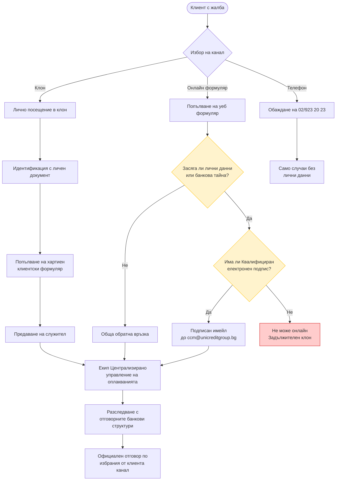

# Задача 1: Проучване — Дигитална обработка на жалби в банкирането

## 1. Въведение

Настоящото проучване разглежда най-добрите практики за дигитализиране на процеса по обработка на жалби в банкирането, като се основава на международни лидери (необанки и традиционни банки), за да предложи иновативно решение, приложимо за българския пазар на УниКредит Булбанк. Целта е да се проектира напълно отдалечен дигитален процес за жалби, без посещение в клон.

---

## 2. Текущо състояние: УниКредит Булбанк

УниКредит Булбанк предлага няколко канала за подаване на жалби, описани на българоезичната им страница „Оплаквания и похвали":

**Налични канали:**
- **Клон:** Лично или чрез упълномощен представител, след идентификация. Жалбата трябва да се подаде писмено чрез „Формуляр за клиенти" (може да се изтегли предварително или да се вземе на място).
- **Онлайн:** Уеб формуляр за обратна връзка или имейл до `ccm@unicreditgroup.bg`.
- **Телефон:** 02/923 20 23
- **Писмо:** София, пл. „Света Неделя" 7

**Ключово ограничение при онлайн/имейл жалбите:** Банката изрично заявява, че **не разглежда жалби, които съдържат лични данни (по GDPR/ЗЗЛД) или банкова тайна (по Закона за кредитните институции)**, когато са подадени през онлайн формуляра или с имейл — **освен ако имейлът не е подписан с Квалифициран електронен подпис (КЕП)**. Това на практика означава, че повечето реални жалби (засягащи детайли по транзакции, информация за сметки и т.н.) **изискват или посещение в клон, или КЕП**, което прави онлайн формуляра използваем само за обща обратна връзка, която не засяга лични или сметкови данни.

**Обработка на жалбите:**
- Всяка жалба се разглежда от специализиран екип — „Централизирано управление на оплакванията" — който провежда детайлно разследване с отговорните банкови структури и предоставя официална позиция на банката по избрания от клиента канал
- Всеки случай се разглежда индивидуално

**Срокове за отговор:**
- **85% от случаите** се решават в рамките на **3 работни дни**
- Жалби по платежни услуги (по ЗПУПС): **15 работни дни**, с възможност за удължаване до **35 работни дни** по причини, независещи от банката
- Жалби по потребителски кредити / ипотеки: **30 дни**

**Пътища за ескалация:**
- Помирителна комисия за платежни спорове (ПКПС) — за спорове по платежни услуги, потребителски кредити и ипотеки
- Комисия за защита на потребителите (КЗП) — София, пл. „Славейков" 4, тел. 02/9330565
- FIN-NET — за презгранични финансови спорове с клиенти в други държави-членки на ЕС

**Програма за удовлетвореност на клиентите:**
- Над 30 000 персонални интервюта годишно с физически и бизнес клиенти
- Mystery shopper програма за мониторинг на качеството на обслужване
- Служителски анкети

**Тестване от първо лице (2026-04-09):**

Онлайн формулярът събира: Име и фамилия, Телефон, Email, тип (радио бутони Похвала/Жалба), Описание, Очаквано действие. Изисква се отметка за GDPR съгласие и reCAPTCHA.

След подаване се показва минимално екранно потвърждение: „Благодарим Ви за обратната връзка! Беше получена от УниКредит Булбанк." с бутон „НАЗАД". Няма референтен номер, няма срок, няма комуникация за следващи стъпки. Не беше получен имейл за потвърждение.

**Наблюдавани пропуски спрямо международните бенчмаркове (виж Раздел 3):**
- Изискването за КЕП при жалби с лични данни прави онлайн канала практически неизползваем за повечето реални жалби
- Няма подаване на жалба от самото Булбанк Мобайл или Булбанк Онлайн приложение (приложението изисква активация на клиент — не беше тествано, тъй като нито един член на екипа не е клиент на УКБ; функционалност за жалби не се рекламира в публичните списъци с функции)
- Няма видимо проследяване в реално време или статусни обновления за подадени жалби
- Няма чатбот или AI-подпомогната триажна оценка на точката на подаване
- Няма самообслужване за често срещани категории жалби

Това контрастира с по-широките дигитални амбиции на УниКредит Груп — групата е преместила **над 75% от банковите трансакции за физически лица към дигитални канали**, инвестирала е **~5,5 млрд. евро** в Digital and Data инициативи (2022–2027) и е партнирала с Google Cloud в 13 пазара.

#### Диаграма: Текущ процес по жалби в УКБ

ОББ (KBC Group) и Банка ДСК (OTP Group) бяха избрани за локален бенчмарк, тъй като са единствените два директни конкурента на УниКредит Булбанк на българския пазар — заедно, тези три банки формират топ-тира на българския банков сектор.

### 2.2 Локален конкурент: Обединена Българска Банка (ОББ)

ОББ (част от KBC Group) е третата от топ-тира български банки, тествана заедно с УКБ и ДСК. **Тествано на 2026-04-09:**

- Структуриран уеб формуляр (категории, прикачени файлове до 6MB, двойно GDPR съгласие)
- Екранно потвърждение с емпатичен език и **законов срок за отговор от 45 дни**; не се предоставя референтен номер
- Не беше получен имейл за потвърждение (предупреждение: тестов burner имейл)
- Виртуалният асистент в мобилното приложение **пренасочва запитванията за жалби към уеб формуляра** — същият in-app пропуск, както при УКБ и ДСК

### 2.3 Локален конкурент: Банка ДСК (OTP Group)

Банка ДСК предлага най-пълното дигитално преживяване по жалби сред тестваните български банки.

**Анализ на формуляра (CX):**

- Опростен, минимален формуляр: фамилия, падащо меню за категория („Жалба/Оплакване"), съдържание, имейл
- Отделна, специализирана връзка за спорове по картови транзакции (води до друг формуляр)
- Преди подаване се показва потвърдителен прозорец, който предупреждава потребителя: ако не е жалба или препоръка, да използва други канали (чат на сайта, ДСК Директ, ДСК Смарт)
- Споменава чата на сайта в долния десен ъгъл за запитвания, които не са жалби

**Преживяване след подаване — двуимейлов поток (тествано на 2026-04-09):**

**Имейл 1 (незабавен):** Потвърждение и триажна информация

- Потвърждава получаването, казва че екипът на Контактния център ще отговори „в най-кратки срокове"
- Приоритетна триажна оценка ясно обяснена с визуални икони:
 - Проблеми с карта, банкова услуга или е-банкиране → **най-висок приоритет**, банката ще потърси клиента проактивно
 - Жалби → разглеждат се от отдел „Грижа за клиента", **официален отговор в рамките на 30 дни**
 - Препоръки → препращат се към съответните екипи за подобряване на услугата
- Напомняне за сигурност: ДСК никога няма да искат пароли, ПИН, CVC/CVV кодове по имейл
- Линк към страница с препоръки за сигурност

**Имейл 2 (скоро след първия):** Присвояване на референтен номер

- Случаят е регистриран под **референтен номер #1317654**
- Срок за отговор: **до 3 работни дни** от получаване на запитването
- Насочва към чат през ДСК Директ или уебсайта на банката за по-бърза помощ
- От „Банка ДСК — Дирекция Контактен център"
- Футърът включва брандирането на D.bot чатбота, телефон (+359 700.10.375), кратък номер (*2375), имейл (call_center@dskbank.bg)

**Ключови разграничители спрямо останалите български банки:**
- **Единствената тествана българска банка, която предоставя референтен номер**
- **Единствената с двуимейлов поток** — незабавно потвърждение + отделна регистрация на случая
- **Приоритетната триажна оценка е комуникирана предварително** — клиентът знае как ще се обработи случаят още преди човек да го прегледа
- **Най-краткият обявен срок за отговор** сред българските банки (3 работни дни срещу 45 дни при ОББ)
- **Споменава D.bot** — индикация, че в екосистемата им съществува чатбот

**Действително разрешаване (получено ~13 часа след подаването):**

Банка ДСК достави персонализиран имейл-отговор приблизително 13 часа след подаването на жалбата — жалбата беше подадена в 01:18 (българско време) и отговорът пристигна в 14:01 същия ден. Това е значително по-бързо от обявения SLA от 3 работни дни.

Ключови наблюдения за отговора:
- **Персонализирано обръщение:** Обръща се към клиента по фамилно име („Здравейте, г-н Ванчев") — не е генеричен шаблон
- **Емпатично начало:** „Благодарим Ви, че се свързахте с нас. Съжаляваме за възникналата ситуация."
- **Практична препоръка:** Пита за потвърждение, че DSK Mobile приложението е на последна версия, със специфични инструкции (Google Play / App Store)
- **Проактивно статусно обновление:** Информира, че в момента няма прекъсване на услугата
- **Отворен канал за проследяване:** Предлага чат платформата за допълнителни въпроси
- **Подпис:** „Поздрави, Екипът на Банка ДСК"

Това представлява реалната производителност на обработката на жалби в ДСК — не просто обявени SLA-та, а реален човешки, персонализиран отговор, под SLA.

**Мобилно приложение / чатбот преживяване:**
- ДСК има виртуален AI асистент (D.bot), но когато бъде попитан „Искам да подам жалба", той **насочва потребителя да подаде през уебсайта** — чатботът не обработва самото подаване на жалба. По време на тестването асистентът беше наблюдаван като нестабилен.

Това означава, че въпреки че ДСК има най-добрата опитност след подаване сред българските банки — включително по-бързо от обявеното разрешаване — *самата входна точка* за жалби все още изисква напускане на приложението/чатбота и отиване на отделен уеб формуляр. Това е фундаменталният пропуск, общ за трите български банки.

### 2.4 Български банки — Локално сравнение

| Аспект | УниКредит Булбанк | ОББ | Банка ДСК |
|---|---|---|---|
| Уеб формуляр за жалба | Да (ограничен — виж КЕП бележката) | Да | Да |
| КЕП изискван за лични данни | **Да** | Не | Не |
| Категории на жалби | Не наблюдавани на формуляра | Структурирани (карти, кредити и др.) | Падащо меню (Жалба/Оплакване) |
| Отделени картови спорове | Неизвестно | В рамките на категориите | Да — отделен формуляр |
| Екранно потвърждение | Да — минимално, без детайли | Да, със срок | Да (чрез модал преди подаване) |
| Имейл потвърждение | Не наблюдавано | Не получено (burner имейл caveat) | Да — незабавно |
| Референтен номер | Не наблюдавано | Не се предоставя | Да — #1317654 |
| Обявен срок за отговор | Да — 85% в 3 дни; 15/35 дни законови (на сайта, не след подаване) | 45 дни (на екрана) | 3 работни дни (имейл) / 30 дни за жалби (имейл) |
| Действително време на отговор (тествано) | Не получено | Не получено (burner имейл caveat) | **~13 часа** — персонализиран, практичен |
| Приоритетна триажна оценка | Не | Не | Да — визуални икони в имейла |
| Документирани пътища за ескалация | Да — ПКПС, КЗП, FIN-NET | Не на формуляра | Не на формуляра |
| Специализиран екип по жалби | Да — „Централизирано управление на оплакванията" | Неизвестно | „Грижа за клиента" |
| Прикачени файлове | Неизвестно | Да (6MB) | Не наблюдавано на формуляра |
| GDPR съгласие | Неизвестно | Явно двойно съгласие | Не наблюдавано на формуляра |
| Чатбот обработва жалби | Не | Пренасочва към уеб формуляра | Пренасочва към уеб формуляра (D.bot е нестабилен) |
| Програма за удовлетвореност | Да — 30к+ интервюта/год., mystery shoppers | Неизвестно | Неизвестно |

Опитността при Банка ДСК е забележимо по-близо до международните стандарти — особено по отношение на референтния номер, комуникацията за приоритетна триажна оценка и двуетапния имейл поток. ОББ предлага по-добра структура на формуляра, но по-слаба опитност след подаване. УниКредит Булбанк има най-детайлно публично документиран процес по жалби (срокове за отговор, пътища за ескалация, специализиран екип), но действителното дигитално подаване изостава спрямо двата конкурента — а изискването за КЕП при жалби с лични данни практически принуждава повечето клиенти да посетят клон, превръщайки онлайн формуляра в канал само за обща обратна връзка.

И трите български банки все още нямат in-app подаване на жалба, проследяване в реално време и AI-подпомогната триажна оценка — базата, зададена от международните играчи (виж Раздел 3).

---

## 3. Международни бенчмаркове

### 3.1 Необанки — Дигитално обработване на жалби

#### Revolut

- **Основен канал:** Чат в приложението (Profile > Help). Менюто за помощ показва често срещани категории проблеми (Dispute transactions, Transfer status, Help with a card и др.) с поле за търсене и „Support — Tap to get help" входна точка за чат на живо.
- **AI триажна оценка:** AI Chat асистентът обработва първоначалните запитвания. При съобщение „I want to submit a complaint", чатботът отговаря веднага: *„You have the right to raise a formal complaint. Would you like me to connect you with a customer support agent to review your case?"* — разпознава намерение за жалба и предлага ескалация до човек на една стъпка.
- **Алтернативни канали:** Онлайн формуляр за жалба, имейл (`formalcomplaint@revolut.com`)
- **Срокове:** Писмено потвърждение с очакван срок за отговор се изпраща скоро след подаване; целеви срок за разрешаване — 15 работни дни (35 в изключителни случаи)
- **Ключова иновация:** Входната точка за жалби е вградена в същия интерфейс, използван за ежедневно банкиране — нулево триене при инициация. Клиентът е вече автентикиран, така че не се изисква верификация на самоличност (в контраст с изискването за КЕП при УКБ).

#### Monzo

- **Философия:** „Когато клиентът не е доволен...имаме възможност да го впечатлим" — жалбите като възможности за растеж, не като пасиви
- **Основен канал:** Чат в приложението, плюс имейл, телефон и писмена кореспонденция
- **Срокове:** Потвърждение в рамките на 3 работни дни; вътрешна цел за разрешаване от 7 дни (регулаторен лимит: 8 седмици)
- **Ключови иновации:**
 - **Специалистна маршрутизация:** Жалбите се маршрутизират към домейн-експерти (не към централен екип по жалби), гарантирайки, че техническата експертиза съответства на проблема
 - **Персонализация:** Финансова компенсация при парично въздействие; смислени жестове (ръкописни бележки) при лично въздействие
 - **Обратна връзка:** Данните от жалби подобряват продукта (напр. преработени екрани за лимити на банкомат след повтарящи се оплаквания от объркване)
 - **Радикална прозрачност:** Публични статусни обновления по подразбиране, дори за проблеми, засягащи малцинство от клиенти

### 3.2 DBS Bank (Сингапур) — Най-добрата в класа AI интеграция

- **DBS Joy (Корпоративен):** Gen AI-захранван чатбот; обслужил над 120 000 уникални чата от началото на ранните тестове през февруари; намалил времето на изчакване, CSAT резултатите се повишили с 23%
- **DBS Digibot (Клиентски):** Виртуален асистент в digibank приложението и уеб сайта — отговаря на въпроси, стартира транзакции, води през процеси
- **CSO Assistant:** Gen AI ко-пилот за customer service officers — транскрипция в реално време, търсене в knowledge base на живо, извличане на информация според конкретното запитване
- **Ескалация:** Сложни случаи се ескалират автоматично от чатбота към специалист, с пълен контекст от разговора
- **Ключови иновации:**
 - AI ко-пилот за служителите (не само за клиентите), намаляващ Average Handle Time
 - Защита на данните, одитни пътеки и процеси за ескалация вградени в архитектурата за регулаторно съответствие
 - Прогресивно внедряване в пазари (Сингапур > Хонг Конг > Индия)

### 3.3 Сравнителна матрица

| Способност | Revolut | Monzo | DBS | УКБ | ОББ | Банка ДСК |
|---|---|---|---|---|---|---|
| In-app жалба | Да | Да | Да | Само уеб | Само уеб | Само уеб |
| AI чатбот триажна оценка | Да | Не | Да (Gen AI) | Не | Пренасочва към уеб | Пренасочва към уеб |
| Проследяване на статус | Да | Да | Да | Не наблюдавано | Не | Не |
| Референтен номер | Да | Да | Да | Не наблюдавано | Не | **Да** |
| Имейл потвърждение | Да | Да | Да | Не наблюдавано | Не получено* | **Да — 2 имейла** |
| Целеви срок за разрешаване | 15 дни | 7 дни** | Вариабилен | Неизвестно | 45 дни | 3 дни / 30 дни |
| AI ко-пилот за служители | Не | Не | Да (CSO) | Няма данни | Няма данни | Няма данни |
| Omnichannel | Висок | Висок | Висок | Нисък | Нисък | Нисък-Среден |

*\* ОББ: използван е burner имейл — имейл потвърждението може да е било изпратено, но не получено.*
*\*\* Сроковете на Monzo са от блог пост от 2017 г. — възможно е да са променени.*

**Надеждност на източниците по колона:**
- **Revolut:** Официален help center
- **Monzo:** Официален блог (2017, 2020) — някои детайли може да са остарели
- **DBS (Сингапур):** Смесица от официален newsroom и конференционна статия на трета страна
- **УКБ:** Тестване от първо лице + публично достъпна информация от уебсайта
- **ОББ:** Изтеглена страница с формуляр + тестване от първо лице (2026-04-09)
- **Банка ДСК:** Тестване от първо лице (2026-04-09) — скрийншоти на формуляра + две получени потвърдителни имейла

---

## 4. Регулаторна рамка

### 4.1 Изисквания на ЕС/EBA

**EBA/ESMA Joint Committee Guidelines on Complaints Handling (JC 2018 35)** установяват хармонизирани изисквания към всички финансови институции в ЕС:

- **Политика за управление на жалбите** — трябва да бъде документирана и одобрена от висшия мениджмънт
- **Функция за управление на жалбите** — обособена организационна единица, отговорна за жалбите
- **Регистрация** — всички жалби трябва да се регистрират, категоризират и проследяват
- **Отчитане** — редовно отчитане към компетентни органи и/или омбудсман
- **Срокове** — потвърждение и отговор в определени периоди
- **Информация към жалбоподателя** — ясна комуникация за процеса, очаквания срок и правата за ескалация
- **Вътрешно проследяване** — анализ на коренните причини и системни подобрения

Тези насоки се прилагат към банки, инвестиционни посредници, платежни институции (PSD2) и кредитни посредници за ипотеки (MCD).

### 4.2 Български регулаторен контекст

- **БНБ (Българска народна банка)** — основен банков надзорник; може да налага надзорни мерки или финансови санкции при нарушения на Закона за платежните услуги и платежните системи
- **Комисия за защита на потребителите (КЗП)** — мониторира кредитните практики, извършва пазарно наблюдение, налага глоби; получила ~1 600 жалби само през януари 2026 г. (предимно свързани с превалутирането в евро)
- **Помирителна комисия за платежни спорове** — безплатно извънсъдебно решаване на спорове, обикновено в рамките на ~2 месеца
- **DORA (Digital Operational Resilience Act)** — изисква стабилни ICT risk management рамки, редовни тестове за дигитална устойчивост, засилени стандарти за киберсигурност и протоколи за докладване на инциденти

### 4.3 Последствия за дигиталния процес по жалби

Съответстваща дигитална система трябва да регистрира и категоризира всяка жалба (EBA), да потвърждава в дефиниран срок, да поддържа одитни пътеки за регулаторно отчитане, да поддържа ескалация до БНБ / КЗП / Омбудсман, да е съвместима с GDPR и да изпълнява DORA изискванията за ICT устойчивост и докладване на инциденти. Технологичните шаблони и избор на компоненти, които реализират тези задължения, са детайлизирани в **Задача 3 — Технологична архитектура**.

---

## 5. Предложение: Дигитална система за жалби на УниКредит Булбанк

На база международните бенчмаркове и регулаторните изисквания, се предлага следният подход, комбиниращ най-добрите елементи от всяка референция.

**Ключово архитектурно наблюдение от анализа на текущото състояние:** Онлайн формулярът за жалби на УниКредит Булбанк в момента изисква Квалифициран електронен подпис (КЕП) за всяка жалба, засягаща лични данни или банкова тайна — което покрива огромното мнозинство от реални жалби. Това изискване съществува, защото уеб формулярът не може да верифицира самоличността на клиента. Но в рамките на Булбанк Мобайл или Булбанк Онлайн клиентът е **вече автентикиран** чрез логина на приложението (биометрия, ПИН, идентификационни данни). Това означава, че in-app подаването на жалба по същество решава проблема с КЕП — самоличността на клиента е вече установена, премахвайки правната бариера, която прави текущия онлайн канал неизползваем за съществени жалби. Само това е най-силният аргумент за преместване на обработката на жалбите в банковото приложение.

### 5.1 Основни принципи
1. **Жалбите като възможности** — всяка жалба се връща като вход за подобряване на продукта *(вдъхновено от философията на Monzo)*
2. **AI-first, human-always** — AI обработва триажната оценка и маршрутизирането, но ескалация до човек е винаги на един тап разстояние *(вдъхновено от Revolut + DBS)*
3. **Пълна прозрачност** — проследяване на статус в реално време, ясни срокове, проактивни обновления *(вдъхновено от ангажимента на Monzo за прозрачност)*
4. **Omnichannel** — последователно преживяване в Булбанк Мобайл, Булбанк Онлайн и клон (за тези, които все още го предпочитат)

### 5.2 Четиристепенен модел на обработка (Tier model)

За да се спазят EBA насоките (всяка жалба да се разглежда от функцията за управление на жалбите) и собствената декларирана политика на УКБ (специализиран екип обработва всяка жалба), AI автоматизацията не може автономно да изпълнява монетарни или регулирани действия. Вместо това се предлага **четиристепенен модел на обработка**:

| Tier | Описание | Примерни действия | Решаваща инстанция |
|---|---|---|---|
| **Tier A — Чисто самообслужване (информационно)** | Насоки или извличане на информация; без промяна в банково състояние | Обяснение на транзакция, показване на данни по сметка, отговор на процедурни въпроси, насочване към настройка | Чатбот (без банково действие) |
| **Tier B — Безопасна обратима автоматизация (клиентски-инициирана)** | Немонетарни, отбранителни, обратими действия, които клиентът и без това може да изпълни в приложението; чатботът просто маршрутизира намерението | Временно блокиране на карта, промяна на нотификационни предпочитания, сваляне на извлечение | Клиент (чатботът изпълнява операции, които клиентът вече има достъп до) |
| **Tier C — AI-предложено, одобрено от човек** | AI подготвя препоръка с пълен контекст; специалист я преглежда и одобрява преди да се изпълни монетарно или регулирано действие | Връщане на такса, goodwill компенсация, решаване на спор, обратна транзакция | Специалист (с подкрепа от AI Ко-пилот) |
| **Tier D — Пълно ръчно разследване** | Високорискови или регулирани категории; без AI shortcut | Измами, кредитни жалби (ЗПК/ЗКНИП), платежни спорове (ЗПУПС), GDPR искания от субекти на данни, спорни транзакции над определен праг | Специалист + евентуално compliance / юридически преглед |

**Защо този tier модел е необходим:**
- EBA/ESMA Joint Committee Guidelines (JC 2018 35): *„Функция за управление на жалбите — обособена организационна единица, отговорна за жалбите"* и *„всички жалби трябва да бъдат регистрирани, категоризирани и проследявани"*
- Декларираната политика на самата УКБ: всяка жалба се разглежда от специализирания екип „Централизирано управление на оплакванията"
- Задължения за одитна пътека и управление на риска по DORA
- Анти-измама: автономно движение на пари от чатбот е вектор за измама (prompt injection, социално инженерство)

### 5.3 Предложен процес по жалби

1. **Иницииране** — Клиентът отваря жалба от Булбанк Мобайл/Онлайн (Помощ > Жалби). AI чатботът събира първоначални детайли: категория, описание и незадължителни прикачени файлове
2. **Интелигентна категоризация** — NLP engine автоматично категоризира жалбата, оценява настроението и спешността и определя приложимия Tier (A / B / C / D) *(вдъхновено от чатбота на Revolut + DBS Digibot)*
3. **Обработка на Tier A/B** — Ако намерението може да бъде разрешено с информация или безопасно клиентско-инициирано действие, чатботът дава отговора / изпълнява действието на клиентско ниво. Взаимодействието се **логва като support case** (не като формална жалба), но се улавя за аналитика
4. **Регистрация на формална жалба** — За Tier C и Tier D намерения (и за всяка Tier A/B ситуация, в която клиентът избере формална жалба), жалбата се регистрира формално с референтен номер, категория, приоритет и времеви маркери
5. **Потвърждение** — Клиентът получава незабавно потвърждение по **in-app съобщение + имейл** — референтен номер, очакван срок за разрешаване, информация за назначения специалист *(адресира пропуска, наблюдаван при текущия уеб формуляр на УниКредит Булбанк, и съответства на двуканалния подход на Банка ДСК)*
6. **Маршрутизиране** — Жалбата се маршрутизира към специалист по домейн (не към общ екип по жалби) *(вдъхновено от специалистното маршрутизиране на Monzo)*. AI ко-пилотът сглобява пълен клиентски контекст, подобни минали случаи и предложени пътища за разрешаване, които да подпомогнат специалиста *(вдъхновено от DBS CSO Assistant)*
7. **Разследване** — Специалистът разследва, използвайки сглобения от AI Ко-пилота контекст. Клиентът получава проактивни статусни обновления по **push нотификация + имейл**. Ако е необходима допълнителна информация, специалистът я заявява през приложението (push + имейл)
8. **Решение на специалиста** — Специалистът одобрява или отхвърля предложеното от AI Ко-пилота разрешение (Tier C), или формулира собствено разрешение от нулата (Tier D). Всички решения, одобрения и обосновки се записват за одит
9. **Доставяне на разрешението** — Официален отговор, доставен по **in-app съобщение + имейл**, с обяснение, предприети действия и детайли за компенсация (ако е приложимо). Ако се прилага монетарна компенсация, системата изпълнява транзакцията само след изрично одобрение от специалиста
10. **Отговор на клиента** — Клиентът може да приеме, да поиска уточнение или да ескалира
11. **Ескалация** — Ако не е разрешено: вътрешен преглед от ръководител → БНБ / КЗП / Помирителна комисия за платежни спорове / FIN-NET. Всички пътища за ескалация са достъпни директно от приложението *(изисквано от EBA насоките + българската регулаторна рамка)*
12. **Обратна връзка** — Проучване след разрешаване. Данните от жалби се агрегират за тенденционен анализ, захранващ подобрения в продукта и процеса *(вдъхновено от модела за непрекъснато подобрение на Monzo)*

**Клиентски канали за потвърждение (при всяка точка на взаимодействие):**
- **In-app съобщение** — основен, автентикиран, видим в историята на жалбите
- **Имейл** — потвърждение за доставка, външен запис, работи дори ако приложението е деинсталирано (съответства на имейл-базирания модел на Банка ДСК)
- **Push нотификация** — осъзнаване в реално време, предизвиква внимание от клиента

#### Диаграма: Предложен процес по жалби

```mermaid
flowchart TD
    Client([Клиент в Булбанк Мобайл/Онлайн<br/>— вече автентикиран])

    Client --> Initiate[Отваря Помощ > Жалби]
    Initiate --> Chatbot[AI Чатбот събира:<br/>Категория, описание, файлове]

    Chatbot --> NLP[NLP: категория, настроение,<br/>спешност, Tier]
    NLP --> Tier{Tier?}

    Tier -->|Tier A<br/>информационно| TierA[Чатбот дава информация<br/>или насока<br/>Без банково действие]
    Tier -->|Tier B<br/>безопасно клиентско| TierB[Чатбот изпълнява<br/>клиентско действие<br/>напр. блок. карта]
    Tier -->|Tier C<br/>AI-предложено| Register
    Tier -->|Tier D<br/>ръчно| Register

    TierA --> LogCase[Запис като support case<br/>за аналитика]
    TierB --> LogCase
    LogCase --> OfferFormal{Иска формална<br/>жалба?}
    OfferFormal -->|Не| Feedback
    OfferFormal -->|Да| Register

    Register[Формална жалба:<br/>ref#, категория, приоритет, timestamps]
    Register --> Ack[Потвърждение<br/>in-app + имейл + push<br/>ref#, срок, специалист]

    Ack --> Route[Маршрут към специалист]
    Route --> CoPilot[AI Ко-пилот сглобява контекст<br/>профил, транзакции, минали случаи,<br/>предложено решение]

    CoPilot --> Investigate[Специалистът разследва]
    Investigate --> NeedInfo{Нужна ли е<br/>доп. информация?}
    NeedInfo -->|Да| RequestInfo[Запитване<br/>in-app + имейл + push]
    RequestInfo --> ClientProvides[Клиент дава информация]
    ClientProvides --> Investigate

    NeedInfo -->|Не| SpecDecision[Специалистът решава:<br/>одобрява AI Tier C<br/>или формира свое Tier D]

    SpecDecision --> ExecAction{Монетарно /<br/>регулирано действие?}
    ExecAction -->|Да| ExecWithApproval[Специалистът изрично одобрява;<br/>системата изпълнява + одит]
    ExecAction -->|Не| Response
    ExecWithApproval --> Response

    Response[Отговор<br/>in-app + имейл + push]

    Response --> ClientResp{Отговор на клиента}
    ClientResp -->|Приема| Feedback
    ClientResp -->|Иска уточнение| Investigate
    ClientResp -->|Ескалира| Internal[Вътрешен преглед<br/>от ръководител]

    Internal --> MgrDecision{Ново решение<br/>на ръководителя}
    MgrDecision -->|Клиентът приема| Feedback
    MgrDecision -->|Клиентът не приема| External[Външна ескалация:<br/>БНБ / КЗП / ПКПС / FIN-NET]

    External --> Feedback
    Feedback([Проучване за удовлетвореност<br/>→ тенденционен анализ<br/>→ подобрения на продукта])

    style Client fill:#d4edda,stroke:#28a745
    style Feedback fill:#cce5ff,stroke:#007bff
    style External fill:#ffcccc,stroke:#cc0000
    style ExecWithApproval fill:#d4edda,stroke:#28a745
    style SpecDecision fill:#d4edda,stroke:#28a745
    style Tier fill:#fff3cd,stroke:#ffc107
    style ExecAction fill:#fff3cd,stroke:#ffc107
```

---

## 6. Източници

### Официални / Институционални източници
- [Revolut — How can I file a complaint?](https://help.revolut.com/help/more/legal-topics/how-do-i-complain/)
- [Revolut's AI Assistant (Rita)](https://www.revolut.com/legal/rita-disclaimer/)
- [Monzo — Complaints at Monzo (Aug 2017)](https://monzo.com/blog/2017/08/09/complaints-at-monzo) — изтеглено директно
- [Monzo — Customer Support Design (Nov 2020)](https://monzo.com/blog/2020/11/11/customer-support-design)
- [DBS Newsroom — Gen AI chatbot rollout](https://www.dbs.com/newsroom/DBS_rolls_out_Gen_AI_powered_chatbot_to_all_corporate_clients)
- [DBS Newsroom — CSO Assistant](https://www.dbs.com/newsroom/DBS_empowers_its_Customer_Service_Officers_with_Gen_AI_powered_virtual_assistant_to_reduce_toil_and_enhance_customer_experience)
- [DBS Digibot page](https://www.dbs.com.sg/personal/deposits/bank-with-ease/digibot)
- [EBA — Joint Committee Guidelines on Complaints Handling](https://www.eba.europa.eu/legacy/regulation-and-policy/regulatory-activities/consumer-protection-and-financial-innovation-10)
- [EBA — Updates to Joint Committee Guidelines](https://www.eba.europa.eu/publications-and-media/press-releases/eba-updates-joint-committee-guidelines-complaints-handling)
- [УниКредит Булбанк — Оплаквания и похвали](https://www.unicreditbulbank.bg/en/contacts/feedback/complaints-and-compliments/) — 403 при директно изтегляне; информацията е от search snippet
- [UniCredit — Digital & Data Strategy](https://www.unicreditgroup.eu/en/business/digital-and-data.html)
- [UniCredit — Unlocked Strategic Plan](https://www.unicreditgroup.eu/en/press-media/press-releases-price-sensitive/2021/unicredit-unlocked--2022-2024-strategic-plan--empowering-communi.html)
- [UniCredit Partners with Google Cloud (May 2025)](https://www.googlecloudpresscorner.com/2025-05-12-UniCredit-Partners-with-Google-Cloud-to-Accelerate-Digital-Transformation-Across-13-Markets)

### Трети страни / Новинарски източници
- [DBS rolls out Gen AI chatbot (Fortune, Nov 2025)](https://fortune.com/2025/11/10/dbs-joy-rolls-out-gen-ai-chatbot/)
- [DBS AI Chatbots (Conversational Tech Summit Asia)](https://conversationaltechsummitasia.com/how-dbs-bank-transformed-customer-experience-with-ai-chatbots/)
- [Banking Regulation 2026 — Bulgaria (Chambers and Partners)](https://practiceguides.chambers.com/practice-guides/banking-regulation-2026/bulgaria) — изтеглено директно
- [Bulgaria Consumer Protection — 1600 complaints (Sofia Globe, Jan 2026)](https://sofiaglobe.com/2026/01/14/bulgarias-consumer-protection-body-1600-complaints-in-a-week-mainly-about-breaches-of-euro-law/)
- [BitBang — How UniCredit Drives Continuous Improvement](https://bitbang.com/stories/customer-experience-2/how-unicredit-drives-continuous-improvement-in-digital-experience/)
- [BPM in Banking (ProcessMaker whitepaper)](https://www.processmaker.com/wp-content/uploads/2016/03/White-Paper-BPM-in-Banking.pdf)
- [Microservices Architecture in Banking (Surf)](https://surf.dev/microservices-architecture-in-banking/)
- [BPM in Banking with Low-Code (Kissflow)](https://kissflow.com/solutions/banking/bpm-in-banking-with-low-code-solutions)

### Тестване от първо лице
- Онлайн формуляр за жалби на УниКредит Булбанк — тестван на 2026-04-09; подаването е извършено, не са наблюдавани незабавно екранно потвърждение или имейл за потвърждение към момента на писане.
- Онлайн формуляр за обратна връзка/жалби на ОББ — тестван на 2026-04-09; екранното потвърждение се показва незабавно с емпатично съобщение и 45-дневен срок за отговор; не се предоставя референтен номер; не е получен имейл за потвърждение (caveat: използван е burner имейл). Виртуалният асистент в мобилното приложение пренасочва запитванията за жалби към уеб формуляра.
- Онлайн формуляр за обратна връзка на Банка ДСК — тестван на 2026-04-09; получени са два потвърдителни имейла: (1) незабавно потвърждение с обяснение на приоритетната триажна оценка и 30-дневен срок за жалби, (2) присвоен референтен номер #1317654 с ангажимент за отговор в 3 работни дни. **Реален персонализиран отговор, получен ~13 часа след подаването** (жалбата е изпратена в 01:18, отговорът е получен в 14:01 същия ден) — значително под обявения SLA. D.bot чатботът не обработва жалби — насочва потребителите към уебсайта; асистентът е наблюдаван като нестабилен.
