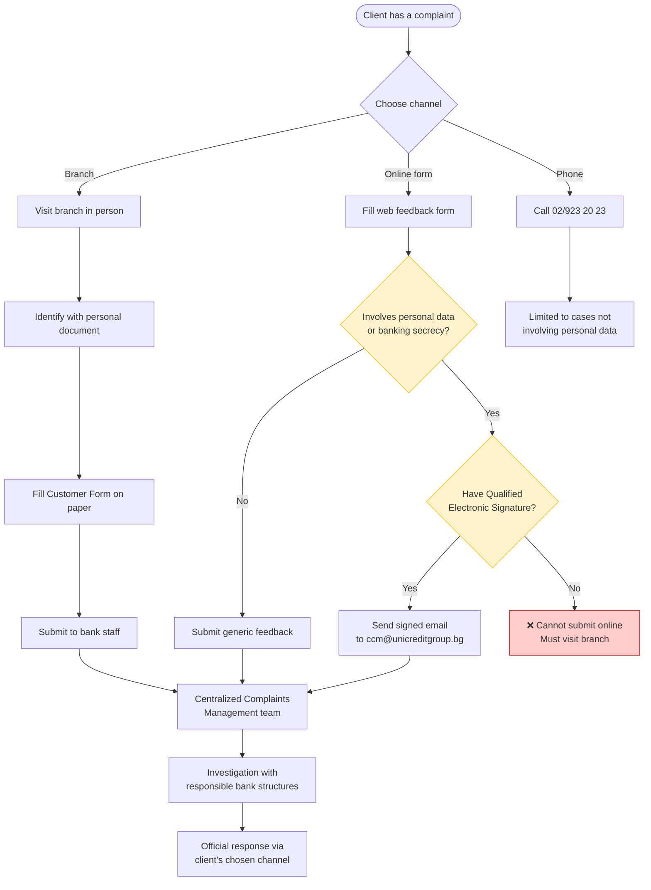
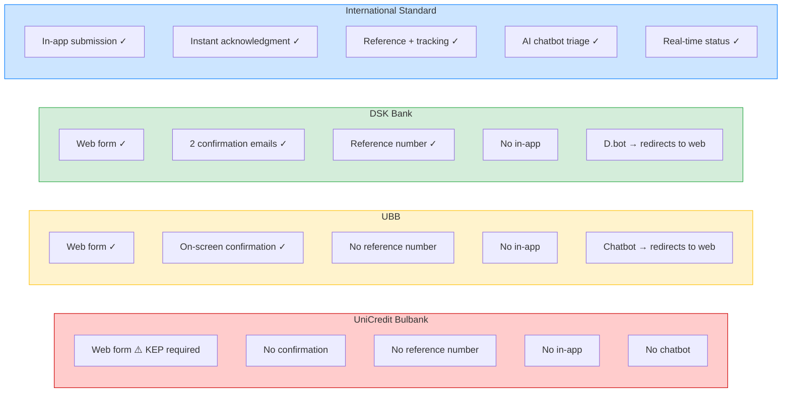
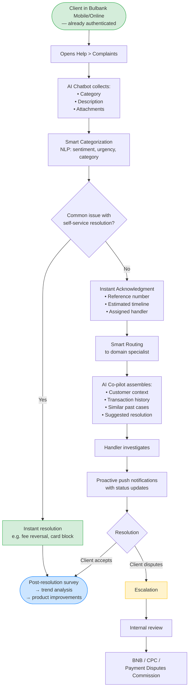

# Task 1: Research — Digital Complaint Handling in Banking

## 1. Introduction

This research examines best practices for digitalizing complaint handling in banking, drawing from international leaders (neobanks and traditional banks) to propose an innovative solution for UniCredit Bulbank's Bulgarian market. The goal is to design a fully remote digital complaint workflow.

---

## 2. Current State: UniCredit Bulbank

UniCredit Bulbank offers multiple complaint channels, detailed on their Bulgarian-language Complaints and Compliments page:

**Available channels:**
- **Branch:** In person or via authorized representative, after identification. Complaint must be submitted in writing using a "Customer Form" (downloadable in advance or available on-site).
- **Online:** Web form for feedback, or email to `ccm@unicreditgroup.bg`.
- **Phone:** 02/923 20 23
- **Letter:** Sofia, pl. "Sveta Nedelya" 7

**Critical limitation on online/email complaints:** The bank explicitly states it **does not review complaints that involve personal data (under GDPR/ЗЗЛД) or banking secrecy (under the Credit Institutions Act)** when submitted via the online form or email — **unless the email is signed with a Qualified Electronic Signature (KEP/КЕП)**. This effectively means most real complaints (involving transaction details, account information, etc.) **require either a branch visit or a KEP**, making the online form usable only for generic feedback that doesn't touch personal or account data.

**Complaint processing:**
- Every complaint is reviewed by a specialized team — "Централизирано управление на оплакванията" (Centralized Complaints Management) — which conducts a detailed investigation with responsible bank structures and provides an official bank position via the client's chosen channel
- Each case is reviewed individually

**Response timelines:**
- **85% of cases** resolved within **3 working days**
- Payment services complaints (under ЗПУПС): **15 working days**, extendable to **35 working days** for reasons beyond the bank's control
- Consumer credit / mortgage complaints: **30 days**

**Escalation paths:**
- Payment Disputes Conciliation Commission (Помирителна комисия за платежни спорове) — for payment service disputes, consumer credit, and mortgage-related complaints
- Consumer Protection Commission (КЗП) — Sofia, pl. "Slaveykov" 4, tel. 02/9330565
- FIN-NET — for cross-border financial disputes with clients residing in other EU member states

**Customer satisfaction program:**
- 30,000+ personal interviews annually with individual and business clients
- Mystery shopper program for service quality monitoring
- Employee surveys

**Firsthand testing (2026-04-09):**

The online form collects: Full name, Telephone, Email, type (Praise/Complaint radio buttons), Description, Expected action. GDPR consent checkbox and reCAPTCHA required.

After submission, a minimal on-screen confirmation is displayed: "Thank you for your feedback! It was received by UniCredit Bulbank." with a "BACK" button. No reference number, no timeline, no next steps communicated. No acknowledgment email was received.

**Observable gaps relative to international benchmarks (see Section 3):**
- The KEP requirement for personal-data complaints makes the online channel effectively unusable for most real complaints
- No complaint submission from within Bulbank Mobile or Bulbank Online apps (app requires client activation — not tested due to no team member being a UCB client; no complaint functionality advertised in public feature listings)
- No visible real-time tracking or status updates for submitted complaints
- No chatbot or AI-assisted triage at the point of complaint entry
- No self-service resolution for common complaint categories

This stands in contrast to UniCredit Group's broader digital ambitions — the group has shifted **75%+ of retail transactions to digital channels**, invested **~EUR 5.5 billion** in Digital and Data initiatives (2022-2027), and partnered with Google Cloud across 13 markets.

#### Diagram: Current UCB Complaint Journey

UBB (KBC Group) and DSK Bank (OTP Group) were selected for local benchmarking because they are the only two direct competitors to UniCredit Bulbank in the Bulgarian market — together, these three banks constitute the top tier of the Bulgarian banking sector.

### 2.2 Local Competitor: United Bulgarian Bank (UBB)

UBB (part of KBC Group) offers a web-based feedback form with a more structured complaint experience than UniCredit Bulbank:

**Form CX analysis (observed without submitting):**
- User selects identity type (natural person / legal entity) and client status upfront
- Complaint categories are specific: card transaction disputes, fund transfers, deposits/accounts, utility payments, personal data, credit register, insurance, loans, online/mobile banking
- Required fields: description (max 3,000 chars), personal ID or client number, phone, name, email
- Supports file attachments: .doc, .docx, .pdf, .jpg, .png, .bmp (up to 6MB)
- Downloadable complaint template available
- Two mandatory GDPR consent checkboxes
- No information about response timelines or escalation paths visible on the form itself

**Post-submission experience (tested 2026-04-09):**

- On-screen confirmation: "Your message has been successfully received."
- Empathetic language: "We do understand that dissatisfaction is a rather unpleasant feeling, hence we will do our best to reply to you as soon as possible."
- **Explicit legal timeline: response within not more than 45 days**
- Signed off as "The UBB Team"
- No reference number or tracking link provided
- No email confirmation received (note: test used a burner email — may not be representative)

**Mobile app / chatbot experience:**
- UBB has a virtual assistant chatbot, but when asked about complaints it **redirects the user to the online web submission form** — there is no way to file a complaint within the app itself other than leaving it

### 2.3 Local Competitor: DSK Bank (OTP Group)

DSK Bank offers the most complete digital complaint experience among the tested Bulgarian banks.

**Form CX analysis:**

- Simple, minimal form: last name, category dropdown ("Жалба/Оплакване"), message body, email
- Separate dedicated link for card transaction disputes (directed to a different form)
- Pre-submission confirmation modal warns users: if it's not a complaint or recommendation, use other channels (website chat, DSK Direct, DSK Smart) instead
- Mentions website chat available in the bottom-right corner for non-complaint queries

**Post-submission experience — two-email flow (tested 2026-04-09):**

**Email 1 (immediate):** Acknowledgment and triage information

- Confirms receipt, says Contact Centre team will reply "in the shortest timeframes"
- Priority-based triage clearly explained with visual icons:
  - Card, banking service, or e-banking issues → **highest priority**, bank will proactively contact the customer
  - Complaints → reviewed by "Грижа за клиента" (Customer Care) department, **official response within 30 days**
  - Recommendations → forwarded to relevant teams for service improvement
- Security reminder: DSK will never ask for passwords, PINs, CVC/CVV codes by email
- Link to security recommendations page

**Email 2 (shortly after):** Reference number assignment

- Case registered under **reference number #1317654**
- Response timeline: **within 3 working days** of receiving the inquiry
- Points to chat via DSK Direct or the bank's website for faster assistance
- From "Банка ДСК - Дирекция Контактен център"
- Footer includes D.bot chatbot branding, phone (+359 700.10.375), short number (*2375), email (call_center@dskbank.bg)

**Key differentiators vs. other Bulgarian banks:**
- **Only Bulgarian bank tested that provides a reference number**
- **Only one with a two-email flow** — immediate acknowledgment + separate case registration
- **Priority triage communicated upfront** — client knows how their case will be handled before a human even reviews it
- **Shortest stated response time** among Bulgarian banks (3 working days vs. UBB's 45 days)
- **Mentions D.bot** — indicating chatbot capability exists in their ecosystem

**Mobile app / chatbot experience:**
- DSK has a virtual AI assistant (D.bot), but when asked "I want to file a complaint" it **directs the user to submit via the website** — the chatbot does not handle complaint intake itself. The assistant was also observed to be buggy during testing.

This means that despite DSK having the best post-submission experience among Bulgarian banks, the actual complaint *entry point* still requires leaving the app/chatbot and going to a separate web form — the same fundamental gap shared by all three Bulgarian banks.

### 2.4 Bulgarian Banks — Local Comparison

| Aspect | UniCredit Bulbank | UBB | DSK Bank |
|---|---|---|---|
| Web complaint form | Yes (limited — see KEP note) | Yes | Yes |
| KEP required for personal data | **Yes** | No | No |
| Complaint categories | Not observed on form | Structured (cards, loans, etc.) | Dropdown (Жалба/Оплакване) |
| Card disputes separated | Unknown | Within categories | Yes — dedicated form |
| On-screen confirmation | Yes — minimal, no details | Yes, with timeline | Yes (via modal pre-submit) |
| Email acknowledgment | Not observed | Not received (burner email caveat) | Yes — immediate |
| Reference number | Not observed | Not provided | Yes — #1317654 |
| Response timeline stated | Yes — 85% within 3 days; 15/35 days legal (on website, not post-submit) | 45 days (on-screen) | 3 working days (email) / 30 days for complaints (email) |
| Priority triage communicated | No | No | Yes — visual icons in email |
| Escalation paths documented | Yes — ПКПС, КЗП, FIN-NET | Not on form | Not on form |
| Dedicated complaints team | Yes — "Централизирано управление на оплакванията" | Unknown | "Грижа за клиента" |
| File attachments | Unknown | Yes (6MB) | Not observed on form |
| GDPR consent | Unknown | Explicit dual consent | Not observed on form |
| Chatbot handles complaints | No | Redirects to web form | Redirects to web form (D.bot buggy) |
| Customer satisfaction program | Yes — 30k+ interviews/year, mystery shoppers | Unknown | Unknown |

DSK Bank's experience is notably closer to international standards — particularly the reference number, priority triage communication, and two-stage email flow. UBB provides a better form structure but weaker post-submission experience. UniCredit Bulbank has the most detailed publicly documented complaint process (response timelines, escalation paths, dedicated team), but the actual digital submission experience trails both competitors — and the KEP requirement for complaints involving personal data effectively forces most clients to visit a branch, making the online form a channel for generic feedback only.

All three Bulgarian banks still lack in-app complaint submission, real-time status tracking, and AI-assisted triage — the baseline set by international players (see Section 3).

#### Diagram: Bulgarian Banks — Digital Complaint Maturity

---

## 3. International Benchmarks

### 3.1 Neobanks — Digital-First Complaint Handling

#### Revolut

- **Primary channel:** In-app chat (Profile > Help). The help menu surfaces common issue categories (Dispute transactions, Transfer status, Help with a card, etc.) with a search bar and a "Support — Tap to get help" entry point for live chat.
- **AI triage:** AI Chat assistant handles initial queries. When told "I want to submit a complaint", the chatbot immediately responds: *"You have the right to raise a formal complaint. Would you like me to connect you with a customer support agent to review your case?"* — recognizing complaint intent and offering human escalation in one step.
- **Alternative channels:** Online complaint form, email (`formalcomplaint@revolut.com`)
- **Timelines:** Written acknowledgment with estimated response time sent shortly after submission; resolution target of 15 business days (35 in exceptional circumstances)
- **Key innovation:** Complaint entry point is embedded in the same interface used for daily banking — zero friction to initiate. The client is already authenticated, so no identity verification is needed (contrast with UCB's KEP requirement).

#### Monzo

- **Philosophy:** "When a customer isn't happy...we have an opportunity to impress the customer" — complaints as growth opportunities, not liabilities
- **Primary channel:** In-app chat, plus email, phone, and written correspondence
- **Timelines:** Acknowledgment within 3 business days; internal resolution target of 7 days (regulatory limit: 8 weeks)
- **Key innovations:**
  - **Specialist routing:** Complaints routed to domain experts (not a centralized complaints team), ensuring technical expertise matches the issue
  - **Personalization:** Financial redress for monetary impact; meaningful gestures (handwritten notes) for personal impact
  - **Feedback loop:** Complaint data drives product improvements (e.g., redesigned ATM limit screens after repeated confusion complaints)
  - **Radical transparency:** Defaults to public status updates even for issues affecting a minority of customers

### 3.2 DBS Bank (Singapore) — Best-in-Class AI Integration

- **DBS Joy (Corporate):** Gen AI-powered chatbot; managed 120,000+ unique chats since early trials began in February; cut waiting times, CSAT scores rose 23%
- **DBS Digibot (Consumer):** Virtual assistant on digibank app and web — answers questions, starts transactions, guides processes
- **CSO Assistant:** Gen AI co-pilot for customer service officers — real-time transcription, live knowledge base search, query-specific information retrieval
- **Escalation:** Complex cases auto-escalated from chatbot to specialist with full conversation context preserved
- **Key innovations:**
  - AI co-pilot for staff (not just customers), reducing Average Handle Time
  - Data protection, audit trails, and escalation processes built into the architecture for regulatory compliance
  - Progressive rollout across markets (Singapore > Hong Kong > India)

### 3.3 Comparison Matrix

| Capability | Revolut | Monzo | DBS | UCB | UBB | DSK Bank |
|---|---|---|---|---|---|---|
| In-app complaint | Yes | Yes | Yes | Web only | Web only | Web only |
| AI chatbot triage | Yes | No | Yes (Gen AI) | No | Redirects to web | Redirects to web |
| Categorization | Via chatbot | Via chatbot | Via chatbot | Not observed | Structured | Dropdown |
| Status tracking | Yes | Yes | Yes | Not observed | No | No |
| On-screen confirm | Yes | Yes | Yes | Yes (minimal) | Yes + timeline | Yes (modal) |
| Reference number | Yes | Yes | Yes | Not observed | No | **Yes** |
| Email acknowledgment | Yes | Yes | Yes | Not observed | Not received* | **Yes — 2 emails** |
| Acknowledgment speed | Immediate | 3 days** | Immediate | Not observed | Immediate | Immediate |
| Resolution target | 15 days | 7 days** | Varies | Unknown | 45 days | 3 days / 30 days |
| Priority triage shown | No | No | No | No | No | **Yes** |
| File attachments | Via chat | Via chat | Via chat | Unknown | Yes (6MB) | Not observed |
| Improvement loop | Yes | Yes (core) | Yes | No evidence | No evidence | No evidence |
| AI co-pilot for staff | No | No | Yes (CSO) | No evidence | No evidence | No evidence |
| Omnichannel | High | High | High | Low | Low | Low-Medium |

*\* UBB: burner email used — email confirmation may have been sent but not received.*
*\*\* Monzo timelines sourced from 2017 blog post — may have changed.*

**Source confidence per column:**
- **Revolut:** Official help centre
- **Monzo:** Official blog (2017, 2020) — some details may be outdated
- **DBS (Singapore):** Mix of official newsroom and third-party conference article
- **UCB:** Firsthand testing + publicly available website information
- **UBB:** Fetched form page + firsthand testing (2026-04-09)
- **DSK Bank:** Firsthand testing (2026-04-09) — form screenshots + two confirmation emails received

---

## 4. Regulatory Framework

### 4.1 EU/EBA Requirements

The **EBA/ESMA Joint Committee Guidelines on Complaints Handling (JC 2018 35)** establish harmonized requirements across all EU financial institutions:

- **Complaints management policy** — must be documented and approved by senior management
- **Complaints management function** — dedicated organizational unit responsible for complaints
- **Registration** — all complaints must be registered, categorized, and tracked
- **Reporting** — regular reporting to competent authorities and/or ombudsman
- **Timelines** — acknowledgment and response within defined periods
- **Information to complainant** — clear communication about process, expected timeline, and escalation rights
- **Internal follow-up** — root cause analysis and systemic improvement

These guidelines apply to banks, investment firms, payment institutions (PSD2), and mortgage credit providers (MCD).

### 4.2 Bulgarian Regulatory Context

- **BNB (Bulgarian National Bank)** — primary banking supervisor; can impose supervisory measures or financial sanctions for breaches of the Payment Services and Payment Systems Act
- **Consumer Protection Commission (CPC)** — monitors lending practices, conducts market surveillance, issues fines; received ~1,600 complaints in January 2026 alone (mostly euro conversion related)
- **Payment Disputes Conciliation Commission** — free out-of-court dispute resolution, typically resolved within ~2 months
- **DORA (Digital Operational Resilience Act)** — requires robust ICT risk management frameworks, regular digital resilience tests, enhanced cybersecurity standards, and incident reporting protocols

### 4.3 Compliance Implications for Digital Complaints

Any digital complaint system must:
1. Register and categorize every complaint (EBA requirement)
2. Provide acknowledgment within a defined timeline
3. Maintain audit trails for regulatory reporting
4. Support escalation to BNB / CPC / Ombudsman
5. Comply with GDPR for personal data handling
6. Meet DORA requirements for ICT resilience and incident reporting

---

## 5. Technology Patterns for Digital Complaint Systems

### 5.1 Architecture Approaches

Modern complaint management systems in banking follow these patterns:

- **Microservices architecture** — independent services for intake, routing, case management, notifications, and analytics; enables independent scaling and deployment
- **Event-driven architecture** — streaming platforms (e.g., Apache Kafka) for real-time data flow between services
- **Workflow orchestration** — engines like Camunda Zeebe for process automation, enforcing SLAs, deadlines, retries, and human approval steps
- **Case management** — each complaint as a "case" with full lifecycle tracking, document attachment, status history, and audit trail

### 5.2 Key Technology Components

| Component | Purpose | Example Technologies |
|---|---|---|
| Workflow Engine | Process orchestration, SLA enforcement | Camunda, Flowable, Activiti |
| Case Management | Complaint lifecycle tracking | Custom microservice, Salesforce Service Cloud |
| AI/NLP | Complaint categorization, sentiment analysis, chatbot | OpenAI/Claude API, custom NLP models |
| Notification Service | Multi-channel alerts (push, email, SMS) | Firebase, Twilio, custom service |
| API Gateway | Unified entry point, auth, rate limiting | Kong, AWS API Gateway |
| Document Store | Attachment handling, compliance archiving | S3, MinIO |
| Analytics | Complaint trends, SLA monitoring, dashboards | ELK Stack, Grafana, custom BI |

### 5.3 Integration Points

A digital complaint system for UniCredit Bulbank would integrate with:
- **Bulbank Mobile / Bulbank Online** — complaint submission UI embedded in existing channels
- **Core Banking System** — customer identity, account data, transaction history
- **CRM** — customer relationship context, previous interactions
- **Document Management** — regulatory archiving of complaint records
- **Reporting** — BNB/EBA regulatory reporting, internal dashboards

---

## 6. Proposal: Digital Complaint System for UniCredit Bulbank

Based on the international benchmarks and regulatory requirements, the following approach is proposed, combining the best elements from each reference.

**A key architectural insight from the current state analysis:** UniCredit Bulbank's online complaint form currently requires a Qualified Electronic Signature (KEP) for any complaint involving personal data or banking secrecy — which covers the vast majority of real complaints. This requirement exists because the web form cannot verify the client's identity. However, within Bulbank Mobile or Bulbank Online, the client is **already authenticated** through the app's login (biometrics, PIN, credentials). This means in-app complaint submission inherently solves the KEP problem — the client's identity is already established, removing the legal barrier that makes the current online channel unusable for substantive complaints. This alone is the single strongest argument for moving complaint handling into the banking app.

### 6.1 Core Principles
1. **Complaints as opportunities** — every complaint feeds back into product improvement *(inspired by Monzo's philosophy)*
2. **AI-first, human-always** — AI handles triage and routing, but human escalation is always one tap away *(inspired by Revolut + DBS)*
3. **Full transparency** — real-time status tracking, clear timelines, proactive updates *(inspired by Monzo's transparency commitment)*
4. **Omnichannel** — consistent experience across Bulbank Mobile, Bulbank Online, and branch (for those who still prefer it)

### 6.2 Proposed Complaint Flow

1. **Initiation** — Client opens complaint from Bulbank Mobile/Online (Help > Complaints). AI chatbot collects initial details: category (transaction dispute, service quality, fees, other), description, and optional attachments (screenshots, documents)
2. **Smart Categorization** — NLP engine auto-categorizes the complaint, assesses sentiment and urgency, and suggests relevant self-service resolutions for common issues *(inspired by Revolut's chatbot + DBS Digibot)*
3. **Acknowledgment** — Instant digital acknowledgment with complaint reference number, estimated resolution timeline, and assigned handler info *(addresses the gap observed in UniCredit Bulbank's current web form)*
4. **Routing** — Complaint routed to domain specialist (not generic complaints team) *(inspired by Monzo's specialist routing)*. AI co-pilot provides handler with full customer context, similar past cases, and suggested resolution paths *(inspired by DBS CSO Assistant)*
5. **Investigation** — Handler investigates with access to transaction history, previous interactions, and relevant department input. Client receives proactive status updates via push notification
6. **Resolution** — Official response delivered in-app with explanation. Client can accept, request clarification, or escalate. Financial redress (if applicable) applied automatically
7. **Escalation** — If unresolved: internal review > BNB/CPC > Payment Disputes Conciliation Commission. All escalation paths accessible from within the app *(required by EBA guidelines + Bulgarian regulatory framework)*
8. **Feedback Loop** — Post-resolution survey. Complaint data aggregated for trend analysis, feeding into product and process improvements *(inspired by Monzo's continuous improvement model)*

#### Diagram: Proposed Complaint Flow

### 6.3 Innovations Beyond Current Market

| Innovation | Inspiration | UniCredit Bulbank Enhancement |
|---|---|---|
| AI chatbot triage | Revolut, DBS | Bilingual (BG/EN) chatbot with banking domain knowledge |
| Specialist routing | Monzo | Auto-routing based on complaint category + customer segment |
| AI co-pilot for staff | DBS CSO Assistant | Real-time context assembly from core banking + CRM |
| Self-service resolution | Revolut | Instant resolution for common issues (fee reversal, card block) |
| Transparency dashboard | Monzo | Client-facing real-time status + estimated resolution date |
| Complaint analytics | Monzo feedback loop, DBS | Automated trend detection, alerting for systemic issues |
| Regulatory compliance | EBA Guidelines | Built-in audit trail, auto-generated BNB/EBA reports |
| Euro-readiness | Bulgarian context | Dual-currency complaint handling (BGN/EUR) for transition period |

---

## 7. Sources

### Official / Institutional Sources
- [Revolut — How can I file a complaint?](https://help.revolut.com/help/more/legal-topics/how-do-i-complain/)
- [Revolut's AI Assistant (Rita)](https://www.revolut.com/legal/rita-disclaimer/)
- [Monzo — Complaints at Monzo (Aug 2017)](https://monzo.com/blog/2017/08/09/complaints-at-monzo) — directly fetched
- [Monzo — Customer Support Design (Nov 2020)](https://monzo.com/blog/2020/11/11/customer-support-design)
- [DBS Newsroom — Gen AI chatbot rollout](https://www.dbs.com/newsroom/DBS_rolls_out_Gen_AI_powered_chatbot_to_all_corporate_clients)
- [DBS Newsroom — CSO Assistant](https://www.dbs.com/newsroom/DBS_empowers_its_Customer_Service_Officers_with_Gen_AI_powered_virtual_assistant_to_reduce_toil_and_enhance_customer_experience)
- [DBS Digibot page](https://www.dbs.com.sg/personal/deposits/bank-with-ease/digibot)
- [EBA — Joint Committee Guidelines on Complaints Handling](https://www.eba.europa.eu/legacy/regulation-and-policy/regulatory-activities/consumer-protection-and-financial-innovation-10)
- [EBA — Updates to Joint Committee Guidelines](https://www.eba.europa.eu/publications-and-media/press-releases/eba-updates-joint-committee-guidelines-complaints-handling)
- [UniCredit Bulbank — Complaints and Compliments](https://www.unicreditbulbank.bg/en/contacts/feedback/complaints-and-compliments/) — 403 on direct fetch; info from search snippet
- [UniCredit — Digital & Data Strategy](https://www.unicreditgroup.eu/en/business/digital-and-data.html)
- [UniCredit — Unlocked Strategic Plan](https://www.unicreditgroup.eu/en/press-media/press-releases-price-sensitive/2021/unicredit-unlocked--2022-2024-strategic-plan--empowering-communi.html)
- [UniCredit Partners with Google Cloud (May 2025)](https://www.googlecloudpresscorner.com/2025-05-12-UniCredit-Partners-with-Google-Cloud-to-Accelerate-Digital-Transformation-Across-13-Markets)

### Third-party / News Sources
- [DBS rolls out Gen AI chatbot (Fortune, Nov 2025)](https://fortune.com/2025/11/10/dbs-joy-rolls-out-gen-ai-chatbot/)
- [DBS AI Chatbots (Conversational Tech Summit Asia)](https://conversationaltechsummitasia.com/how-dbs-bank-transformed-customer-experience-with-ai-chatbots/)
- [Banking Regulation 2026 — Bulgaria (Chambers and Partners)](https://practiceguides.chambers.com/practice-guides/banking-regulation-2026/bulgaria) — directly fetched
- [Bulgaria Consumer Protection — 1600 complaints (Sofia Globe, Jan 2026)](https://sofiaglobe.com/2026/01/14/bulgarias-consumer-protection-body-1600-complaints-in-a-week-mainly-about-breaches-of-euro-law/)
- [BitBang — How UniCredit Drives Continuous Improvement](https://bitbang.com/stories/customer-experience-2/how-unicredit-drives-continuous-improvement-in-digital-experience/)
- [BPM in Banking (ProcessMaker whitepaper)](https://www.processmaker.com/wp-content/uploads/2016/03/White-Paper-BPM-in-Banking.pdf)
- [Microservices Architecture in Banking (Surf)](https://surf.dev/microservices-architecture-in-banking/)
- [BPM in Banking with Low-Code (Kissflow)](https://kissflow.com/solutions/banking/bpm-in-banking-with-low-code-solutions)

### Firsthand Testing
- UniCredit Bulbank online complaint form — tested 2026-04-09; submission completed, no immediate on-screen confirmation or acknowledgment email observed at time of writing
- UBB online feedback/complaint form — tested 2026-04-09; on-screen confirmation displayed immediately with empathetic messaging and 45-day response timeline; no reference number provided; no email confirmation received (caveat: burner email used). Mobile app virtual assistant redirects complaint queries to the web form.
- DSK Bank online feedback form — tested 2026-04-09; two emails received: (1) immediate acknowledgment with priority triage explanation and 30-day complaint timeline, (2) reference number #1317654 assigned with 3-working-day response commitment. D.bot chatbot does not handle complaints — directs users to website; chatbot observed to be buggy.
