# Task 1: Research — Digital Complaint Handling in Banking

## 1. Introduction

This research examines best practices for digitalizing complaint handling in banking, drawing from international leaders (neobanks and traditional banks) to propose an innovative solution for UniCredit Bulbank's Bulgarian market. The goal is to design a fully remote digital complaint workflow.

---

## 2. Current State: UniCredit Bulbank

UniCredit Bulbank offers multiple complaint channels, detailed on their Bulgarian-language Complaints and Compliments page:

**Available channels:**
- **Branch:** In person or via authorized representative, after identification. Complaint must be submitted in writing using a "Customer Form" (downloadable in advance or available on-site).
- **Online:** Web form for feedback, or email to `ccm@unicreditgroup.bg`.
- **Phone:** 02/923 20 23
- **Letter:** Sofia, pl. "Sveta Nedelya" 7

**Critical limitation on online/email complaints:** The bank explicitly states it **does not review complaints that involve personal data (under GDPR/ЗЗЛД) or banking secrecy (under the Credit Institutions Act)** when submitted via the online form or email — **unless the email is signed with a Qualified Electronic Signature (KEP/КЕП)**. This effectively means most real complaints (involving transaction details, account information, etc.) **require either a branch visit or a KEP**, making the online form usable only for generic feedback that doesn't touch personal or account data.

**Complaint processing:**
- Every complaint is reviewed by a specialized team — "Централизирано управление на оплакванията" (Centralized Complaints Management) — which conducts a detailed investigation with responsible bank structures and provides an official bank position via the client's chosen channel
- Each case is reviewed individually

**Response timelines:**
- **85% of cases** resolved within **3 working days**
- Payment services complaints (under ЗПУПС): **15 working days**, extendable to **35 working days** for reasons beyond the bank's control
- Consumer credit / mortgage complaints: **30 days**

**Escalation paths:**
- Payment Disputes Conciliation Commission (Помирителна комисия за платежни спорове) — for payment service disputes, consumer credit, and mortgage-related complaints
- Consumer Protection Commission (КЗП) — Sofia, pl. "Slaveykov" 4, tel. 02/9330565
- FIN-NET — for cross-border financial disputes with clients residing in other EU member states

**Customer satisfaction program:**
- 30,000+ personal interviews annually with individual and business clients
- Mystery shopper program for service quality monitoring
- Employee surveys

**Firsthand testing (2026-04-09):**

The online form collects: Full name, Telephone, Email, type (Praise/Complaint radio buttons), Description, Expected action. GDPR consent checkbox and reCAPTCHA required.

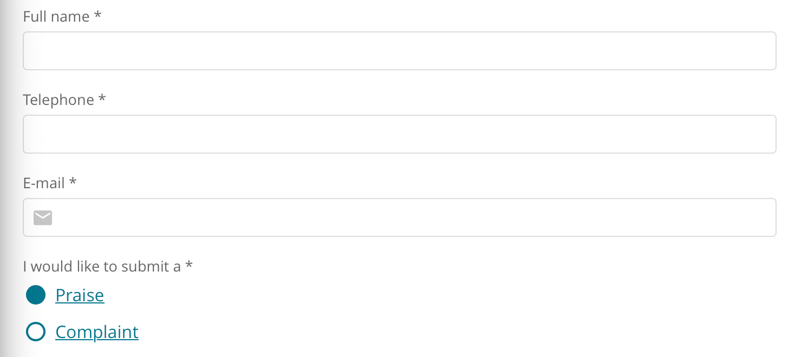
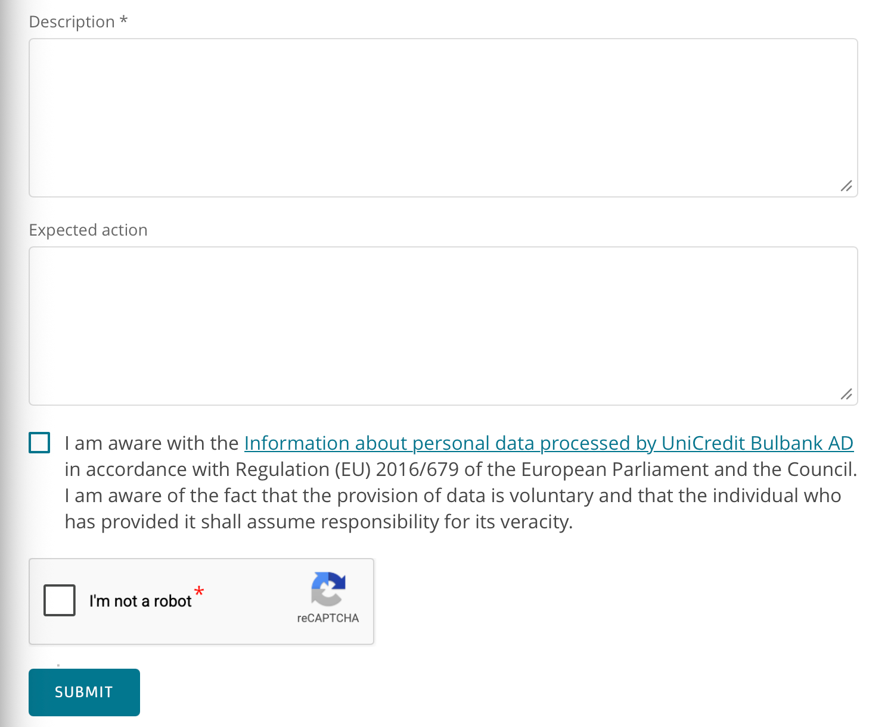

After submission, a minimal on-screen confirmation is displayed: "Thank you for your feedback! It was received by UniCredit Bulbank." with a "BACK" button. No reference number, no timeline, no next steps communicated. No acknowledgment email was received.

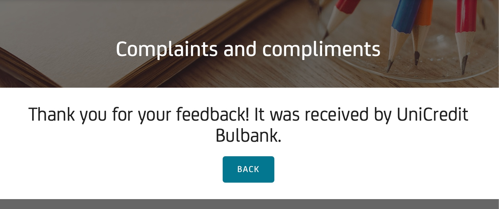

**Observable gaps relative to international benchmarks (see Section 3):**
- The KEP requirement for personal-data complaints makes the online channel effectively unusable for most real complaints
- No complaint submission from within Bulbank Mobile or Bulbank Online apps (app requires client activation — not tested due to no team member being a UCB client; no complaint functionality advertised in public feature listings)
- No visible real-time tracking or status updates for submitted complaints
- No chatbot or AI-assisted triage at the point of complaint entry
- No self-service resolution for common complaint categories

This stands in contrast to UniCredit Group's broader digital ambitions — the group has shifted **75%+ of retail transactions to digital channels**, invested **~EUR 5.5 billion** in Digital and Data initiatives (2022-2027), and partnered with Google Cloud across 13 markets.

#### Diagram: Current UCB Complaint Journey

UBB (KBC Group) and DSK Bank (OTP Group) were selected for local benchmarking because they are the only two direct competitors to UniCredit Bulbank in the Bulgarian market — together, these three banks constitute the top tier of the Bulgarian banking sector.

### 2.2 Local Competitor: United Bulgarian Bank (UBB)

UBB (part of KBC Group) is the third of the top-tier Bulgarian banks tested alongside UCB and DSK. **Tested 2026-04-09:**

- Structured web form (categories, file attachments up to 6MB, dual GDPR consent)
- On-screen confirmation with empathetic language and **legal 45-day response timeline**; no reference number provided
- No email acknowledgment observed (burner email caveat)
- Mobile app virtual assistant **redirects complaint queries to the web form** — same in-app gap as UCB and DSK

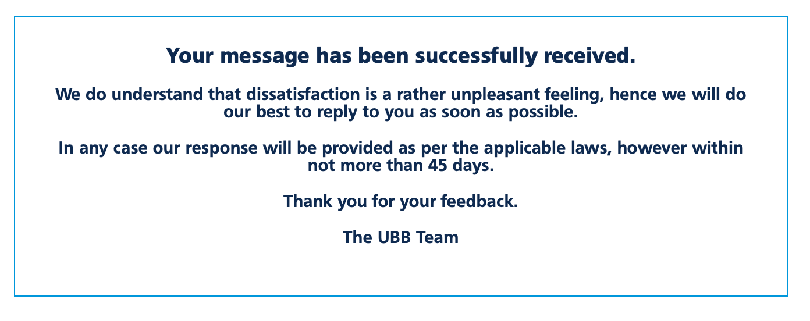

### 2.3 Local Competitor: DSK Bank (OTP Group)

DSK Bank offers the most complete digital complaint experience among the tested Bulgarian banks.

**Form CX analysis:**

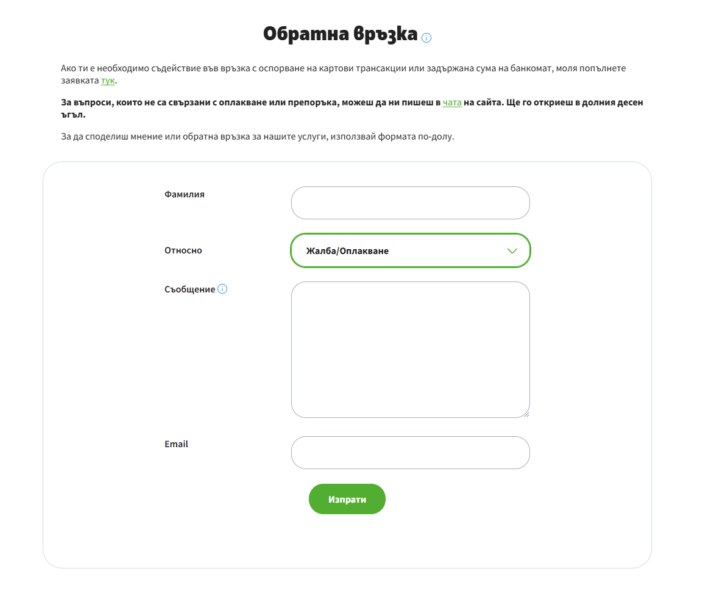

- Simple, minimal form: last name, category dropdown ("Жалба/Оплакване"), message body, email
- Separate dedicated link for card transaction disputes (directed to a different form)
- Pre-submission confirmation modal warns users: if it's not a complaint or recommendation, use other channels (website chat, DSK Direct, DSK Smart) instead
- Mentions website chat available in the bottom-right corner for non-complaint queries

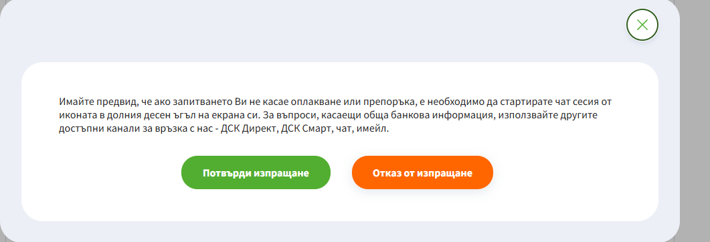

**Post-submission experience — two-email flow (tested 2026-04-09):**

**Email 1 (immediate):** Acknowledgment and triage information

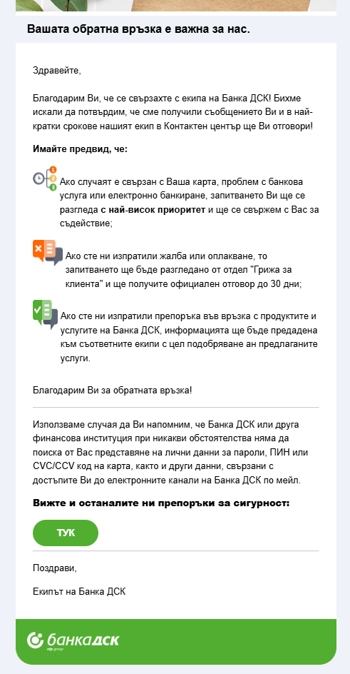

- Confirms receipt, says Contact Centre team will reply "in the shortest timeframes"
- Priority-based triage clearly explained with visual icons:
  - Card, banking service, or e-banking issues → **highest priority**, bank will proactively contact the customer
  - Complaints → reviewed by "Грижа за клиента" (Customer Care) department, **official response within 30 days**
  - Recommendations → forwarded to relevant teams for service improvement
- Security reminder: DSK will never ask for passwords, PINs, CVC/CVV codes by email
- Link to security recommendations page

**Email 2 (shortly after):** Reference number assignment

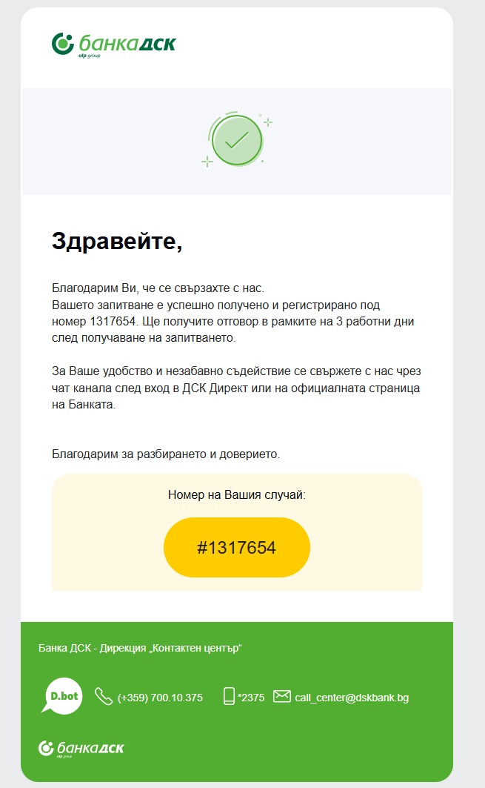

- Case registered under **reference number #1317654**
- Response timeline: **within 3 working days** of receiving the inquiry
- Points to chat via DSK Direct or the bank's website for faster assistance
- From "Банка ДСК - Дирекция Контактен център"
- Footer includes D.bot chatbot branding, phone (+359 700.10.375), short number (*2375), email (call_center@dskbank.bg)

**Key differentiators vs. other Bulgarian banks:**
- **Only Bulgarian bank tested that provides a reference number**
- **Only one with a two-email flow** — immediate acknowledgment + separate case registration
- **Priority triage communicated upfront** — client knows how their case will be handled before a human even reviews it
- **Shortest stated response time** among Bulgarian banks (3 working days vs. UBB's 45 days)
- **Mentions D.bot** — indicating chatbot capability exists in their ecosystem

**Actual resolution (received ~13 hours after submission):**

DSK Bank delivered a personalized email response approximately 13 hours after the complaint was submitted — the complaint was sent at 01:18 (Bulgarian time) and the response arrived at 14:01 the same day. This is significantly faster than their stated 3 working days SLA.

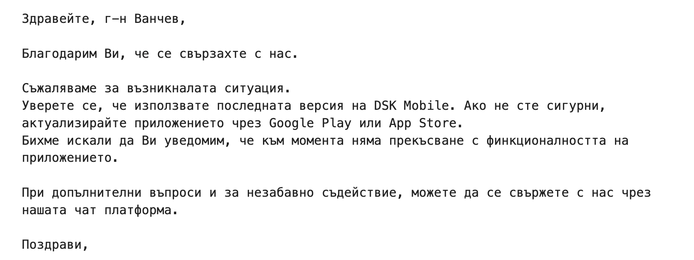

Key observations about the response:
- **Personalized salutation:** Addresses the client by surname ("Здравейте, г-н Ванчев") — not a generic template
- **Empathetic opening:** "Благодарим Ви, че се свързахте с нас. Съжаляваме за възникналата ситуация."
- **Actionable recommendation:** Asks to confirm the DSK Mobile app is on the latest version, with specific instructions (Google Play / App Store)
- **Proactive status update:** Informs that there is no current service interruption
- **Open follow-up channel:** Offers the chat platform for further questions
- **Signed off as:** "Поздрави, Екипът на Банка ДСК"

This represents the real-world performance of DSK's complaint handling — not just stated SLAs, but an actual human, personalized, under-SLA response.

**Mobile app / chatbot experience:**
- DSK has a virtual AI assistant (D.bot), but when asked "I want to file a complaint" it **directs the user to submit via the website** — the chatbot does not handle complaint intake itself. The assistant was also observed to be buggy during testing.

This means that despite DSK having the best post-submission experience among Bulgarian banks — including a faster-than-stated resolution time — the actual complaint *entry point* still requires leaving the app/chatbot and going to a separate web form. This is the fundamental gap shared by all three Bulgarian banks.

### 2.4 Bulgarian Banks — Local Comparison

| Aspect | UniCredit Bulbank | UBB | DSK Bank |
|---|---|---|---|
| Web complaint form | Yes (limited — see KEP note) | Yes | Yes |
| KEP required for personal data | **Yes** | No | No |
| Complaint categories | Not observed on form | Structured (cards, loans, etc.) | Dropdown (Жалба/Оплакване) |
| Card disputes separated | Unknown | Within categories | Yes — dedicated form |
| On-screen confirmation | Yes — minimal, no details | Yes, with timeline | Yes (via modal pre-submit) |
| Email acknowledgment | Not observed | Not received (burner email caveat) | Yes — immediate |
| Reference number | Not observed | Not provided | Yes — #1317654 |
| Response timeline stated | Yes — 85% within 3 days; 15/35 days legal (on website, not post-submit) | 45 days (on-screen) | 3 working days (email) / 30 days for complaints (email) |
| Actual response time (tested) | Not received | Not received (burner email caveat) | **~13 hours** — personalized, actionable |
| Priority triage communicated | No | No | Yes — visual icons in email |
| Escalation paths documented | Yes — ПКПС, КЗП, FIN-NET | Not on form | Not on form |
| Dedicated complaints team | Yes — "Централизирано управление на оплакванията" | Unknown | "Грижа за клиента" |
| File attachments | Unknown | Yes (6MB) | Not observed on form |
| GDPR consent | Unknown | Explicit dual consent | Not observed on form |
| Chatbot handles complaints | No | Redirects to web form | Redirects to web form (D.bot buggy) |
| Customer satisfaction program | Yes — 30k+ interviews/year, mystery shoppers | Unknown | Unknown |

DSK Bank's experience is notably closer to international standards — particularly the reference number, priority triage communication, and two-stage email flow. UBB provides a better form structure but weaker post-submission experience. UniCredit Bulbank has the most detailed publicly documented complaint process (response timelines, escalation paths, dedicated team), but the actual digital submission experience trails both competitors — and the KEP requirement for complaints involving personal data effectively forces most clients to visit a branch, making the online form a channel for generic feedback only.

All three Bulgarian banks still lack in-app complaint submission, real-time status tracking, and AI-assisted triage — the baseline set by international players (see Section 3).

---

## 3. International Benchmarks

### 3.1 Neobanks — Digital-First Complaint Handling

#### Revolut

- **Primary channel:** In-app chat (Profile > Help). The help menu surfaces common issue categories (Dispute transactions, Transfer status, Help with a card, etc.) with a search bar and a "Support — Tap to get help" entry point for live chat.
- **AI triage:** AI Chat assistant handles initial queries. When told "I want to submit a complaint", the chatbot immediately responds: *"You have the right to raise a formal complaint. Would you like me to connect you with a customer support agent to review your case?"* — recognizing complaint intent and offering human escalation in one step.
- **Alternative channels:** Online complaint form, email (`formalcomplaint@revolut.com`)
- **Timelines:** Written acknowledgment with estimated response time sent shortly after submission; resolution target of 15 business days (35 in exceptional circumstances)
- **Key innovation:** Complaint entry point is embedded in the same interface used for daily banking — zero friction to initiate. The client is already authenticated, so no identity verification is needed (contrast with UCB's KEP requirement).

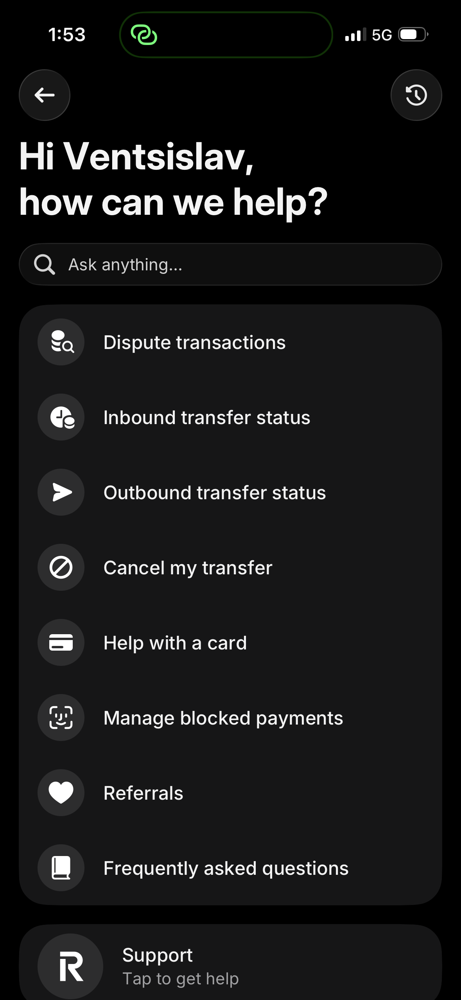
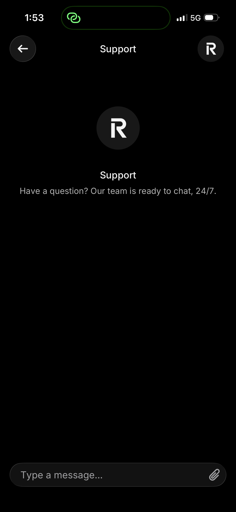
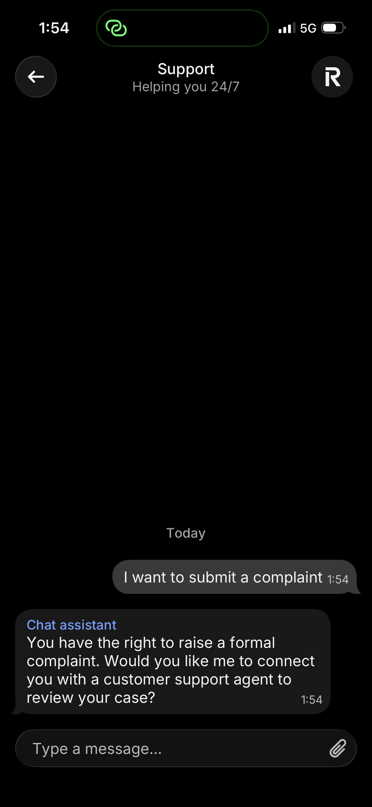

#### Monzo

- **Philosophy:** "When a customer isn't happy...we have an opportunity to impress the customer" — complaints as growth opportunities, not liabilities
- **Primary channel:** In-app chat, plus email, phone, and written correspondence
- **Timelines:** Acknowledgment within 3 business days; internal resolution target of 7 days (regulatory limit: 8 weeks)
- **Key innovations:**
  - **Specialist routing:** Complaints routed to domain experts (not a centralized complaints team), ensuring technical expertise matches the issue
  - **Personalization:** Financial redress for monetary impact; meaningful gestures (handwritten notes) for personal impact
  - **Feedback loop:** Complaint data drives product improvements (e.g., redesigned ATM limit screens after repeated confusion complaints)
  - **Radical transparency:** Defaults to public status updates even for issues affecting a minority of customers

### 3.2 DBS Bank (Singapore) — Best-in-Class AI Integration

- **DBS Joy (Corporate):** Gen AI-powered chatbot; managed 120,000+ unique chats since early trials began in February; cut waiting times, CSAT scores rose 23%
- **DBS Digibot (Consumer):** Virtual assistant on digibank app and web — answers questions, starts transactions, guides processes
- **CSO Assistant:** Gen AI co-pilot for customer service officers — real-time transcription, live knowledge base search, query-specific information retrieval
- **Escalation:** Complex cases auto-escalated from chatbot to specialist with full conversation context preserved
- **Key innovations:**
  - AI co-pilot for staff (not just customers), reducing Average Handle Time
  - Data protection, audit trails, and escalation processes built into the architecture for regulatory compliance
  - Progressive rollout across markets (Singapore > Hong Kong > India)

### 3.3 Comparison Matrix

| Capability | Revolut | Monzo | DBS | UCB | UBB | DSK Bank |
|---|---|---|---|---|---|---|
| In-app complaint | Yes | Yes | Yes | Web only | Web only | Web only |
| AI chatbot triage | Yes | No | Yes (Gen AI) | No | Redirects to web | Redirects to web |
| Status tracking | Yes | Yes | Yes | Not observed | No | No |
| Reference number | Yes | Yes | Yes | Not observed | No | **Yes** |
| Email acknowledgment | Yes | Yes | Yes | Not observed | Not received* | **Yes — 2 emails** |
| Resolution target | 15 days | 7 days** | Varies | Unknown | 45 days | 3 days / 30 days |
| AI co-pilot for staff | No | No | Yes (CSO) | No evidence | No evidence | No evidence |
| Omnichannel | High | High | High | Low | Low | Low-Medium |

*\* UBB: burner email used — email confirmation may have been sent but not received.*
*\*\* Monzo timelines sourced from 2017 blog post — may have changed.*

**Source confidence per column:**
- **Revolut:** Official help centre
- **Monzo:** Official blog (2017, 2020) — some details may be outdated
- **DBS (Singapore):** Mix of official newsroom and third-party conference article
- **UCB:** Firsthand testing + publicly available website information
- **UBB:** Fetched form page + firsthand testing (2026-04-09)
- **DSK Bank:** Firsthand testing (2026-04-09) — form screenshots + two confirmation emails received

---

## 4. Regulatory Framework

### 4.1 EU/EBA Requirements

The **EBA/ESMA Joint Committee Guidelines on Complaints Handling (JC 2018 35)** establish harmonized requirements across all EU financial institutions:

- **Complaints management policy** — must be documented and approved by senior management
- **Complaints management function** — dedicated organizational unit responsible for complaints
- **Registration** — all complaints must be registered, categorized, and tracked
- **Reporting** — regular reporting to competent authorities and/or ombudsman
- **Timelines** — acknowledgment and response within defined periods
- **Information to complainant** — clear communication about process, expected timeline, and escalation rights
- **Internal follow-up** — root cause analysis and systemic improvement

These guidelines apply to banks, investment firms, payment institutions (PSD2), and mortgage credit providers (MCD).

### 4.2 Bulgarian Regulatory Context

- **BNB (Bulgarian National Bank)** — primary banking supervisor; can impose supervisory measures or financial sanctions for breaches of the Payment Services and Payment Systems Act
- **Consumer Protection Commission (CPC)** — monitors lending practices, conducts market surveillance, issues fines; received ~1,600 complaints in January 2026 alone (mostly euro conversion related)
- **Payment Disputes Conciliation Commission** — free out-of-court dispute resolution, typically resolved within ~2 months
- **DORA (Digital Operational Resilience Act)** — requires robust ICT risk management frameworks, regular digital resilience tests, enhanced cybersecurity standards, and incident reporting protocols

### 4.3 Compliance Implications for Digital Complaints

A compliant digital system must register and categorize every complaint (EBA), acknowledge within a defined timeline, maintain audit trails for regulatory reporting, support escalation to BNB / CPC / Ombudsman, comply with GDPR, and meet DORA ICT resilience and incident-reporting requirements. Technology patterns and component choices that implement these obligations are detailed in **Task 3 — Technology Architecture**.

---

## 5. Proposal: Digital Complaint System for UniCredit Bulbank

Based on the international benchmarks and regulatory requirements, the following approach is proposed, combining the best elements from each reference.

**A key architectural insight from the current state analysis:** UniCredit Bulbank's online complaint form currently requires a Qualified Electronic Signature (KEP) for any complaint involving personal data or banking secrecy — which covers the vast majority of real complaints. This requirement exists because the web form cannot verify the client's identity. However, within Bulbank Mobile or Bulbank Online, the client is **already authenticated** through the app's login (biometrics, PIN, credentials). This means in-app complaint submission inherently solves the KEP problem — the client's identity is already established, removing the legal barrier that makes the current online channel unusable for substantive complaints. This alone is the single strongest argument for moving complaint handling into the banking app.

### 5.1 Core Principles
1. **Complaints as opportunities** — every complaint feeds back into product improvement *(inspired by Monzo's philosophy)*
2. **AI-first, human-always** — AI handles triage and routing, but human escalation is always one tap away *(inspired by Revolut + DBS)*
3. **Full transparency** — real-time status tracking, clear timelines, proactive updates *(inspired by Monzo's transparency commitment)*
4. **Omnichannel** — consistent experience across Bulbank Mobile, Bulbank Online, and branch (for those who still prefer it)

### 5.2 Tiered Handling Model

To comply with EBA guidelines (every complaint reviewed by the complaints management function) and UCB's own stated policy (specialized team handles each complaint), AI automation must not autonomously execute monetary or regulated actions. Instead, a **four-tier handling model** is proposed:

| Tier | Description | Example actions | Decision authority |
|---|---|---|---|
| **Tier A — Pure self-service (informational)** | Guidance or information retrieval; no change in bank state | Explaining a transaction, showing account details, answering procedural questions, guiding the user to a settings page | Chatbot (no bank action executed) |
| **Tier B — Safe reversible automation (client-initiated)** | Non-monetary, defensive, reversible actions that the client can already perform in the app; the chatbot just routes the intent | Temporary card block, notification preference change, statement download | Client (chatbot executes existing client-accessible operations) |
| **Tier C — AI-suggested, human-approved** | AI prepares a recommendation with full context; a specialist reviews and approves before any monetary or regulated action executes | Fee refund, goodwill compensation, dispute resolution, transaction reversal | Specialist (with AI Co-pilot assistance) |
| **Tier D — Full manual investigation** | High-stakes or regulated categories; no AI shortcut path | Fraud claims, credit disputes (ЗПК/ЗКНИП), payment service disputes (ЗПУПС), GDPR data subject requests, transaction disputes above a threshold | Specialist + possibly compliance / legal review |

**Why this tiered model is required:**
- EBA/ESMA Joint Committee Guidelines (JC 2018 35): *"Complaints management function — dedicated organizational unit responsible for complaints"* and *"all complaints must be registered, categorized, and tracked"*
- UCB's own stated policy: every complaint is reviewed by the specialized team "Централизирано управление на оплакванията"
- DORA audit-trail and risk-management obligations
- Anti-fraud: autonomous money movement by a chatbot is a fraud vector (prompt injection, social engineering)

### 5.3 Proposed Complaint Flow

1. **Initiation** — Client opens complaint from Bulbank Mobile/Online (Help > Complaints). AI chatbot collects initial details: category, description, and optional attachments
2. **Smart Categorization** — NLP engine auto-categorizes the complaint, assesses sentiment and urgency, and determines the applicable tier (A / B / C / D) *(inspired by Revolut's chatbot + DBS Digibot)*
3. **Tier A/B handling** — If the intent can be resolved by information or safe client-initiated action, the chatbot provides the answer / executes the client-level action. The interaction is **logged as a support case** (not as a formal complaint) but still captured for analytics
4. **Formal complaint registration** — For Tier C and Tier D intents (and any Tier A/B case where the client opts for a formal complaint), the complaint is formally registered with a reference number, category, priority, and timestamps
5. **Acknowledgment** — Client receives an instant acknowledgment via **both in-app message + email** — reference number, estimated resolution timeline, assigned handler info *(addresses the gap observed in UniCredit Bulbank's current web form, and matches DSK Bank's two-channel approach)*
6. **Routing** — Complaint routed to domain specialist (not a generic complaints team) *(inspired by Monzo's specialist routing)*. AI co-pilot assembles full customer context, similar past cases, and suggested resolution paths for the specialist *(inspired by DBS CSO Assistant)*
7. **Investigation** — Specialist investigates with the AI Co-pilot's context assembly. Client receives proactive status updates via **push notification + email**. If additional information is needed, the specialist requests it through the app (push + email)
8. **Specialist decision** — Specialist approves or rejects the AI Co-pilot's suggested resolution (Tier C), or formulates their own resolution from scratch (Tier D). All decisions, approvals, and rationale are recorded for audit
9. **Resolution delivery** — Official response delivered via **in-app message + email** with explanation, actions taken, and compensation details (if applicable). If monetary compensation applies, the system executes the transaction only after the specialist's explicit approval
10. **Client response** — Client can accept, request clarification, or escalate
11. **Escalation** — If unresolved: internal review by manager → BNB / CPC / Payment Disputes Conciliation Commission / FIN-NET. All escalation paths accessible from within the app *(required by EBA guidelines + Bulgarian regulatory framework)*
12. **Feedback Loop** — Post-resolution survey. Complaint data aggregated for trend analysis, feeding into product and process improvements *(inspired by Monzo's continuous improvement model)*

**Client-facing confirmation channels (on every touchpoint):**
- **In-app message** — primary, authenticated, visible in complaint history
- **Email** — delivery confirmation, external record, works even if the app is uninstalled (matches DSK Bank's email-based acknowledgment model)
- **Push notification** — real-time awareness, triggers client attention

#### Diagram: Proposed Complaint Flow

```mermaid
flowchart TD
    Client([Client in Bulbank Mobile/Online<br/>— already authenticated])

    Client --> Initiate[Opens Help > Complaints]
    Initiate --> Chatbot[AI Chatbot collects:<br/>Category, description, attachments]

    Chatbot --> NLP[NLP: categorization, sentiment,<br/>urgency, tier determination]
    NLP --> Tier{Tier?}

    Tier -->|Tier A<br/>informational| TierA[Chatbot provides info<br/>or guidance<br/>No bank action]
    Tier -->|Tier B<br/>safe client-initiated| TierB[Chatbot executes<br/>client-level action<br/>e.g. card block]
    Tier -->|Tier C<br/>AI-suggested| Register
    Tier -->|Tier D<br/>full manual| Register

    TierA --> LogCase[Log as support case<br/>for analytics]
    TierB --> LogCase
    LogCase --> OfferFormal{Client wants<br/>formal complaint?}
    OfferFormal -->|No| Feedback
    OfferFormal -->|Yes| Register

    Register[Formal complaint registered<br/>ref#, category, priority, timestamps]
    Register --> Ack[📧📱 Acknowledgment<br/>in-app + email + push<br/>ref#, timeline, handler]

    Ack --> Route[Route to domain specialist]
    Route --> CoPilot[AI Co-pilot assembles context<br/>profile, transactions, past cases,<br/>suggested resolution]

    CoPilot --> Investigate[Specialist investigates]
    Investigate --> NeedInfo{Need more<br/>info from client?}
    NeedInfo -->|Yes| RequestInfo[📧📱 Request via<br/>in-app + email + push]
    RequestInfo --> ClientProvides[Client provides info]
    ClientProvides --> Investigate

    NeedInfo -->|No| SpecDecision[Specialist decides:<br/>approve AI suggestion Tier C<br/>or formulate own Tier D]

    SpecDecision --> ExecAction{Monetary /<br/>regulated action?}
    ExecAction -->|Yes| ExecWithApproval[Specialist explicitly approves;<br/>system executes + logs to audit]
    ExecAction -->|No| Response
    ExecWithApproval --> Response

    Response[📧📱 Response via in-app + email + push]

    Response --> ClientResp{Client response}
    ClientResp -->|Accepts| Feedback
    ClientResp -->|Wants clarification| Investigate
    ClientResp -->|Escalates| Internal[Internal review<br/>by manager]

    Internal --> MgrDecision{Manager new decision}
    MgrDecision -->|Client accepts| Feedback
    MgrDecision -->|Client still unhappy| External[External escalation:<br/>BNB / CPC / ПКПС / FIN-NET]

    External --> Feedback
    Feedback([Post-resolution survey<br/>→ trend analysis<br/>→ product improvements])

    style Client fill:#d4edda,stroke:#28a745
    style Feedback fill:#cce5ff,stroke:#007bff
    style External fill:#ffcccc,stroke:#cc0000
    style ExecWithApproval fill:#d4edda,stroke:#28a745
    style SpecDecision fill:#d4edda,stroke:#28a745
    style Tier fill:#fff3cd,stroke:#ffc107
    style ExecAction fill:#fff3cd,stroke:#ffc107
```

---

## 6. Sources

### Official / Institutional Sources
- [Revolut — How can I file a complaint?](https://help.revolut.com/help/more/legal-topics/how-do-i-complain/)
- [Revolut's AI Assistant (Rita)](https://www.revolut.com/legal/rita-disclaimer/)
- [Monzo — Complaints at Monzo (Aug 2017)](https://monzo.com/blog/2017/08/09/complaints-at-monzo) — directly fetched
- [Monzo — Customer Support Design (Nov 2020)](https://monzo.com/blog/2020/11/11/customer-support-design)
- [DBS Newsroom — Gen AI chatbot rollout](https://www.dbs.com/newsroom/DBS_rolls_out_Gen_AI_powered_chatbot_to_all_corporate_clients)
- [DBS Newsroom — CSO Assistant](https://www.dbs.com/newsroom/DBS_empowers_its_Customer_Service_Officers_with_Gen_AI_powered_virtual_assistant_to_reduce_toil_and_enhance_customer_experience)
- [DBS Digibot page](https://www.dbs.com.sg/personal/deposits/bank-with-ease/digibot)
- [EBA — Joint Committee Guidelines on Complaints Handling](https://www.eba.europa.eu/legacy/regulation-and-policy/regulatory-activities/consumer-protection-and-financial-innovation-10)
- [EBA — Updates to Joint Committee Guidelines](https://www.eba.europa.eu/publications-and-media/press-releases/eba-updates-joint-committee-guidelines-complaints-handling)
- [UniCredit Bulbank — Complaints and Compliments](https://www.unicreditbulbank.bg/en/contacts/feedback/complaints-and-compliments/) — 403 on direct fetch; info from search snippet
- [UniCredit — Digital & Data Strategy](https://www.unicreditgroup.eu/en/business/digital-and-data.html)
- [UniCredit — Unlocked Strategic Plan](https://www.unicreditgroup.eu/en/press-media/press-releases-price-sensitive/2021/unicredit-unlocked--2022-2024-strategic-plan--empowering-communi.html)
- [UniCredit Partners with Google Cloud (May 2025)](https://www.googlecloudpresscorner.com/2025-05-12-UniCredit-Partners-with-Google-Cloud-to-Accelerate-Digital-Transformation-Across-13-Markets)

### Third-party / News Sources
- [DBS rolls out Gen AI chatbot (Fortune, Nov 2025)](https://fortune.com/2025/11/10/dbs-joy-rolls-out-gen-ai-chatbot/)
- [DBS AI Chatbots (Conversational Tech Summit Asia)](https://conversationaltechsummitasia.com/how-dbs-bank-transformed-customer-experience-with-ai-chatbots/)
- [Banking Regulation 2026 — Bulgaria (Chambers and Partners)](https://practiceguides.chambers.com/practice-guides/banking-regulation-2026/bulgaria) — directly fetched
- [Bulgaria Consumer Protection — 1600 complaints (Sofia Globe, Jan 2026)](https://sofiaglobe.com/2026/01/14/bulgarias-consumer-protection-body-1600-complaints-in-a-week-mainly-about-breaches-of-euro-law/)
- [BitBang — How UniCredit Drives Continuous Improvement](https://bitbang.com/stories/customer-experience-2/how-unicredit-drives-continuous-improvement-in-digital-experience/)
- [BPM in Banking (ProcessMaker whitepaper)](https://www.processmaker.com/wp-content/uploads/2016/03/White-Paper-BPM-in-Banking.pdf)
- [Microservices Architecture in Banking (Surf)](https://surf.dev/microservices-architecture-in-banking/)
- [BPM in Banking with Low-Code (Kissflow)](https://kissflow.com/solutions/banking/bpm-in-banking-with-low-code-solutions)

### Firsthand Testing
- UniCredit Bulbank online complaint form — tested 2026-04-09; submission completed, no immediate on-screen confirmation or acknowledgment email observed at time of writing
- UBB online feedback/complaint form — tested 2026-04-09; on-screen confirmation displayed immediately with empathetic messaging and 45-day response timeline; no reference number provided; no email confirmation received (caveat: burner email used). Mobile app virtual assistant redirects complaint queries to the web form.
- DSK Bank online feedback form — tested 2026-04-09; two acknowledgment emails received: (1) immediate acknowledgment with priority triage explanation and 30-day complaint timeline, (2) reference number #1317654 assigned with 3-working-day response commitment. **Actual personalized response received ~13 hours after submission** (complaint sent 01:18, response received 14:01 same day) — well under the stated SLA. D.bot chatbot does not handle complaints — directs users to website; chatbot observed to be buggy.
