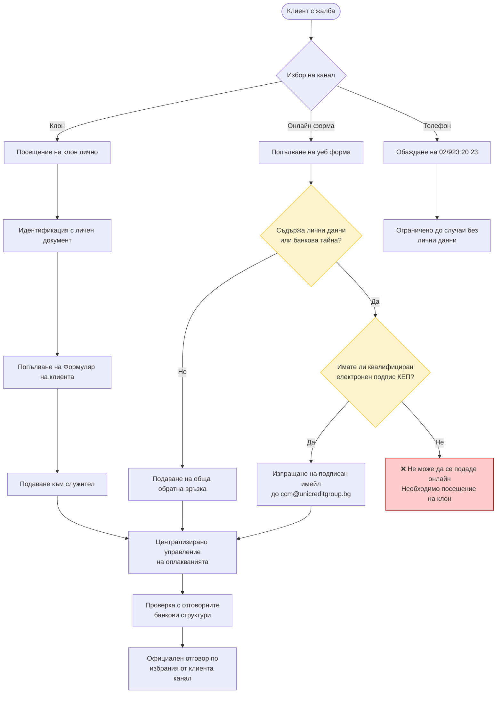
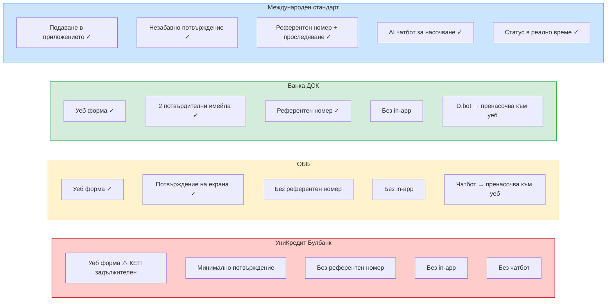
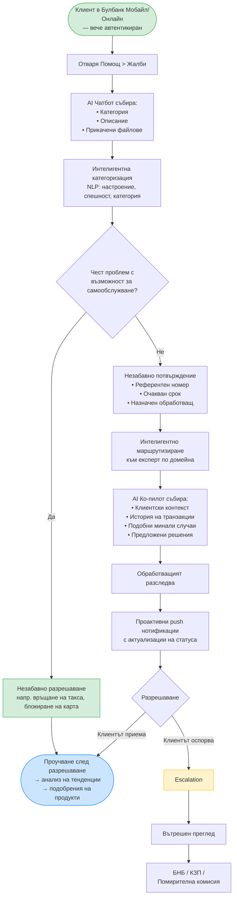

# Задача 1: Проучване — Дигитално управление на жалби в банкирането

## 1. Въведение

Настоящото проучване разглежда най-добрите практики за дигитализация на процеса по управление на жалби в банкирането, като използва опита на международни лидери (необанки и традиционни банки), за да предложи иновативно решение за пазара на УниКредит Булбанк в България. Целта е проектиране на изцяло дистанционен дигитален процес за подаване и обработка на жалби.

---

## 2. Текущо състояние: УниКредит Булбанк

УниКредит Булбанк предлага множество канали за подаване на жалби, описани подробно на страницата „Оплаквания и похвали":

**Налични канали:**
- **В клон:** Лично или чрез упълномощен представител, след идентифициране. Жалбата трябва да бъде подадена в писмен вид с попълнен „Формуляр на клиента" (може да бъде изтеглен предварително или получен на място).
- **Онлайн:** Уеб форма за обратна връзка или имейл до `ccm@unicreditgroup.bg`.
- **По телефон:** 02/923 20 23
- **По пощата:** София, пл. „Света Неделя" 7

**Критично ограничение за онлайн/имейл жалби:** Банката изрично заявява, че **не разглежда жалби, които предполагат ползване на лични данни (по ЗЗЛД) или банкова тайна (по ЗКИ)**, когато са изпратени чрез онлайн формата или имейл — **освен ако имейлът не е подписан с квалифициран електронен подпис (КЕП)**. Това означава, че повечето реални жалби (свързани с транзакции, информация по сметки и т.н.) **изискват или посещение на клон, или КЕП**, правейки онлайн формата използваема само за обща обратна връзка, която не засяга лични или банкови данни.

**Обработка на жалби:**
- Всяка жалба се разглежда от специализиран екип — „Централизирано управление на оплакванията" — който извършва детайлна проверка със съдействието на отговорните банкови структури и предоставя официално становище на банката по избрания от клиента канал
- Всеки казус се разглежда индивидуално

**Срокове за отговор:**
- **85% от случаите** се разрешават в рамките на **3 работни дни**
- Жалби по платежни услуги (по ЗПУПС): **15 работни дни**, с възможност за удължаване до **35 работни дни**
- Жалби по потребителски кредити / ипотеки: **30 дни**

**Пътища за ескалация:**
- Помирителна комисия за платежни спорове (ПКПС) — за спорове по платежни услуги, потребителски кредити и ипотечни кредити
- Комисия за защита на потребителите (КЗП) — София, пл. „Славейков" 4, тел. 02/9330565
- FIN-NET — за презгранични финансови спорове с клиенти от други държави-членки на ЕС

**Програма за клиентска удовлетвореност:**
- Над 30 000 персонални интервюта годишно с индивидуални и бизнес клиенти
- Програма „Таен клиент" за проследяване качеството на обслужване
- Проучвания сред служителите

**Тестване от първо лице (09.04.2026):**

Онлайн формата събира: Пълно име, Телефон, Имейл, тип (Похвала/Оплакване — радио бутони), Описание, Очаквано действие. Изисква се съгласие за обработка на лични данни и reCAPTCHA.

След подаването се показва минимално потвърждение на екрана: „Thank you for your feedback! It was received by UniCredit Bulbank." с бутон „BACK". Без референтен номер, без срокове, без информация за следващи стъпки. Не е получен потвърдителен имейл.

**Наблюдавани пропуски спрямо международните стандарти (виж Раздел 3):**
- Изискването за КЕП при жалби, свързани с лични данни, прави онлайн канала практически неизползваем за повечето реални жалби
- Няма подаване на жалби от Булбанк Мобайл или Булбанк Онлайн (приложението изисква активация като клиент — не е тествано, тъй като никой от екипа не е клиент на УКБ; няма рекламирана функция за жалби в публичните описания на приложението)
- Няма видимо проследяване в реално време или актуализация на статуса на подадени жалби
- Няма чатбот или AI-подпомогнато насочване при подаване на жалба
- Няма възможност за самообслужване при често срещани категории жалби

Това контрастира с по-широките дигитални амбиции на групата UniCredit — групата е прехвърлила **над 75% от транзакциите на дребно към дигитални канали**, инвестирала е **~5,5 млрд. евро** в дигитални и данни инициативи (2022-2027) и е партньор на Google Cloud в 13 пазара.

#### Диаграма: Текущ процес на жалба в УКБ

ОББ (KBC Group) и Банка ДСК (OTP Group) бяха избрани за локален бенчмарк, тъй като са единствените двама преки конкуренти на УниКредит Булбанк на българския пазар — заедно тези три банки съставляват водещата тройка в българския банков сектор.

### 2.2 Локален конкурент: Обединена българска банка (ОББ)

ОББ (част от KBC Group) предлага уеб-базирана форма за обратна връзка с по-структурирано изживяване при подаване на жалби в сравнение с УниКредит Булбанк:

**Анализ на формата от CX перспектива (наблюдение без подаване):**
- Потребителят избира тип идентичност (физическо лице / юридическо лице) и клиентски статус
- Категориите на жалби са конкретни: оспорване на картови транзакции, парични преводи, депозити/сметки, комунални плащания, лични данни, кредитен регистър, застраховки, кредити, онлайн/мобилно банкиране
- Задължителни полета: описание (макс. 3 000 символа), ЕГН или клиентски номер, телефон, име, имейл
- Поддържа прикачване на файлове: .doc, .docx, .pdf, .jpg, .png, .bmp (до 6MB)
- Наличен е шаблон за жалба за изтегляне
- Два задължителни чекбокса за GDPR съгласие
- Няма информация за срокове за отговор или пътища за ескалация на самата форма

**Изживяване след подаване (тествано 09.04.2026):**

- Потвърждение на екрана: „Your message has been successfully received."
- Емпатичен език: „We do understand that dissatisfaction is a rather unpleasant feeling, hence we will do our best to reply to you as soon as possible."
- **Изрично заявен законов срок: отговор в рамките на не повече от 45 дни**
- Подписано от „The UBB Team"
- Не е предоставен референтен номер или линк за проследяване
- Не е получен имейл за потвърждение (забележка: тестът е с временен имейл — може да не е представително)

**Мобилно приложение / чатбот:**
- ОББ разполага с виртуален асистент (чатбот), но при запитване за жалба **пренасочва потребителя към онлайн уеб формата** — няма начин да се подаде жалба в самото приложение

### 2.3 Локален конкурент: Банка ДСК (OTP Group)

Банка ДСК предлага най-пълноценното дигитално изживяване при жалби сред тестваните български банки.

**Анализ на формата:**

- Проста, минимална форма: фамилия, падащо меню за категория („Жалба/Оплакване"), текст на съобщението, имейл
- Отделен специализиран линк за оспорване на картови транзакции (насочва към различна форма)
- Модал за потвърждение преди изпращане, който предупреждава: ако запитването не е жалба или препоръка, да се използват други канали (чат на сайта, ДСК Директ, ДСК Смарт)
- Споменава наличен уебсайт чат в долния десен ъгъл за запитвания, различни от жалби

**Изживяване след подаване — двуетапен имейл процес (тествано 09.04.2026):**

**Имейл 1 (незабавен):** Потвърждение и информация за приоритизиране

- Потвърждение за получаване, посочва че екипът на Контактен център ще отговори „в най-кратки срокове"
- Приоритетно насочване, ясно обяснено с визуални икони:
  - Проблеми с карта, банкова услуга или електронно банкиране → **най-висок приоритет**, банката ще се свърже проактивно с клиента
  - Жалби → разглеждане от отдел „Грижа за клиента", **официален отговор до 30 дни**
  - Препоръки → препращане към съответните екипи за подобряване на услугите
- Напомняне за сигурност: ДСК никога няма да поиска пароли, ПИН или CVC/CVV кодове по имейл
- Линк към препоръки за сигурност

**Имейл 2 (малко след първия):** Присвояване на референтен номер

- Случаят е регистриран под **референтен номер #1317654**
- Срок за отговор: **в рамките на 3 работни дни** от получаване на запитването
- Насочване към чат канала чрез ДСК Директ или уебсайта на банката за по-бързо съдействие
- От „Банка ДСК - Дирекция Контактен център"
- В подписа: D.bot чатбот брандинг, телефон (+359 700.10.375), кратък номер (*2375), имейл (call_center@dskbank.bg)

**Ключови отличия спрямо другите български банки:**
- **Единствената тествана българска банка, която предоставя референтен номер**
- **Единствената с двуетапен имейл процес** — незабавно потвърждение + отделна регистрация на случая
- **Приоритизирането е комуникирано предварително** — клиентът знае как ще бъде обработена жалбата му, преди човек да я е прегледал
- **Най-краткият заявен срок за отговор** сред българските банки (3 работни дни спрямо 45 дни на ОББ)
- **Споменава D.bot** — индикация за наличие на чатбот в екосистемата

**Мобилно приложение / чатбот:**
- ДСК разполага с виртуален AI асистент (D.bot), но при заявка „Искам да подам жалба" **насочва потребителя да подаде чрез уебсайта** — чатботът не обработва жалби сам. Асистентът беше забелязан и да работи нестабилно по време на тестването.

Това означава, че въпреки най-доброто изживяване след подаване сред българските банки, действителната *входна точка* за жалби при ДСК все още изисква напускане на приложението/чатбота и отиване към отделна уеб форма — същият фундаментален пропуск, споделен и от трите български банки.

### 2.4 Български банки — Локално сравнение

| Аспект | УниКредит Булбанк | ОББ | Банка ДСК |
|---|---|---|---|
| Уеб форма за жалби | Да (ограничена — виж KEP) | Да | Да |
| Изискване за КЕП при лични данни | **Да** | Не | Не |
| Категории на жалби | Не е наблюдавано | Структурирани (карти, кредити и др.) | Падащо меню (Жалба/Оплакване) |
| Отделяне на картови спорове | Неизвестно | В рамките на категориите | Да — отделна форма |
| Потвърждение на екрана | Да — минимално, без детайли | Да, със срок | Да (модал преди подаване) |
| Имейл потвърждение | Не е наблюдавано | Не е получено (временен имейл) | Да — незабавно |
| Референтен номер | Не е наблюдаван | Не е предоставен | Да — #1317654 |
| Заявен срок за отговор | Да — 85% до 3 дни; 15/35 дни (на сайта, не след подаване) | 45 дни (на екрана) | 3 раб. дни (имейл) / 30 дни за жалби |
| Комуникация на приоритет | Не | Не | Да — визуални икони в имейл |
| Документирани ескалации | Да — ПКПС, КЗП, FIN-NET | Не на формата | Не на формата |
| Специализиран екип за жалби | Да — „Централизирано управление на оплакванията" | Неизвестно | „Грижа за клиента" |
| Прикачване на файлове | Неизвестно | Да (6MB) | Не е наблюдавано |
| GDPR съгласие | Неизвестно | Изрично двойно съгласие | Не е наблюдавано |
| Чатбот обработва жалби | Не | Пренасочва към уеб | Пренасочва към уеб (D.bot нестабилен) |
| Програма за удовлетвореност | Да — 30к+ интервюта/год., тайни клиенти | Неизвестно | Неизвестно |

Изживяването при Банка ДСК е забележимо по-близо до международните стандарти — особено референтният номер, комуникацията на приоритета и двуетапният имейл процес. ОББ предлага по-добра структура на формата, но по-слабо изживяване след подаване. УниКредит Булбанк има най-детайлно публично документиран процес (срокове, ескалации, специализиран екип), но реалното дигитално изживяване при подаване изостава от двата конкурента — а изискването за КЕП при жалби с лични данни на практика принуждава повечето клиенти да посетят клон, правейки онлайн формата канал само за обща обратна връзка.

И трите български банки все още нямат подаване на жалби в приложението, проследяване в реално време и AI-подпомогнато насочване — базовият стандарт, поставен от международните играчи (виж Раздел 3).

#### Диаграма: Български банки — Дигитална зрелост при жалби

---

## 3. Международни еталони

### 3.1 Необанки — дигитален подход към жалби

#### Revolut

- **Основен канал:** Чат в приложението (Профил > Помощ). Менюто за помощ показва категории на чести проблеми (Оспорване на транзакции, Статус на превод, Помощ с карта и др.) с поле за търсене и бутон „Support — Tap to get help" за жив чат.
- **AI насочване:** AI чат асистент обработва първоначалните запитвания. При съобщение „I want to submit a complaint" чатботът незабавно отговаря: *„You have the right to raise a formal complaint. Would you like me to connect you with a customer support agent to review your case?"* — разпознава намерението за жалба и предлага ескалация към човек в една стъпка.
- **Алтернативни канали:** Онлайн форма за жалби, имейл (`formalcomplaint@revolut.com`)
- **Срокове:** Писмено потвърждение с очакван срок за отговор, изпратено веднага след подаване; цел за разрешаване — 15 работни дни (35 при извънредни обстоятелства)
- **Ключова иновация:** Входната точка за жалби е вградена в същия интерфейс, използван за ежедневно банкиране — нулево триене при иницииране. Клиентът вече е автентикиран, така че не е необходима допълнителна проверка на самоличността (контраст с изискването за КЕП при УКБ).

#### Monzo

- **Философия:** „When a customer isn't happy...we have an opportunity to impress the customer" — жалбите като възможности за растеж, не като задължения
- **Основен канал:** Чат в приложението, плюс имейл, телефон и писмена кореспонденция
- **Срокове:** Потвърждение в рамките на 3 работни дни; вътрешна цел за разрешаване — 7 дни (регулаторен лимит: 8 седмици)
- **Ключови иновации:**
  - **Специализирано насочване:** Жалбите се насочват към експерти по домейни (не към централизиран екип за жалби), осигурявайки съответствие между техническата експертиза и проблема
  - **Персонализация:** Финансово обезщетение при парична загуба; смислени жестове (ръчно написани бележки) при лично въздействие
  - **Обратна връзка:** Данните от жалби движат подобрения на продукти (напр. редизайн на екрана за лимити на АТМ след повтарящи се оплаквания за объркване)
  - **Радикална прозрачност:** Публикуват статус актуализации по подразбиране дори за проблеми, засягащи малцинство от клиентите

### 3.2 DBS Bank (Сингапур) — Водещ клас в AI интеграцията

- **DBS Joy (Корпоративен):** Gen AI чатбот; обработил 120 000+ уникални чатове от началото на пилотните тестове; намалил времето за чакане, оценките за клиентска удовлетвореност (CSAT) са се повишили с 23%
- **DBS Digibot (Потребителски):** Виртуален асистент в digibank приложението и уеб — отговаря на въпроси, инициира транзакции, насочва процеси
- **CSO Assistant:** Gen AI ко-пилот за служители в обслужването — транскрипция в реално време, живо търсене в базата знания, извличане на информация специфична за запитването
- **Ескалация:** Сложните случаи автоматично се ескалират от чатбота към специалист с пълен контекст на разговора
- **Ключови иновации:**
  - AI ко-пилот за персонала (не само за клиентите), намаляващ средното време за обработка
  - Защита на данните, одитни пътеки и процеси за ескалация, вградени в архитектурата за регулаторно съответствие
  - Постепенно разгръщане по пазари (Сингапур > Хонг Конг > Индия)

### 3.3 Сравнителна матрица

| Възможност | Revolut | Monzo | DBS | УКБ | ОББ | Банка ДСК |
|---|---|---|---|---|---|---|
| Жалба в приложението | Да | Да | Да | Само уеб | Само уеб | Само уеб |
| AI чатбот за насочване | Да | Не | Да (Gen AI) | Не | Пренасочва | Пренасочва |
| Категоризация | Чрез чатбот | Чрез чатбот | Чрез чатбот | Не е набл. | Структурирана | Падащо меню |
| Проследяване на статус | Да | Да | Да | Не е набл. | Не | Не |
| Потвърждение на екрана | Да | Да | Да | Да (минимално) | Да + срок | Да (модал) |
| Референтен номер | Да | Да | Да | Не е набл. | Не | **Да** |
| Имейл потвърждение | Да | Да | Да | Не е набл. | Не е получено* | **Да — 2 имейла** |
| Скорост на потвърждение | Незабавно | 3 дни** | Незабавно | Не е набл. | Незабавно | Незабавно |
| Целеви срок | 15 дни | 7 дни** | Различен | Неизвестен | 45 дни | 3 дни / 30 дни |
| Показване на приоритет | Не | Не | Не | Не | Не | **Да** |
| Прикачване на файлове | Чрез чат | Чрез чат | Чрез чат | Неизвестно | Да (6MB) | Не е набл. |
| Подобрения от жалби | Да | Да (ядро) | Да | Без данни | Без данни | Без данни |
| AI ко-пилот за персонал | Не | Не | Да (CSO) | Без данни | Без данни | Без данни |
| Омниканалност | Висока | Висока | Висока | Ниска | Ниска | Ниска-Средна |

*\* ОББ: използван временен имейл — потвърждение може да е изпратено, но неполучено.*
*\*\* Сроковете на Monzo са от блог пост от 2017 г. — възможно е да са се променили.*

**Степен на достоверност по колони:**
- **Revolut:** Официален помощен център + тестване от първо лице
- **Monzo:** Официален блог (2017, 2020) — някои детайли може да са остарели
- **DBS (Сингапур):** Микс от официална прессъобщения и конферентна статия
- **УКБ:** Тестване от първо лице + публично достъпна информация от уебсайта
- **ОББ:** Анализ на формата + тестване от първо лице (09.04.2026)
- **Банка ДСК:** Тестване от първо лице (09.04.2026) — скрийншоти + два потвърдителни имейла

---

## 4. Регулаторна рамка

### 4.1 Изисквания на ЕС/EBA

**Съвместните насоки на EBA/ESMA за обработка на жалби (JC 2018 35)** установяват хармонизирани изисквания за всички финансови институции в ЕС:

- **Политика за управление на жалби** — трябва да бъде документирана и одобрена от висшето ръководство
- **Функция за управление на жалби** — специализирано организационно звено, отговорно за жалбите
- **Регистрация** — всички жалби трябва да бъдат регистрирани, категоризирани и проследявани
- **Отчетност** — редовно докладване до компетентни органи и/или омбудсман
- **Срокове** — потвърждение и отговор в рамките на определени периоди
- **Информация за жалбоподателя** — ясна комуникация за процеса, очаквания срок и права за ескалация
- **Вътрешно проследяване** — анализ на първопричините и системни подобрения

Тези насоки се прилагат за банки, инвестиционни посредници, платежни институции (PSD2) и доставчици на ипотечни кредити (MCD).

### 4.2 Български регулаторен контекст

- **БНБ (Българска народна банка)** — основен банков надзорник; може да налага надзорни мерки или финансови санкции при нарушения на Закона за платежните услуги и платежните системи
- **Комисия за защита на потребителите (КЗП)** — следи кредитните практики, провежда пазарен надзор, налага глоби; получила ~1 600 жалби само през януари 2026 г. (предимно свързани с конвертирането към евро)
- **Помирителна комисия за платежни спорове** — безплатно извънсъдебно решаване на спорове, обикновено в рамките на ~2 месеца
- **DORA (Акт за дигитална оперативна устойчивост)** — изисква стабилни рамки за управление на ИКТ рисковете, редовни тестове за дигитална устойчивост, подобрени стандарти за киберсигурност и протоколи за докладване на инциденти

### 4.3 Регулаторни изисквания към дигитална система за жалби

Всяка дигитална система за жалби трябва:
1. Да регистрира и категоризира всяка жалба (изискване на EBA)
2. Да предоставя потвърждение в определен срок
3. Да поддържа одитни пътеки за регулаторна отчетност
4. Да поддържа ескалация към БНБ / КЗП / Омбудсман
5. Да спазва GDPR за обработка на лични данни
6. Да отговаря на изискванията на DORA за ИКТ устойчивост и докладване на инциденти

---

## 5. Технологични модели за дигитални системи за жалби

### 5.1 Архитектурни подходи

Съвременните системи за управление на жалби в банкирането следват тези модели:

- **Микросервизна архитектура** — независими услуги за приемане, маршрутизиране, управление на случаи, нотификации и анализ; позволява независимо мащабиране и внедряване
- **Архитектура, управлявана от събития** — стрийминг платформи (напр. Apache Kafka) за поток от данни в реално време между услугите
- **Оркестрация на работни процеси** — двигатели като Camunda Zeebe за автоматизация на процеси, прилагане на SLA, крайни срокове, повторни опити и стъпки за човешко одобрение
- **Управление на случаи** — всяка жалба като „случай" с пълно проследяване на жизнения цикъл, прикачване на документи, история на статуса и одитна пътека

### 5.2 Ключови технологични компоненти

| Компонент | Предназначение | Примерни технологии |
|---|---|---|
| Двигател за процеси | Оркестрация, прилагане на SLA | Camunda, Flowable, Activiti |
| Управление на случаи | Проследяване жизнения цикъл на жалбата | Собствен микросервиз, Salesforce Service Cloud |
| AI/NLP | Категоризация, анализ на настроения, чатбот | OpenAI/Claude API, собствени NLP модели |
| Нотификации | Многоканални известия (push, имейл, SMS) | Firebase, Twilio, собствен сервиз |
| API Gateway | Единна входна точка, автентикация, ограничаване | Kong, AWS API Gateway |
| Документно хранилище | Прикачени файлове, архивиране за съответствие | S3, MinIO |
| Анализ | Тенденции в жалбите, мониторинг на SLA, табла | ELK Stack, Grafana, собствен BI |

### 5.3 Интеграционни точки

Дигитална система за жалби за УниКредит Булбанк би се интегрирала с:
- **Булбанк Мобайл / Булбанк Онлайн** — потребителски интерфейс за подаване на жалби, вграден в съществуващите канали
- **Основна банкова система** — идентичност на клиента, данни за сметки, история на транзакции
- **CRM** — контекст на клиентските взаимоотношения, предишни взаимодействия
- **Управление на документи** — регулаторно архивиране на записи за жалби
- **Отчетност** — регулаторна отчетност за БНБ/EBA, вътрешни табла

---

## 6. Предложение: Дигитална система за жалби за УниКредит Булбанк

На базата на международните еталони и регулаторните изисквания е предложен следният подход, комбиниращ най-добрите елементи от всяка референция.

**Ключов архитектурен извод от анализа на текущото състояние:** Онлайн формата за жалби на УниКредит Булбанк в момента изисква квалифициран електронен подпис (КЕП) за всяка жалба, свързана с лични данни или банкова тайна — което обхваща огромното мнозинство от реални жалби. Това изискване съществува, защото уеб формата не може да верифицира самоличността на клиента. Обаче в Булбанк Мобайл или Булбанк Онлайн клиентът **вече е автентикиран** чрез вход в приложението (биометрия, ПИН, креденшали). Това означава, че подаването на жалби в приложението по своята същност решава проблема с КЕП — самоличността на клиента вече е установена, премахвайки правната бариера, която прави текущия онлайн канал неизползваем за реални жалби. Само това е най-силният аргумент за преместване на обработката на жалби в банковото приложение.

### 6.1 Основни принципи
1. **Жалбите като възможности** — всяка жалба захранва подобрения на продукти *(вдъхновено от философията на Monzo)*
2. **AI-първо, човек-винаги** — AI обработва насочването и маршрутизирането, но ескалацията към човек е винаги на едно натискане *(вдъхновено от Revolut + DBS)*
3. **Пълна прозрачност** — проследяване на статуса в реално време, ясни срокове, проактивни актуализации *(вдъхновено от ангажимента за прозрачност на Monzo)*
4. **Омниканалност** — еднакво изживяване в Булбанк Мобайл, Булбанк Онлайн и клон (за тези, които все още предпочитат)

### 6.2 Предложен процес за жалби

1. **Иницииране** — Клиентът отваря жалба от Булбанк Мобайл/Онлайн (Помощ > Жалби). AI чатбот събира първоначалните детайли: категория (транзакционен спор, качество на обслужване, такси, друго), описание и незадължителни прикачени файлове (скрийншоти, документи)
2. **Интелигентна категоризация** — NLP двигател автоматично категоризира жалбата, оценява настроението и спешността, и предлага релевантни решения за самообслужване при чести проблеми *(вдъхновено от чатбота на Revolut + DBS Digibot)*
3. **Потвърждение** — Незабавно дигитално потвърждение с референтен номер, очакван срок за разрешаване и информация за назначения обработващ *(адресира пропуска в текущата уеб форма на УниКредит Булбанк)*
4. **Маршрутизиране** — Жалбата се насочва към експерт по домейна (не към общ екип за жалби) *(вдъхновено от специализираното насочване на Monzo)*. AI ко-пилот предоставя на обработващия пълен клиентски контекст, подобни минали случаи и предложени пътища за разрешаване *(вдъхновено от DBS CSO Assistant)*
5. **Разследване** — Обработващият разследва с достъп до история на транзакции, предишни взаимодействия и информация от съответните отдели. Клиентът получава проактивни актуализации на статуса чрез push нотификации
6. **Разрешаване** — Официалният отговор се доставя в приложението с обяснение. Клиентът може да приеме, да поиска уточнение или да ескалира. Финансово обезщетение (ако е приложимо) се прилага автоматично
7. **Ескалация** — Ако не е разрешено: вътрешен преглед > БНБ/КЗП > Помирителна комисия за платежни спорове. Всички пътища за ескалация са достъпни от приложението *(изискване от насоките на EBA + българската регулаторна рамка)*
8. **Обратна връзка** — Проучване след разрешаване. Данните от жалби се агрегират за анализ на тенденции, захранвайки подобрения на продукти и процеси *(вдъхновено от модела за непрекъснато подобрение на Monzo)*

#### Диаграма: Предложен процес за жалби

### 6.3 Иновации отвъд текущия пазар

| Иновация | Вдъхновение | Подобрение за УниКредит Булбанк |
|---|---|---|
| AI чатбот за насочване | Revolut, DBS | Двуезичен (БГ/EN) чатбот с банков домейн |
| Специализирано маршрутизиране | Monzo | Авто-маршрутизиране по категория + клиентски сегмент |
| AI ко-пилот за персонал | DBS CSO Assistant | Сглобяване на контекст в реално време от основна система + CRM |
| Самообслужване | Revolut | Незабавно разрешаване на чести проблеми (връщане на такса, блокиране на карта) |
| Табло за прозрачност | Monzo | Статус в реално време + очаквана дата за разрешаване, видим за клиента |
| Анализ на жалби | Monzo, DBS | Автоматично откриване на тенденции, алармиране за системни проблеми |
| Регулаторно съответствие | Насоки на EBA | Вградена одитна пътека, авто-генерирани отчети за БНБ/EBA |
| Готовност за еврото | Български контекст | Двувалутна обработка на жалби (лв./EUR) за преходния период |

---

## 7. Източници

### Официални / Институционални
- Revolut — How can I file a complaint? (help.revolut.com)
- Revolut's AI Assistant — Rita disclaimer (revolut.com)
- Monzo — Complaints at Monzo, август 2017 (monzo.com/blog)
- Monzo — Customer Support Design, ноември 2020 (monzo.com/blog)
- DBS Newsroom — Gen AI chatbot rollout (dbs.com/newsroom)
- DBS Newsroom — CSO Assistant (dbs.com/newsroom)
- DBS Digibot (dbs.com.sg)
- EBA — Joint Committee Guidelines on Complaints Handling (eba.europa.eu)
- EBA — Updates to Joint Committee Guidelines (eba.europa.eu)
- UniCredit Bulbank — Оплаквания и похвали (unicreditbulbank.bg)
- UniCredit — Digital & Data Strategy (unicreditgroup.eu)
- UniCredit — Unlocked Strategic Plan (unicreditgroup.eu)
- UniCredit Partners with Google Cloud, май 2025 (googlecloudpresscorner.com)

### Медийни / Аналитични
- DBS rolls out Gen AI chatbot, Fortune, ноември 2025
- DBS AI Chatbots, Conversational Tech Summit Asia
- Banking Regulation 2026 — Bulgaria, Chambers and Partners
- Bulgaria Consumer Protection — 1600 complaints, Sofia Globe, януари 2026
- BitBang — How UniCredit Drives Continuous Improvement
- BPM in Banking, ProcessMaker whitepaper
- Microservices Architecture in Banking, Surf
- BPM in Banking with Low-Code, Kissflow

### Тестване от първо лице (09.04.2026)
- УниКредит Булбанк — онлайн форма за жалби; подаване завършено, минимално потвърждение на екрана, без референтен номер, без имейл потвърждение
- ОББ — онлайн форма за обратна връзка; потвърждение на екрана със срок от 45 дни; без референтен номер; без имейл (временен имейл). Чатбот пренасочва към уеб формата.
- Банка ДСК — онлайн форма за обратна връзка; два имейла: (1) незабавно потвърждение с приоритизиране и 30-дневен срок, (2) референтен номер #1317654 със срок от 3 работни дни. D.bot не обработва жалби — насочва към уебсайта; нестабилна работа.
- Revolut — тестване в приложението; AI чатбот разпознава намерение за жалба и предлага ескалация към човек (не е подадена реална жалба).
