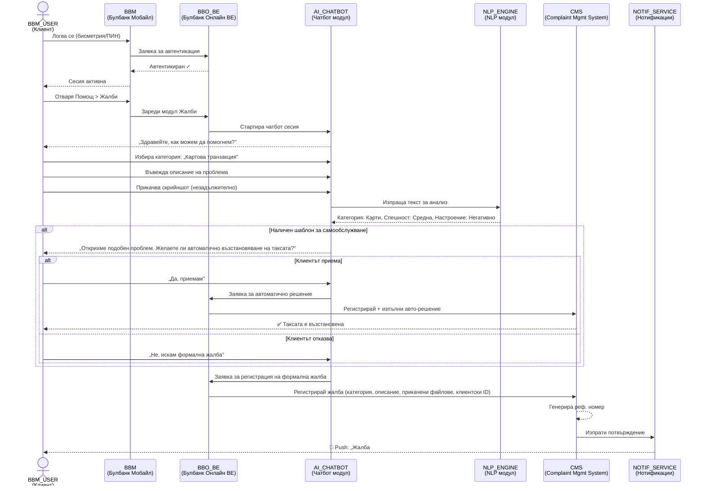
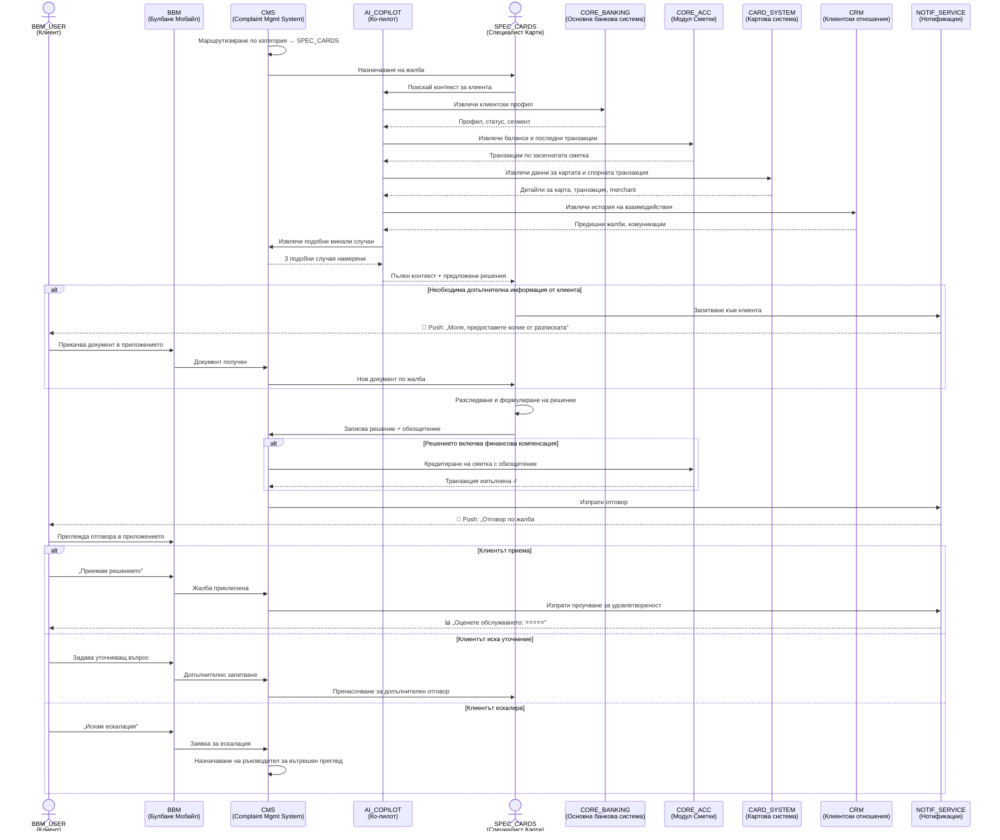

# Задача 2: Бизнес процес — Дигитално управление на жалби

## 1. Общ преглед на процеса

Настоящият раздел описва бизнес процеса за дигитално подаване и обработка на жалби в УниКредит Булбанк от гледна точка на клиента. Процесът е проектиран да се извършва изцяло дистанционно — чрез мобилно или онлайн банкиране — без посещение на банков клон.

### Действащи лица (Actors)

| Участник | Роля | Описание |
|---|---|---|
| **Клиент** | Подател на жалба | Физическо или юридическо лице, клиент на банката, автентикиран в Булбанк Мобайл или Булбанк Онлайн |
| **AI Чатбот** | Първична обработка | Виртуален асистент, който приема жалбата, категоризира я и предлага решения за самообслужване |
| **Система за жалби** | Оркестрация | Бекенд система, която регистрира, маршрутизира и проследява жалбите |
| **Обработващ специалист** | Разследване | Служител от съответния домейн (карти, сметки, кредити и др.), назначен за конкретния случай |
| **AI Ко-пилот** | Подпомагане на персонала | AI инструмент, който сглобява контекст и предлага решения на обработващия |
| **Ръководител** | Ескалация | Старши служител за вътрешен преглед при неудовлетвореност на клиента |
| **Регулаторни органи** | Външна ескалация | БНБ, КЗП, Помирителна комисия за платежни спорове |

---

## 2. Процесна BPMN диаграма — Пълен процес

```mermaid
flowchart TD
    Start([🟢 Клиентът открива проблем])

    Start --> Login[Клиентът се логва в\nБулбанк Мобайл / Онлайн]
    Login --> Navigate[Навигира до\nПомощ > Жалби]
    Navigate --> ChatStart[AI Чатбот: Поздрав\n„Как можем да помогнем?"]

    ChatStart --> Collect[Чатботът събира:\n• Категория на жалбата\n• Описание на проблема\n• Прикачени файлове]

    Collect --> NLP[NLP анализ:\n• Автоматична категоризация\n• Оценка на спешност\n• Анализ на настроение]

    NLP --> SelfServe{Чест проблем с\nготово решение?}

    SelfServe -->|Да| Suggest[Чатботът предлага\nрешение за самообслужване]
    Suggest --> ClientAcceptSelf{Клиентът\nприема решението?}
    ClientAcceptSelf -->|Да| AutoResolve[✅ Автоматично изпълнение\nнапр. връщане на такса]
    AutoResolve --> Survey
    ClientAcceptSelf -->|Не| EscToHuman[Ескалация: Продължава\nкъм формална жалба]

    SelfServe -->|Не| EscToHuman

    EscToHuman --> Register[Системата регистрира жалбата:\n• Референтен номер\n• Категория\n• Приоритет\n• Timestamps]

    Register --> Ack[📧 Незабавно потвърждение:\n• Реф. номер\n• Очакван срок\n• Назначен обработващ]

    Ack --> Route{Интелигентно\nмаршрутизиране}

    Route -->|Карти| SpecCards[Специалист Карти]
    Route -->|Сметки/Преводи| SpecAcc[Специалист Сметки]
    Route -->|Кредити| SpecCredit[Специалист Кредити]
    Route -->|Е-банкиране| SpecDigi[Специалист Дигитални канали]
    Route -->|Друго| SpecGeneral[Общ специалист]

    SpecCards --> CoPilot
    SpecAcc --> CoPilot
    SpecCredit --> CoPilot
    SpecDigi --> CoPilot
    SpecGeneral --> CoPilot

    CoPilot[AI Ко-пилот предоставя:\n• Клиентски профил\n• История на транзакции\n• Подобни минали случаи\n• Предложени решения]

    CoPilot --> Investigate[Обработващият разследва\nсъс съдействието на\nотговорните структури]

    Investigate --> NeedInfo{Необходима\nдопълнителна информация\nот клиента?}
    NeedInfo -->|Да| RequestInfo[📱 Push нотификация:\nЗапитване за информация]
    RequestInfo --> ClientProvides[Клиентът предоставя\nинформация в приложението]
    ClientProvides --> Investigate

    NeedInfo -->|Не| Decision{Решение}

    Decision --> Response[📧 Официален отговор\nдоставен в приложението:\n• Обяснение\n• Предприети действия\n• Обезщетение ако е приложимо]

    Response --> ClientSatisfied{Клиентът\nудовлетворен?}

    ClientSatisfied -->|Да| Survey
    ClientSatisfied -->|Не, иска уточнение| Clarify[Клиентът задава\nуточняващи въпроси\nв приложението]
    Clarify --> Investigate

    ClientSatisfied -->|Не, ескалира| InternalReview[Вътрешен преглед\nот ръководител]

    InternalReview --> ReviewDecision{Ново решение}
    ReviewDecision -->|Клиентът приема| Survey
    ReviewDecision -->|Клиентът не приема| External[Външна ескалация:\n• БНБ\n• КЗП\n• Помирителна комисия\n• FIN-NET]

    External --> Survey

    Survey([📊 Проучване за удовлетвореност\n→ Данни за анализ на тенденции\n→ Подобрения на продукти\n🔴 Край])

    style Start fill:#d4edda,stroke:#28a745
    style Survey fill:#cce5ff,stroke:#007bff
    style AutoResolve fill:#d4edda,stroke:#28a745
    style External fill:#ffcccc,stroke:#cc0000
    style SelfServe fill:#fff3cd,stroke:#ffc107
    style ClientSatisfied fill:#fff3cd,stroke:#ffc107
    style NeedInfo fill:#fff3cd,stroke:#ffc107
```

---

## 3. Детайлно описание на стъпките

### Фаза 1: Иницииране (Клиент → AI Чатбот)

| Стъпка | Действие | Участник | Правило за преминаване |
|---|---|---|---|
| 1.1 | Вход в Булбанк Мобайл или Булбанк Онлайн | Клиент | Автентикация чрез биометрия/ПИН/креденшали. Самоличността е верифицирана — не е необходим КЕП. |
| 1.2 | Навигация до Помощ > Жалби | Клиент | Секцията е достъпна от главното меню |
| 1.3 | AI Чатбот поздравява клиента | AI Чатбот | Автоматично стартиране при влизане в секцията |
| 1.4 | Събиране на информация: категория, описание, прикачени файлове | AI Чатбот + Клиент | Клиентът трябва да избере категория и да въведе описание (мин. 20 символа). Прикачените файлове са незадължителни. |

**Правила за връщане назад:**
- Клиентът може да прекъсне процеса по всяко време и да се върне към началния екран
- Ако чатботът не разбере запитването, предлага преформулиране или директна връзка с човек

### Фаза 2: Анализ и самообслужване (AI Чатбот → Система)

| Стъпка | Действие | Участник | Правило за преминаване |
|---|---|---|---|
| 2.1 | NLP анализ: категоризация, спешност, настроение | AI Чатбот | Автоматично — клиентът не вижда тази стъпка |
| 2.2 | Проверка за решение чрез самообслужване | AI Чатбот | Ако проблемът съвпада с предефинирани шаблони (напр. грешно начислена такса, блокирана карта) |
| 2.3 | Предлагане на решение на клиента | AI Чатбот | Клиентът вижда предложеното решение и избира: Приемам / Искам формална жалба |
| 2.4 | Автоматично изпълнение на решението | Система | Само ако клиентът е приел — напр. възстановяване на такса, деблокиране на карта |

**Правила за преминаване:**
- Ако клиентът приеме решението за самообслужване → процесът приключва с проучване за удовлетвореност
- Ако клиентът отхвърли → преминава към формална регистрация на жалба (Фаза 3)
- Ако NLP не открие шаблон за самообслужване → директно към Фаза 3

### Фаза 3: Регистрация и потвърждение (Система → Клиент)

| Стъпка | Действие | Участник | Правило за преминаване |
|---|---|---|---|
| 3.1 | Регистриране на жалбата в системата | Система за жалби | Автоматично — генерира референтен номер, записва timestamps, категория, приоритет |
| 3.2 | Изпращане на потвърждение до клиента | Система за жалби | Незабавно — push нотификация + in-app съобщение с реф. номер, очакван срок и назначен обработващ |
| 3.3 | Маршрутизиране към специалист по домейн | Система за жалби | Автоматично — базирано на категория и клиентски сегмент |

**Срокове:**
- Потвърждение: незабавно (< 1 минута)
- Назначаване на специалист: в рамките на 1 работен час

### Фаза 4: Разследване (Обработващ специалист + AI Ко-пилот)

| Стъпка | Действие | Участник | Правило за преминаване |
|---|---|---|---|
| 4.1 | AI Ко-пилот сглобява контекст | AI Ко-пилот | Автоматично — клиентски профил, транзакции, минали жалби, предложени решения |
| 4.2 | Специалистът преглежда жалбата и контекста | Обработващ специалист | Ръчно — преценява дали е необходима допълнителна информация |
| 4.3 | (Ако е необходимо) Запитване за допълнителна информация | Обработващ + Клиент | Push нотификация до клиента; процесът е на пауза до получаване на отговор |
| 4.4 | Разследване със съдействието на отговорни структури | Обработващ специалист | Може да включва консултация с други отдели (правен, ризк, операции) |
| 4.5 | Формулиране на решение | Обработващ специалист | С подкрепата на AI Ко-пилот за предложени решения |

**Правила за връщане назад:**
- Ако е необходима допълнителна информация от клиента → процесът се връща към комуникация с клиента (стъпка 4.3)
- Ако специалистът определи, че жалбата е в грешна категория → пренасочване към друг специалист (връщане към стъпка 3.3)

**Срокове:**
- Обикновени случаи: до 3 работни дни (85% от случаите по текущата статистика на банката)
- Платежни услуги: до 15 работни дни (до 35 при извънредни обстоятелства)
- Кредитни жалби: до 30 дни

**Проактивни нотификации:**
- При промяна на статуса: push нотификация до клиента
- При забавяне над 5 работни дни: автоматичен статус ъпдейт с обяснение

### Фаза 5: Разрешаване (Система → Клиент)

| Стъпка | Действие | Участник | Правило за преминаване |
|---|---|---|---|
| 5.1 | Доставка на официален отговор в приложението | Система + Обработващ | Push нотификация + детайлен отговор in-app с обяснение, предприети действия, обезщетение |
| 5.2 | Клиентът преглежда отговора | Клиент | Три опции: Приемам / Искам уточнение / Ескалирам |
| 5.3 | (Ако иска уточнение) Допълнителна комуникация | Клиент + Обработващ | Чрез in-app чат — връща процеса към Фаза 4 |
| 5.4 | (Ако финансово обезщетение) Автоматично кредитиране | Система | Ако решението включва финансова компенсация — автоматично изпълнение |

**Правила за преминаване:**
- Клиентът приема → Фаза 6 (Проучване)
- Клиентът иска уточнение → Връщане към Фаза 4
- Клиентът ескалира → Фаза 5а (Вътрешен преглед)

### Фаза 5а: Ескалация

| Стъпка | Действие | Участник | Правило за преминаване |
|---|---|---|---|
| 5а.1 | Вътрешен преглед от ръководител | Ръководител | Преглед на целия случай, предишните решения и комуникация |
| 5а.2 | Ново решение или потвърждение на предишното | Ръководител | Комуникация до клиента с ново/потвърдено решение |
| 5а.3 | (Ако клиентът все още не е удовлетворен) Външна ескалация | Клиент | Директно от приложението — линкове и инструкции за БНБ, КЗП, ПКПС, FIN-NET |

**Правила за преминаване:**
- Клиентът приема новото решение → Фаза 6
- Клиентът ескалира към регулатор → Системата предоставя необходимите данни и инструкции

### Фаза 6: Обратна връзка и подобрение

| Стъпка | Действие | Участник | Правило за преминаване |
|---|---|---|---|
| 6.1 | Проучване за удовлетвореност | Клиент | Кратък формуляр (1-5 звезди + коментар) — незадължителен |
| 6.2 | Агрегиране на данни от жалби | Система | Автоматично — тенденции, категории, времена за разрешаване |
| 6.3 | Информиране на продуктови екипи | Система | Автоматични алерти при системни проблеми (напр. множество жалби за един продукт) |

---

## 4. Sequence диаграма — Подаване на жалба

Следната диаграма показва взаимодействието между системите при подаване на жалба (стъпки 1.1 до 3.2), следвайки стила от упражнението по бизнес анализ с реалните системни наименования на UniCredit.



## 5. Sequence диаграма — Обработка и разрешаване (пример: картова жалба)



---

## 6. Правила за придвижване — Обобщение

### Правила за движение напред

| От → Към | Условие |
|---|---|
| Логин → Чатбот | Успешна автентикация |
| Чатбот → Самообслужване | NLP открива съвпадение с шаблон за автоматично решение |
| Чатбот → Формална жалба | Клиентът отхвърля самообслужване ИЛИ няма наличен шаблон |
| Регистрация → Маршрутизиране | Автоматично — веднага след генериране на реф. номер |
| Маршрутизиране → Специалист | Автоматично — по категория и клиентски сегмент |
| Разследване → Отговор | Специалистът е завършил проверката и е формулирал решение |
| Отговор → Приключване | Клиентът приема решението |
| Отговор → Вътрешен преглед | Клиентът изрично избира „Ескалация" |
| Вътрешен преглед → Външна ескалация | Клиентът не приема и новото решение |

### Правила за движение назад

| От → Към | Условие |
|---|---|
| Разследване → Клиент | Необходима е допълнителна информация |
| Отговор → Разследване | Клиентът иска уточнение (допълнителен in-app диалог) |
| Маршрутизиране → Друг специалист | Погрешна категоризация — пренасочване |
| Всяка стъпка → Начало | Клиентът прекъсва процеса (жалбата остава в чернова) |

### SLA и срокове

| Фаза | Максимален срок | Основание |
|---|---|---|
| Потвърждение | < 1 минута | Автоматично |
| Назначаване на специалист | < 1 работен час | SLA на системата |
| Разрешаване (обикновен случай) | 3 работни дни | 85% от случаите на банката се решават в този срок |
| Разрешаване (платежни услуги) | 15 работни дни (до 35) | ЗПУПС |
| Разрешаване (кредитни жалби) | 30 дни | ЗПК / ЗКНИП |
| Вътрешен преглед | 5 работни дни | Вътрешна политика |

---

## 7. Glossary / Речник

### Системни участници (по конвенция от BA упражненията)

| Участник | Пълно наименование | Описание |
|---|---|---|
| BBM_USER | Потребител на Булбанк Мобайл | Клиент на банката, използващ мобилното приложение |
| BBM | Булбанк Мобайл | Мобилно приложение на УниКредит Булбанк |
| BBO_BE | Булбанк Онлайн Backend | Бекенд на платформата за онлайн/мобилно банкиране |
| AI_CHATBOT | AI Чатбот модул | Виртуален асистент с NLP способности за приемане и категоризация на жалби |
| NLP_ENGINE | NLP двигател | Модул за обработка на естествен език — категоризация, анализ на настроение и спешност |
| CMS | Complaint Management System | Система за управление на жалби — регистрация, маршрутизиране, проследяване, одит |
| AI_COPILOT | AI Ко-пилот | Вътрешен AI инструмент за служителите — сглобява контекст от всички системи и предлага решения |
| CORE_BANKING | Основна банкова система | Системата, която управлява клиенти, продукти и основни банкови операции |
| CORE_ACC | Модул Сметки | Модул в CORE_BANKING, съхраняващ информация за сметки, баланси и транзакции |
| CARD_SYSTEM | Картова система | Система за управление на дебитни и кредитни карти, картови транзакции и спорове |
| CRM | CRM система | Система за управление на клиентски взаимоотношения — история на взаимодействия, предишни жалби |
| NOTIF_SERVICE | Нотификационен сервиз | Услуга за многоканални известия (push, имейл, SMS) |
| SPEC_CARDS | Специалист Карти | Обработващ специалист от домейна Карти |
| SPEC_ACC | Специалист Сметки | Обработващ специалист от домейна Сметки и Преводи |
| SPEC_CREDIT | Специалист Кредити | Обработващ специалист от домейна Кредити |
| SPEC_DIGI | Специалист Дигитални канали | Обработващ специалист от домейна Е-банкиране |

### Регулаторни и бизнес термини

| Термин | Описание |
|---|---|
| КЕП | Квалифициран електронен подпис |
| ЗПУПС | Закон за платежните услуги и платежните системи |
| ЗПК | Закон за потребителския кредит |
| ЗКНИП | Закон за кредитите за недвижими имоти на потребители |
| БНБ | Българска народна банка |
| КЗП | Комисия за защита на потребителите |
| ПКПС | Помирителна комисия за платежни спорове |
| FIN-NET | Мрежа за презгранично извънсъдебно решаване на финансови спорове в ЕС |
| SLA | Service Level Agreement — договорено ниво на обслужване |
| NLP | Natural Language Processing — обработка на естествен език |
| BPMN | Business Process Model and Notation — стандарт за моделиране на бизнес процеси |
