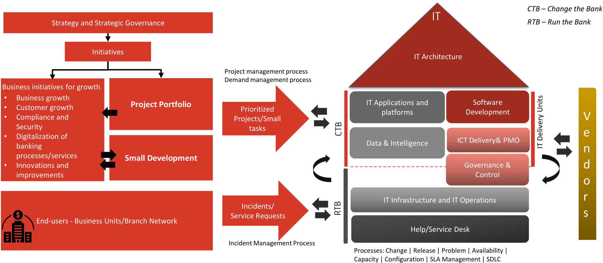
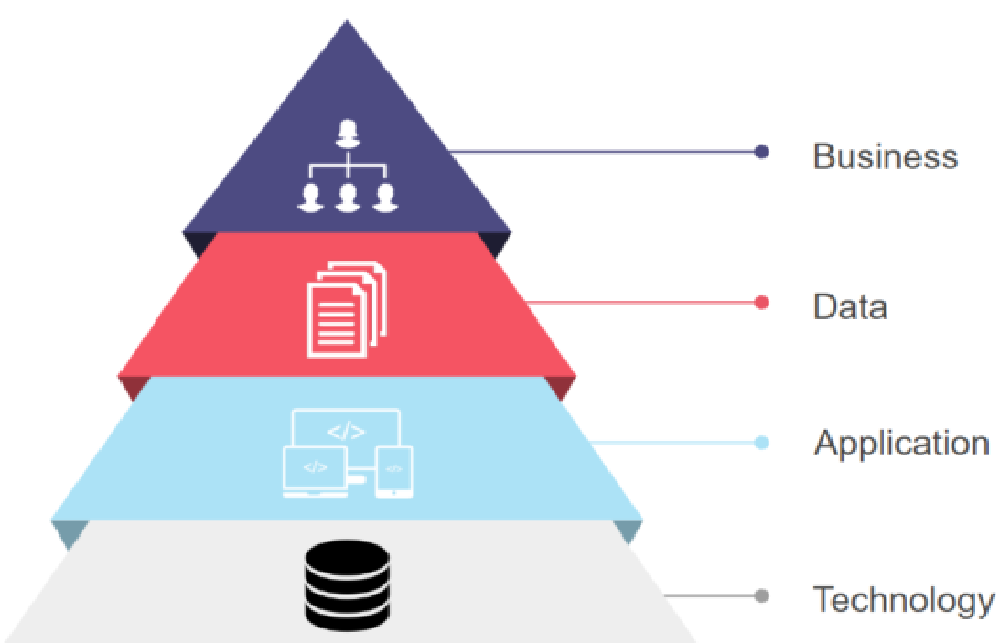
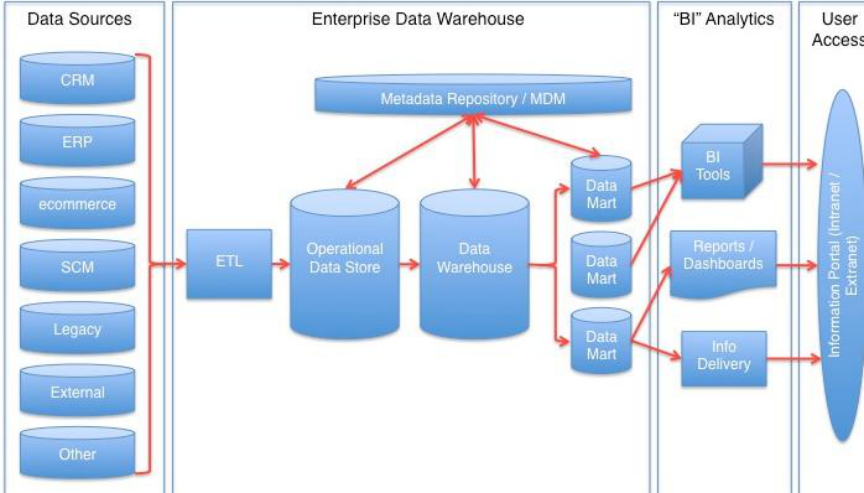
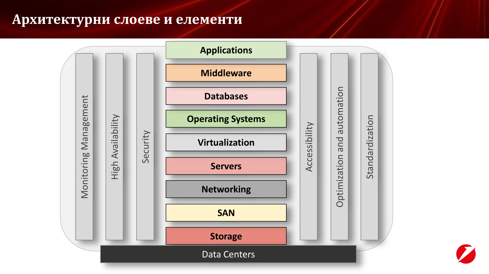
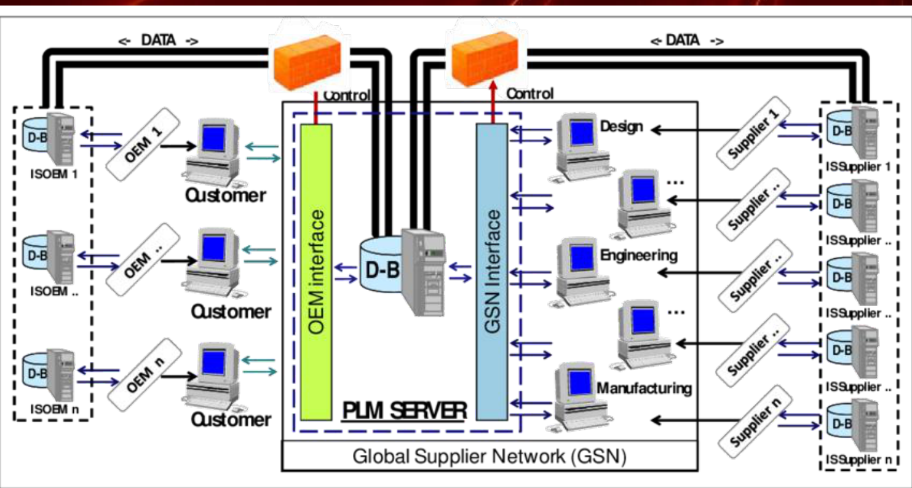
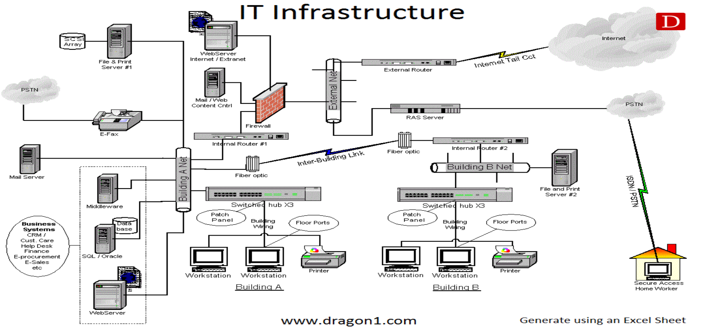
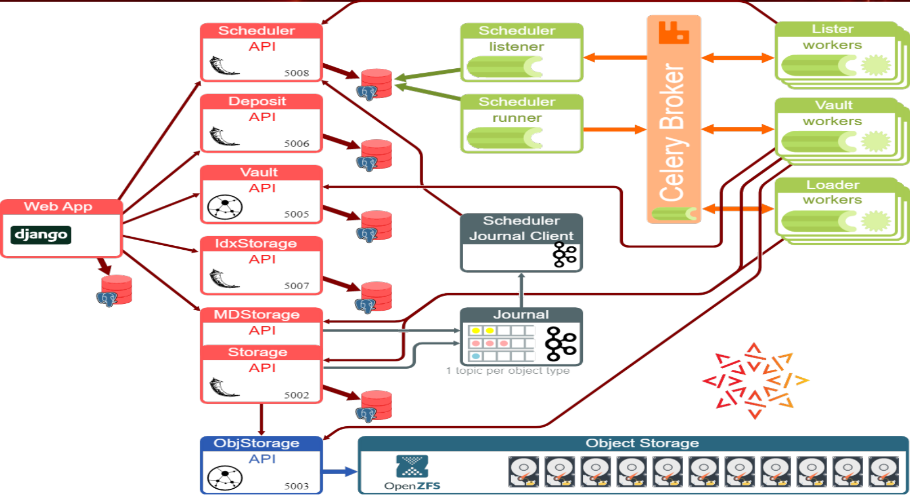
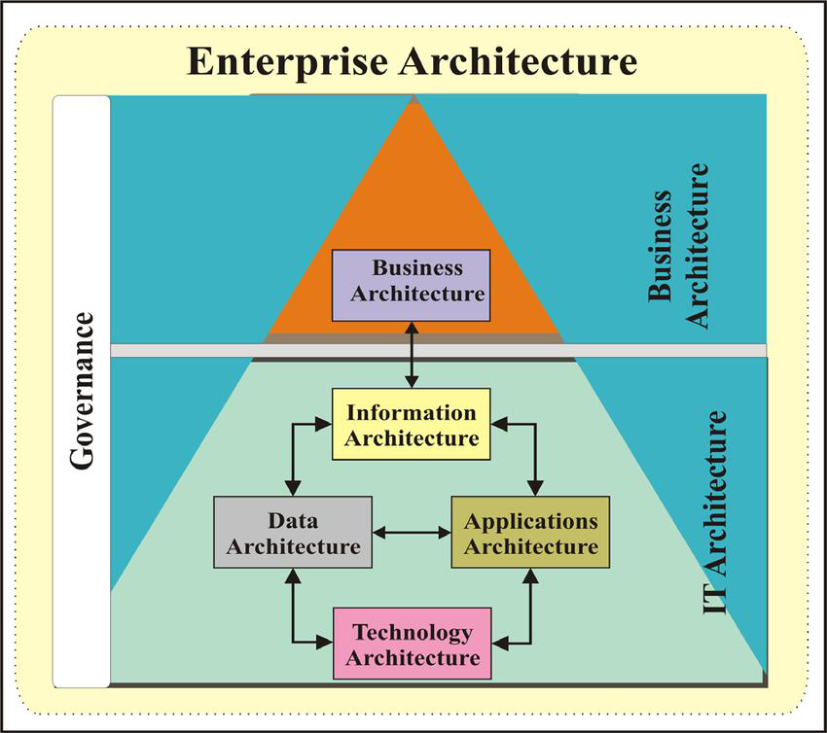
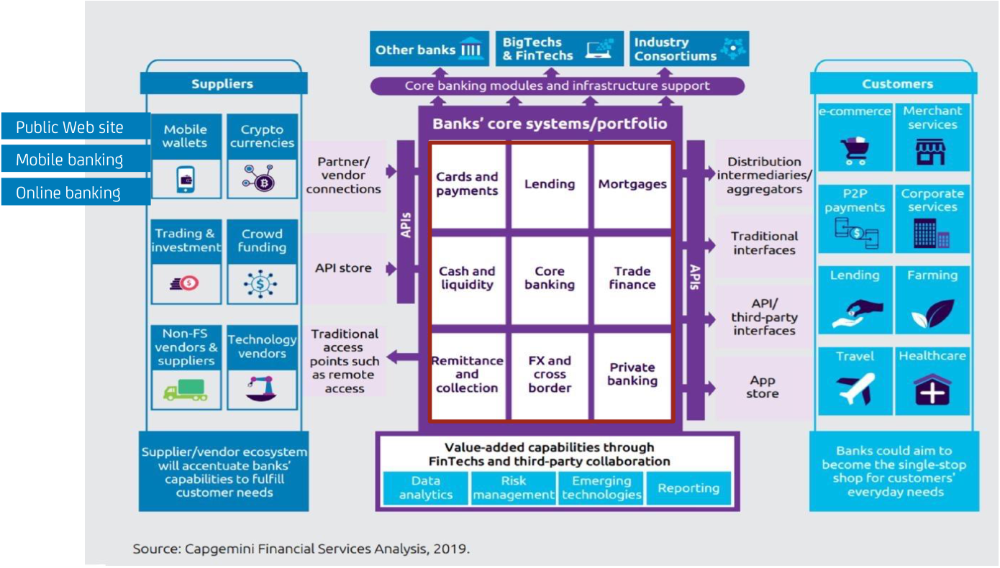

**----- Start of picture text -----** 
Дигитализация в банкирането - ТУ София **----- End of picture text -----** 

**- д р инж. Даниел Джолев** Директор Дигитални и Информационни технологии Уникредит Булбанк Daniel.Dzholev@unicreditgroup.bg www.javac.bg 

**----- Start of picture text -----** 
Agenda Лекция 1 **----- End of picture text -----** 

## • Въведение в Дигитализация в банкирането 

- Основни теми 

- Работна организация и структура на ИТ отделите в 

. корпоративна организация 

- Enterprise Architecture 

- Основни банкови типове архитектури 

**----- Start of picture text -----** 
Въведение в Дигитализация в банкирането **----- End of picture text -----** 

## **Цели и ключови теми:** 

- Да се запознаем как изглежда **ИТ организация** в корп. Организация(Банка) 

- Да разберем какво е **Еnterprise архитектура** и основни типове архитектури на приложения 

- Какви са съвременните **ИТ платформи** за оперираната приложения в една организация 

- Да разгледаме отблизо **техниките за програмиране** с използване на архитектура, ориентирана около **микро услуги и DevOps** методология 

- Да се запознаем с **техниките за роботизиране и автоматизация** на бизнес процеси 

- **Управление на проектно портфолио** , Waterfall and Agile 

- Как се **дигитализират банкови услуги** – изграждане на дигитални процеси, дигитални канали, платежни системи и картови разплащания, развитие на дигитални канали – **мобилни и уеб банкирания** . 

- Как AI помага? 

**3** 

**----- Start of picture text -----** 
Организация на курса **----- End of picture text -----** 

**Лекции** – 10 лекции по 3 учебни часа, четвъртък, 16:45 

## **Упражнения:** 

- Започват от: 5-та учебна седмица 

- 

   - **3 упражнения, задължително присъствие** , по списък 

- 

   - 

   - **1 онлайн упражнения за консултации** , присъствие при нужда 

- **3 присъствени упражнения за защита, поне 1 задължително (по време на защитата)** 

- Възможно е да се отработва с друга група 

За заверка за упражнения: общ брой присъствени упражнения:  3+1 =4 

**4** 

**----- Start of picture text -----** 
Организация на курса **----- End of picture text -----** 

## **Упражнения:** 

- 

- 

   - 1-во упр. – Изграждане и проектиране на банкови архитектури (присъствено) 

   - 2-ро упр. – Бизнес анализ и техники за подготовка на бизнес изисквания с AI (присъствено) 

- 3-то упр. – Създаване на проектен план (присъствено) 

- 4-то упр. – Програмиране на приложения с AI (присъствено) 

- 5-то упр. – Консултация (виртуално) 

- 

- **6-то упр. – Представяне и защита на проекти (присъствено)** 

**Проектите (в група до 3ма студенти) ще се защитават пред ръководителите на дисциплината. Ще се използват за освобождаване от изпит по ДБ. АКо имате КП/КР по дисциплината, проектът е 1.** 

- За освобождаване от изпит: 

- Успешно защитен проект с оценка над Среден(3) 

- **Поне 2 присъствия на лекция(запис в присъствен списък)** 

- Присъствия на всички присъствени упражнения: 4 

## Изпит – през редовна/поправителна сесия. 

**5** 

**----- Start of picture text -----** 
Въведение  – ? Дигитализация в банкирането  защо **----- End of picture text -----** 

## Банките в миналото.. 

**6** 

**----- Start of picture text -----** 
Въведение  – ? Дигитализация в банкирането  защо **----- End of picture text -----** 

Банките днес 

**7** 

**----- Start of picture text -----** 
Въведение  – ? Дигитализация в банкирането  защо **----- End of picture text -----** 

- Отдавна парите в банките се управляват като **записи в банковата Информационна система** , а транзакциите между сметките – по същия начин. 

- Банките преминават все повече към дигитални услуги за сметка на такива, изискващи физическо присъствие 

- Традиционните банки инвестират милиони в дигитализация на продукти и процеси през последните години. 

- В същото време на пазара навлизат нови играчи – Fintech, Challenger banks и тн. 

**8** 

**----- Start of picture text -----** 
В Уникредит Булбанк **----- End of picture text -----** 

- 1964 е основана банката в България 

- 3900 служители в България 

- 86 000 служители в групата Уникредит 

- 130+ офиси в България 

- 270 – служители в управление Информационни технологии в България 

- 7 – и повече езици/технологии за програмиране 

- 170 и повече ИТ приложения 

- 40% и повече от всички плащания в България минават през Булбанк 

- - 

- 21%- Най висок пазарен дял за корпоративно банкиране в БГ 

**2024г. 60г. от основаването си През Уникредит Булбанк навършва** 

По официални данни за 01.2023г 

**9** 

**----- Start of picture text -----** 
Работна организация и структура на ИТ отделите в корпоративна финансова организация **----- End of picture text -----** 

**----- Start of picture text -----** 
CTB – Change the Bank IT Strategy and Strategic Governance RTB – Run the Bank Initiatives IT Architecture Project management process Demand management process Business initiatives for growth • Business growth • Project Portfolio IT Applications and  Software Customer growth Prioritized • Compliance and  Projects/Small  platforms Development V Security tasks • Digitalization of  e ICT Delivery& PMO Data & Intelligence banking  n processes/services Small Development • Innovations and  Governance &  d improvements Control o r IT Infrastructure and IT Operations Incidents/ s Service Requests End-users - Business Units/Branch Network Help/Service Desk Incident Management Process Processes: Change | Release | Problem | Availability | Capacity | Configuration | SLA Management | SDLC CTB IT Delivery Units RTB **----- End of picture text -----** 

• Example of simplification of Business and IT organization 

**----- Start of picture text -----** 
ИТ структура в Enterprise Организация(Банка) **----- End of picture text -----** 

- Представлява **вътрешен доставчик на ИТ услуги** (обикновено са стотици), партньор на - 

- бизнес а в реализирането на бизнес целите на организацията 

- Управлява и отговаря за всички ИТ услуги, включително техния **избор, внедряване, наличност, поддръжка, стабилност и подмяна** . 

- Управлява **ИТ инвестиционен бюджет** (обикновено е многомилионен), както и ИТ **оперативен бюджет** , свързан с инвестиции в нови и поддръжка на съществуващи ИТ решения 

- **Управлява доставчици на ИТ услуги** , **контролира** изпълнението на ИТ поръчки към външни доставчици 

- Работи по **дефинирани бизнес приоритети за развитие на ИТ системите** в съответствие с бизнес плана за развитие, с нормативното съответствие и изискванията за . 

- сигурност 

- Прави **технологични подобрения по инфраструктурата** , свързани с внедряване на нови платформи, подмяна на съществуващи хардуерни компоненти, свързани с техния жизнен . 

- цикъл и осигурява необходимия им съпорт 

**11** 

**----- Start of picture text -----** 
Архитектура / IT Architecture **----- End of picture text -----** 

## • **IT or Digital strategy definition and management** 

- **Architects participate** in all the IT **projects** within the organization and work together with the business, developers analysts and vendors and as a result provide different level of IT architectures 

- **Definition and development** of enterprise-wide **Reference architectures and integration frameworks** 

- **Check compatibility** of existing technical framework with newly architected solutions 

- **Evaluation and estimation of business requests** for new systems and changes as per DM process 

- **Assess design and integration** of new systems 

|**Role**|**Description**|
|---|---|
|IT architect|General IT architecture role|
|Solution Architect|Low level architecture role, covering projects e2e|
|Application/Data/Infrastructure/Automation Architect|Architecture of the respective architecture domain|

**12** 

**----- Start of picture text -----** 
ИТ архитектурни области **----- End of picture text -----** 

**13** 

**----- Start of picture text -----** 
Разработки на софтуер/Software Development **----- End of picture text -----** 

- **Researching, designing, implementing** , and **managing** software programs 

- **Testing and evaluating** new programs 

- Identifying areas for **modification** in existing programs and subsequently developing these modifications 

- Writing and implementing **efficient code** 

- Determining operational practicality 

- Developing **quality assurance procedures** 

- Deploying **software tools** , processes, and metrics 

- **Maintaining and upgrading** existing systems 

- Training users 

- Working closely with other developers, UX designers, business and systems analysts 

|**Role**|**Description**|
|---|---|
|Software Developer|A software developer create and test software from start to finish based on a Software/IT  architecture. They follow the business analysis specification, done by Business Analysts, then research and brainstorm practical solutions to meet those needs, and determine the best course of action to create the application applying best practices in software development|

**14** 

**----- Start of picture text -----** 
ИТ апликации и платформи / IT Applications and Platforms **----- End of picture text -----** 

- Responsible for all the IT applications mainly separated im the following areas: 

## `o` **Core banking system** 

## `o` All other business applications, Digital channels, Card systems 

- Participation of all the projects related to IT applications with Business/System analysis competence - Review, analysis and evaluation of business requirements 

- Support of all the IT applications – incidents, problems, ticket resolution 

- Vendor management on projects 

- Coordination, impact analysis and dependency management of various initiatives 

- Preparation of detailed documentation for IT applications 

|**Role**|**Descr**|
|---|---|
|Business analyst|Business analysis specifications, business requirements engineering|
|System analyst|System analysis specification, system engineering and support|
|Application administrator|Support IT applications, incidents, problems investigation and solution|

**15** 

**----- Start of picture text -----** 
ИТ инфраструктура и ИТ операции /IT Infrastructure & IT Operations, Help/Service Desk **----- End of picture text -----** 

- **Management of infrastructure services, components and platforms** - server installation, configuration and maintenance, network configuration and maintenance, Cloud operations and Microservice run, system patching, backup and restore, disaster recovery tests. Configuration and maintenance of database and middleware platforms and technologies 

- **Data center** governance 

- Support proper operation of **IT services** 

- **Help Desk** and **Service Desk** 

- **Installation and maintenance** of hardware 

- **Inventory** management 

- **POS and ATM** management 

|**Role**|**Description**|
|---|---|
|Database Administrator|Ensures databases run efficiently and securely, administer database servers|
|IT Operator|Do manual operations into the Systems – run some programs, checks, monitor|
|Network Engineer|Sets up and maintains network infrastructure and devices within the organization|

**16** 

**----- Start of picture text -----** 
Данни и изкуствен интелект / Data & Intelligence **----- End of picture text -----** 

- **Data Warehouse** – engineering, design and development 

- Schedule, provisioning and execution of **Management, Risk, Commercial, Operative and Regulative reporting** 

- Development of reports, calculation engines, reporting applications, tools and interfaces 

- **Clean and group data** for further analysis, maintain **data history** and **data ownership** 

- Monitoring of **data consistency and data quality** 

- In charge of the **governance and utilization of information** , data **processing** , analysis and data mining 

- **Machine Learning** models 

- **Artificial Intelligence (AI)** 

|**Role**|**Description**|
|---|---|
|Reporting Developer|Compiles massive amounts of data on an enterprise level to filter out unnecessary information and provide insight into business operations|
|Reporting Administrator|Provides business analysis to document business processes, user stories, configurations, functional specifications, interface and data designs required within or across applications to deliver on business objectives|
|**17** RPA Developer|Build, design, develop, and implement RPA systems|

**----- Start of picture text -----** 
Управление и Контрол / Governance & Control **----- End of picture text -----** 

- **IT Service Quality and Monitoring** – real time monitoring of critical applications availability, reporting on Service Quality, designing of monitoring solutions 

- **Processes:** Change Management, Availability Management, Configuration Management, Incident Management, Problem Management, Capacity Management, Financials, IT Service Continuity and Security Management 

- Development and implementation of **procedures, methodic and tools** related to: Change management, Configuration Management, Release Management, Availability and Capacity Management 

|**Role**|**Description**|
|---|---|
|Incident and Problem Manager|Responsible for owning incident and problem resolution, working collaboratively across multiple trams to identify root cause; identify, record and resolve problems; and avoid incidents.|
|Service Quality and Monitoring Expert|Monitors and administrates systems daily and responds immediately to usability concerns|
|Financial Manager|Performs data analysis and advises senior managers on profit-maximizing ideas. Financial manager is responsible for the financial health of an organization. He/she creates financial reports, direct investment activities, and develops plans for the long-term financial goals of their organization.|

**18** 

**----- Start of picture text -----** 
Управление на проекти /Project Management Office **----- End of picture text -----** 

- **Project Portfolio Coordination** – development of project management methodology, portfolio monitoring 

- **Project Management Office (PMO)** – management of complex strategic projects throughout the entire project lifecycle. This includes but it’s not limited to planning, organizing, executing, monitoring, controlling and closing projects 

- **Budget planning** and project/portfolio **financials** 

- Timely and accurate **updates** to key business and technology **stakeholders** ensuring **transparency and visibility** on local IT activities 

## • **Stakeholder management** 

|**Role**|**Description**|
|---|---|
|Project Manager|A project manager is responsible for planning and overseeing projects within an organization, from the initial ideation through to completion. They coordinate people and processes to deliver projects on time, within budget and with the desired outcomes aligned to objectives|
|Project Management Officer|Planning project management activities, analyzing financial information to keep projects on track, and collaborating with different departments to ensure all leaders understand where a project is in the development process|

**19** 

**----- Start of picture text -----** 
Роли в ИТ / Roles in IT **----- End of picture text -----** 

**20** 

**----- Start of picture text -----** 
Архитектурни слоеве и елементи Applications Middleware Databases Operating Systems Virtualization Servers Networking SAN Storage Data Centers Security Accessibility High Availability Standardization Monitoring Management Optimization and automation **----- End of picture text -----** 

**----- Start of picture text -----** 
Enterprise architecture/Архитектура на ниво организация **----- End of picture text -----** 

- Enterprise architecture is the process by which organizations standardize and organize IT infrastructure to align with business goals. These strategies support digital transformation, IT growth, and the modernization of IT. 

- It includes bot **IT architecture** and **Business Architecture** 

• **Enterprise architecture** (EA) is the blueprint of the whole company and defines **the architecture** of the **complete company** . It includes all applications and IT systems that are used within the company and by different companies' departments including all applications (core and satellite), integration platforms (e.g. Enterprise Service Bus, API mgt), web, portal and mobile apps, data analytical tooling, data warehouse and data lake, operational and development toolings (e.g. DevOps tooling, monitoring, backup, archiving etc.), security, and collaborative applications (e.g. email, chat, file systems) etc. 

- The EA blueprint shows all IT system in a logical map. 

**22** 

**----- Start of picture text -----** 
ИТ архитектура **----- End of picture text -----** 

- **ИТ Архитектура** – Най-общо, представлява технологично направление, което дефинира способите и начините за **ОПИСАНИЕ** на компонентите и връзките по между им в една ИТ . 

- среда 

- Съществуват различни видове ИТ архитектура – Solution, Technology, Software и тн. Наричат се по-различен начин в различните организации, но най-общо: 

   - **Solution architecture** – описва функционалните специфики на системата, логика, зависимости, информация и данни. Може да се нарече още “Functional architecture” – от нея трябва да се разбере как функционира едно ИТ решение(на „средно ниско ниво“) 

   - **Technology architecture** – описва детайлно какви са различните технологични компоненти, които са използвани, за да се опише едно ИТ решение, както и зависимостите и връзките между тях. Може да стигне до детайл на сървър, модел, ОС, версия на софтуер, мидълуеър, хардуер, мрежови сегменти и тн. 

   - **Software architecture** – описва детайлно слоевете и модулите на едно софтуерно решение, - 

   - обикновено на възможно най ниско ниво. Може да стигне до клас, функция, пакет и тн. 

- – 

- **Бизнес архитектура** описва как даден бизнес функционира 

**23** 

**----- Start of picture text -----** 
ИТ архитектура **----- End of picture text -----** 

- Описва 

компонентите, 

връзките и 

зависимостите 

между тях в една ИТ среда. 

- Може да бъде на 

различно ниво – компонентно, 

логическо, мрежово, инфраструктурно, софтуерно, технологично и тн. 

**24** 

**----- Start of picture text -----** 
Infrastructure Architecture **----- End of picture text -----** 

**25** 

**----- Start of picture text -----** 
Software architecture **----- End of picture text -----** 

**26** 

**----- Start of picture text -----** 
Бизнес архитектура **----- End of picture text -----** 

**27** 

**----- Start of picture text -----** 
TOGAF – The Open-group architecture framework **----- End of picture text -----** 

- TOGAF is an enterprise architecture framework that helps define business goals and align them with architecture objectives around enterprise software development. 

- The Open Group states that TOGAF is intended to: 

   - **Ensure everyone speaks the same language** 

   - **Avoid lock-in to proprietary solutions by standardizing on open methods for enterprise architecture** 

   - **Save time and money, and utilize resources more effectively** 

   - **Achieve demonstrable ROI** 

   - **Provide a holistic view of an organizational landscape** 

   - **Act as a modular, scalable framework that enables organizational transformation** 

   - **Enable organizations of all sizes across all industries to work off the same standard for enterprise architecture** 

**28** 

**----- Start of picture text -----** 
Банкова ИТ архитектура **----- End of picture text -----** 

- . 

- Описва основните ИТ приложения в банката 

   - **Основна банкова система –** основното приложение в организацията, което поддържа основните банкови продукти – сметка, кредит, депозит и тн. – техните актуални баланси и всички банкови операции, свързани с тях. 

   - **Картова система** – в много случаи е изнесена отделно от основната банкова система, но е възможно и да е част от нея. Управлява целия жизнен цикъл на една банкова карта, както и нейния баланс и транзакции 

   - **Системи за работа в обслужващите точки** (Клонова мрежа, Контактен център) 

   - **Системи за дигитално обслужване на клиенти** – Дигитални канали - мобилно, онлайн банкиране, уеб сайт, дигитален портфейл, мобилен софтуерен токен 

   - **Processing системи** – обработващи различни събития като плащания, кредити и тн. 

   - **Системи за управление на данни и репортинг** – Datawarehouse, BI systems 

**29** 

**----- Start of picture text -----** 
Bank Architecture **----- End of picture text -----** 

**----- Start of picture text -----** 
Public Web site Mobile banking Online banking **----- End of picture text -----** 

**30** 

