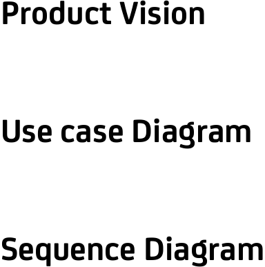
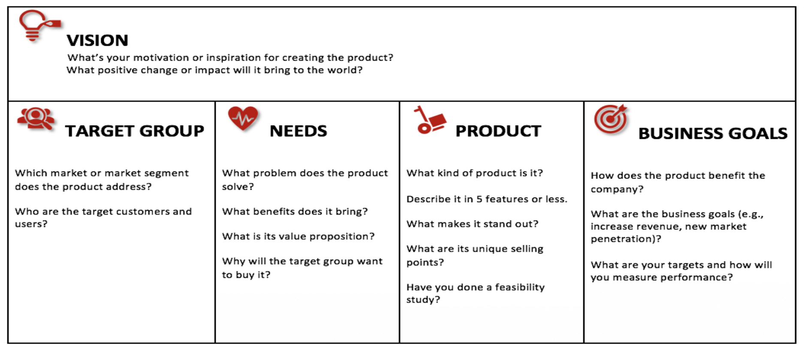
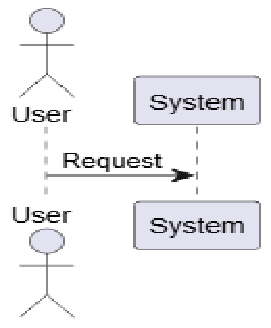
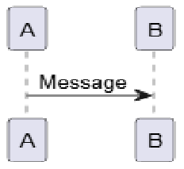
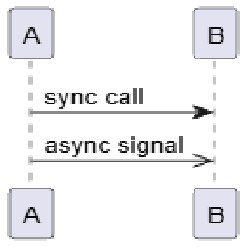
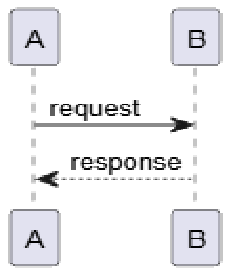
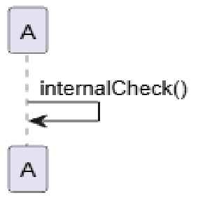
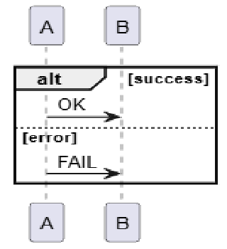
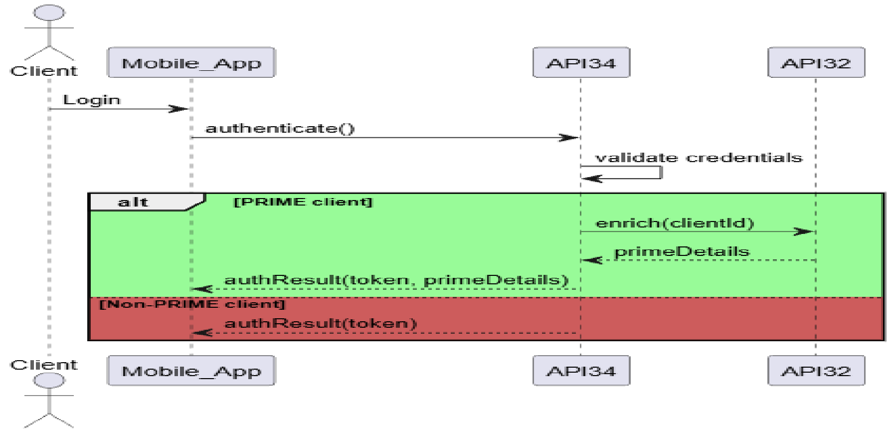

# Introduction 

to 

Business analysis 

**Ivaylo Ivanov, ivaylo.b.ivanov@unicreditgroup.bg** Sofia, February 2026 

**1** 

**----- Start of picture text -----** 
Agenda 2 **----- End of picture text -----** 

**----- Start of picture text -----** 
2 **----- End of picture text -----** 

**3** 

**4** 

**----- Start of picture text -----** 
5 **----- End of picture text -----** 

**----- Start of picture text -----** 
6 **----- End of picture text -----** 

# **What is Business analysis** 

**What is a  Business analyst** 

**Tools and Techniques** 

**----- Start of picture text -----** 
Product Vision Use case Diagram Sequence Diagram **----- End of picture text -----** 

**International Institute of Business Analysis (IIBA[®] ) is a professional association shaping the practice of business analysis to achieve better enterprise outcomes** 

## What is a Business analysis 

Business Analysis Helps Businesses Do Business Better 

**Business Analysis is the practice of enabling change in an organizational context, by defining needs and recommending solutions that deliver value to stakeholders.** 

**4** 

## Business analyst 

**The Business Analyst is an agent of change. Business Analysis is a disciplined approach for introducing and managing change to organizations, whether they are for-profit businesses, governments, or non-profits.** 

**5** 

## BA Techniques 

|**Business Related**|**Project Initiation**|**Requirements**|**Define (Refine)**|**Product Backlog**|
|---|---|---|---|---|
|❖Business Model|❖Capability Map|**Discovery**|**Product Artefacts**|**Management**|
|❖Canvas|❖Glossary|❖Workshop|❖Business Policies|❖Accessibility|
|❖Capability Map|❖Problem statement|❖Business Process|and Rules|❖Availability|
|❖**Product vision**|❖Roadmap|❖Diagram|❖Data Dictionary|❖Compatibility|
||❖Solution Statement|❖Context Diagram|❖Decision tree|❖Data Integrity|
||❖Stakeholder analysis|❖Domain Model|❖Quality Attributes|❖Decision Table|
||❖Stakeholder Matrix|❖Personas|❖Roles and|❖Localization|
|||❖Quality Attributes|Permissions Matrix|❖Performance|
|||❖Software|❖State Diagram|❖Product Backlog|
|||❖Architecture Sketch||❖Items Management|
|||❖(HLA)||❖Scalability|
|||❖Story Map||❖Security|
|||❖**Use Case Diagram**||❖Usability|
|||❖User Journey||❖**Sequence Diagram**|

**6** 

## Product Vision 

**7** 

## Main UML Use Case Notation 

Actor – Represents a user or external system. 

Use Case – Represents a functional goal or action. 

System Boundary – Defines the scope of the system 

«include» Relationships – Association «extend» Relationships – Include Relationships – Extend 

**8** 

## Example 

Actor – Represents a user or external system. Use Case – Represents a functional goal or action. Use Case – Represents a functional goal or action. 

**9** 

## Main Sequence  Notation 

**Actor** –Represents an external role that interacts with the system. 

**Lifeline** – Represents a participant in the interaction. 

**Message** – Represents communication between participants. Can be **synchronous** (waits for response) or asynchronous (does not wait). Defines the order of execution in the interaction. 

**10** 1 

## Main Sequence  Notation 

**Self Message (Self Call)** – Represents a participant calling one of its own operations. 

**Alt Fragment** – Represents alternative flows in the interaction. Used to model conditional logic (if/else). Each section has a guard condition that determines which path executes. 

**11** 

## Main Sequence  Notation 

**12** 

## Product Vision 

**13** 

