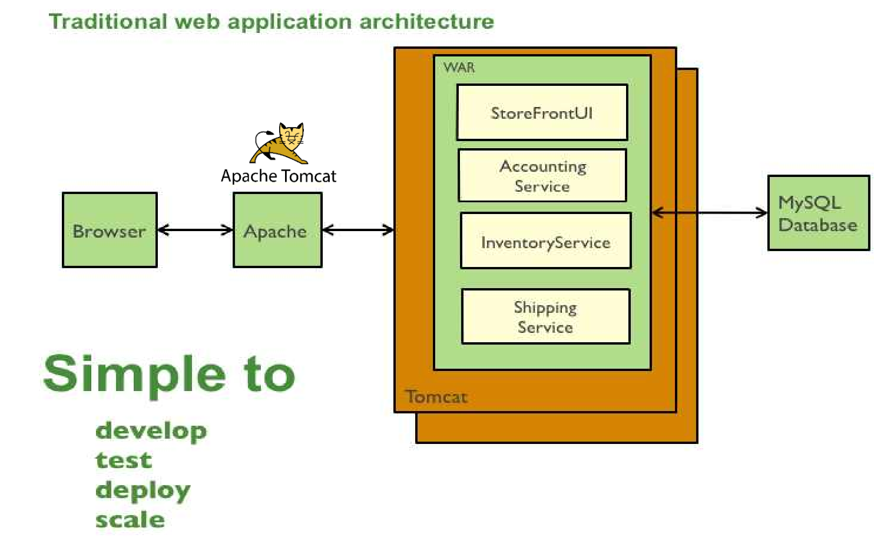
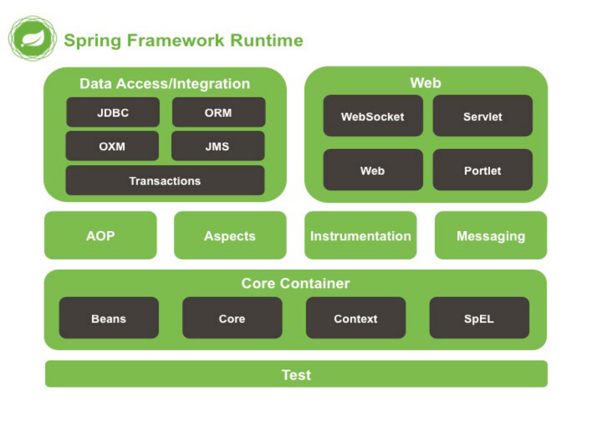
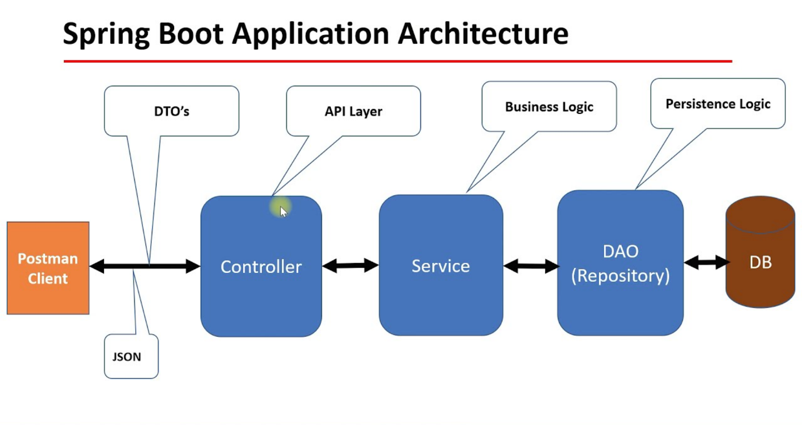
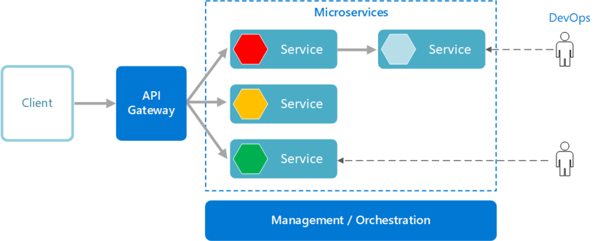
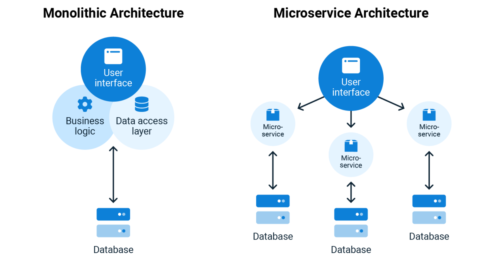
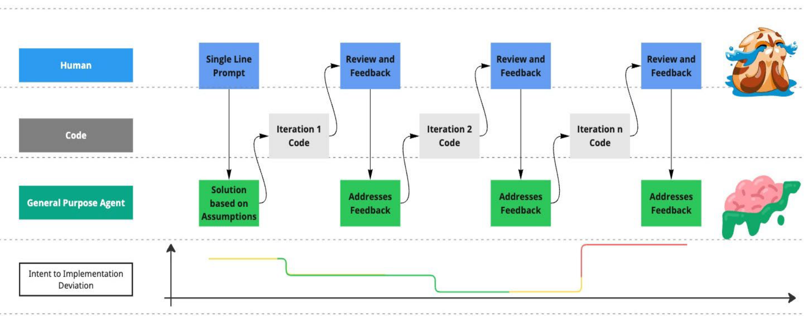
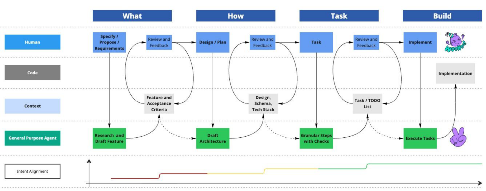

# **Програмиране на микросервизни приложения и следване на DevOps методология** Ангел Ботев 

1 

# **Програмиране на микросервизни приложения** 

**----- Start of picture text -----** 
Микросервизни приложения разработени на Java **----- End of picture text -----** 

**3** 

**----- Start of picture text -----** 
Видове приложение - конзолни **----- End of picture text -----** 

**Конзолното приложение** е компютърна програма проектирана да бъде използвана само чрез текстово-базиран компютърен интерфейс с помощта на компютърния терминал или интерфейсът с команден ред. 

**5** 

**----- Start of picture text -----** 
Видове приложение - графични **----- End of picture text -----** 

**Графично приложение** е компютърна програма проектирана да бъде използвана чрез графичен потребителски интерфейс. Този вид приложения предоставя на потребителя подобрена визуална част в сравнение с конзолните приложения, която има бутони, текстови полета, картинки, символи, помощни текстове подобряващи потребителското преживяване. 

**6** 

**----- Start of picture text -----** 
Видове приложение – проблеми при графични и конзолни **----- End of picture text -----** 

**Графичните и конзолните приложения** са проектирани да бъдат използвани само върху хардуерното устройство на което са инсталирани. Тези приложения нямат връзка с интернет и това ги прави ограничени за света. 

**7** 

**----- Start of picture text -----** 
Видове приложение – уеб приложение **----- End of picture text -----** 

**Уеб приложение** e приложение, до което потребителите имат достъп през мрежа като интернет. Уеб приложението използва клиент-сървър архитектура и се достъпва онлайн чрез браузър. 

**8** 

**----- Start of picture text -----** 
Архитектура на уеб приложение **----- End of picture text -----** 

**9** 

**----- Start of picture text -----** 
Уеб сървър – Apache Tomcat **----- End of picture text -----** 

**10** 

**----- Start of picture text -----** 
Java библиотеки **----- End of picture text -----** 

**11** 

**----- Start of picture text -----** 
Уеб фреймуърк – Spring Boot, Java EE, … **----- End of picture text -----** 

## Какво е уеб фреймуърк (web framework) ? 

Фреймуърк ( _или наричан още „технологична рамка“ или „софтуерна рамка“_ ) представлява универсална, преизползваема софтуерна среда, която е стандартизиран способ за изграждане и разполагане на приложения. По този начин технологичните рамки ускоряват разработката на софтуерни приложения, продукти и различни решения. За целта технологичните рамки могат да включват и допълнителни приложения и инструменти като компилатори, библиотеки, application programming interface-и (API-та), като всичко това ви позволява пълноценна разработка. 

## Познати  технологични рамки: 

- Spring – използва се за уеб приложения разработвани на Java 

- ASP.NET Core – използва за уеб приложения разработвани на C# 

- Java EE – използва се за уеб приложения разработвани на Java 

**12** 

**----- Start of picture text -----** 
Уеб фреймуърк – Spring Boot, Java EE, … **----- End of picture text -----** 

**13** 

**----- Start of picture text -----** 
Уеб фреймуърк – Spring Boot **----- End of picture text -----** 

**14** 

**----- Start of picture text -----** 
Структура на просто Java уеб приложение **----- End of picture text -----** 

**15** 

**----- Start of picture text -----** 
Монолитно приложение **----- End of picture text -----** 

**16** 

**----- Start of picture text -----** 
Монолитно приложение **----- End of picture text -----** 

**17** 

**----- Start of picture text -----** 
Монолитноооо приложение **----- End of picture text -----** 

**18** 

**----- Start of picture text -----** 
Монолитно приложение **----- End of picture text -----** 

**19** 

**----- Start of picture text -----** 
Проблеми при монолитните приложения **----- End of picture text -----** 

##  Големина и сложност 

- монолитните приложения са обикновено големи и сложни, което прави тяхното поддръжка и развитие трудни 

**20** 

**----- Start of picture text -----** 
Монолитно приложение **----- End of picture text -----** 

**----- Start of picture text -----** 
User Accounts Customer Service **----- End of picture text -----** 

**----- Start of picture text -----** 
Shopping Cart Product Catalog **----- End of picture text -----** 

**----- Start of picture text -----** 
Проблеми при монолитните приложения **----- End of picture text -----** 

 Големина и сложност 

- монолитните приложения са обикновено големи и сложни, което прави тяхното поддръжка и развитие трудни 

 Скалируемост 

- монолитните приложения са трудни за скалиране, тъй като целият апликационен слой трябва да бъде скалиран заедно, дори ако само един модул на приложението се нуждае от допълнителен капацитет. 

**22** 

**----- Start of picture text -----** 
Монолитно приложение **----- End of picture text -----** 

**----- Start of picture text -----** 
User Accounts Customer Service **----- End of picture text -----** 

**----- Start of picture text -----** 
Shopping Cart Product Catalog **----- End of picture text -----** 

**----- Start of picture text -----** 
Проблеми при монолитните приложения **----- End of picture text -----** 

 Големина и сложност 

- монолитните приложения са обикновено големи и сложни, което прави тяхното поддръжка и развитие трудни 

- Скалируемост 

- монолитните приложения са трудни за скалиране, тъй като целият апликационен слой трябва да бъде скалиран заедно, дори ако само един модул на приложението се нуждае от допълнителен капацитет. 

- Трудно разбиране 

- поради големината и сложността си, монолитните приложения могат да бъдат трудни за разбиране и за новите членове на екипа. 

**24** 

**----- Start of picture text -----** 
Монолитно приложение **----- End of picture text -----** 

**----- Start of picture text -----** 
User Accounts Customer Service **----- End of picture text -----** 

**----- Start of picture text -----** 
Shopping Cart Product Catalog **----- End of picture text -----** 

**----- Start of picture text -----** 
Проблеми при монолитните приложения **----- End of picture text -----** 

 Рискове при обновяване 

- при актуализации или разширения на монолитните приложения често се появяват проблеми със съвместимостта и непредвидими проблеми, което може да доведе до сериозни проблеми. 

**26** 

**----- Start of picture text -----** 
Монолитно приложение **----- End of picture text -----** 

**----- Start of picture text -----** 
User Accounts Customer Service **----- End of picture text -----** 

**----- Start of picture text -----** 
Shopping Cart Product Catalog **----- End of picture text -----** 

**----- Start of picture text -----** 
Проблеми при монолитните приложения **----- End of picture text -----** 

 Рискове при обновяване 

- при актуализации или разширения на монолитните приложения често се появяват проблеми със съвместимостта и непредвидими проблеми, което може да доведе до сериозни проблеми. 

 Ограничения на технологията 

- монолитните приложения обикновено са изградени с една технология и техните възможности за интеграция на нови технологии са ограничени. 

**28** 

**----- Start of picture text -----** 
Монолитно приложение **----- End of picture text -----** 

**----- Start of picture text -----** 
User Accounts Customer Service **----- End of picture text -----** 

**----- Start of picture text -----** 
Shopping Cart Product Catalog **----- End of picture text -----** 

**----- Start of picture text -----** 
Наличност (Availability) **----- End of picture text -----** 

A single missing “;” brought down the Netflix website for many hours (~2008) 

## **Грешки при наличността (Failure & Availability)** 

**----- Start of picture text -----** 
Monolithic Apps – Failure & Availability **----- End of picture text -----** 

**----- Start of picture text -----** 
Знаете ли, че … **----- End of picture text -----** 

      - Bulbank Online е монолитно приложение и има 17 000 класа. Разработката е започнала през 2004 година и се развива до ден днешен 

      - Историята на Netflix 

- Сайт за отдаване на DVD дискове 

- Монолитно приложение 

   - ~ 30 служителя 

- 

- ~ 130 Милиона потребителя 

   - ~ 3 Милиарда заявки / ден 

- 

- ~ 40 Инженерни екипа 

Как го постигат 

? 

# Микросервизи 

**----- Start of picture text -----** 
Микросервизно приложение **----- End of picture text -----** 

**34** 

**35** 

**----- Start of picture text -----** 
Монолитна vs Микросервизна архитектура **----- End of picture text -----** 

**Микросервизно приложение** 

**----- Start of picture text -----** 
Микросервизно приложение - предимства **----- End of picture text -----** 

- Гъвкавост и лесна мащабируемост 

- микросервизите са малки, отделни услуги, които могат да 

- бъдат мащабирани независимо един от друг. 

**37** 

**Микросервизно приложение - предимства** 

**----- Start of picture text -----** 
Микросервизно приложение - предимства **----- End of picture text -----** 

 Гъвкавост и лесна мащабируемост 

- микросервизите са малки, отделни услуги, които могат да бъдат мащабирани независимо един от друг. 

 По-добра устойчивост 

- при микросервизната архитектура, грешките в един микросервиз не би трябвало да повлияят на работата на останалите микросервизи. 

**39** 

**Микросервизно приложение - предимства** 

**----- Start of picture text -----** 
Микросервизно приложение - предимства **----- End of picture text -----** 

 Гъвкавост и лесна мащабируемост 

- микросервизите са малки, отделни услуги, които могат да бъдат мащабирани независимо един от друг. 

 По-добра устойчивост 

- при микросервизната архитектура, грешките в един микросервиз не би трябвало да повлияят на работата на останалите микросервизи. 

 Бързо развитие и доставка на нови функционалности 

- микросервизите могат да бъдат разработвани, тествани и доставяни независимо един от друг, което прави разработката на нови функционалности бърза и ефективна. 

**41** 

**Микросервизно приложение - предимства** 

**----- Start of picture text -----** 
Микросервизно приложение - предимства **----- End of picture text -----** 

- Лесно управление на различни технологии 

- микросервизите могат да бъдат изградени с различни технологии, което прави системата лесна за управление и поддръжка 

**43** 

**Микросервизно приложение - предимства** 

**----- Start of picture text -----** 
Микросервизно приложение - предимства **----- End of picture text -----** 

- Лесно управление на различни технологии 

- микросервизите могат да бъдат изградени с различни технологии, което прави системата лесна за управление и поддръжка 

- По-добра съвместимост и интеграция 

- микросервизите могат да се интегрират лесно с други системи и приложения, което прави цялата система по-гъвкава и ефективна. 

**45** 

**----- Start of picture text -----** 
Микросервизно приложение - недостатъци **----- End of picture text -----** 

**46** 

**----- Start of picture text -----** 
Микросервизно приложение - недостатъци **----- End of picture text -----** 

Can lead to chaos if not designed right … 

**----- Start of picture text -----** 
Service Discovery **----- End of picture text -----** 

**----- Start of picture text -----** 
Service Discovery 100s of MicroServices Need a Service Metadata Registry (Discovery Service) Catalog Account Service Registry Service Service (e.g. Netflix Eureka) Recommendation Customer Service Service Service X Service Y Z Service Service **----- End of picture text -----** 

**----- Start of picture text -----** 
Управление на микросервизи **----- End of picture text -----** 

## Spring Cloud 

-   Spring Cloud provides tools for developers to quickly build some of the common patterns in distributed systems 

## Kubernetes 

- Open-source system for automating deployment, scaling, and management of containerized applications 

## Openshift 

-   An enterprise-ready Kubernetes container platform with full-stack automated operations to manage hybrid cloud, multicloud, and edge deployments. 

2 

# **Следване на DevOps методология** 

**Процес преминаващ всяко приложение** 

# **Процес при Монолитно и Микросервизно приложение** 

**DevOps дефиниция** 

**CI/CD Pipeline** 

**DevOps Инструменти** 

## **Проучване** 

3 

# **AI-Driven Development: Новата парадигма в софтуерното инженерство** 

**----- Start of picture text -----** 
Какво всъщност е AI? **----- End of picture text -----** 

## **Магията на предсказанието** 

Изкуственият интелект, особено в контекста на езиковите модели, не е магия, а усъвършенствана статистика. Той е инструмент за предсказване на вероятности, чиято истинска сила произлиза от прецизността, с която се дефинират проблемите. 

## **Статистика, а не разум** 

AI предсказва следващия токен, без да "разбира" логиката като човек. **Силата на контекста (Prompting)** Качеството на въпроса пряко определя качеството на отговора, който получаваме. 

## **Рискът от "Халюцинации"** 

AI може да бъде "уверено грешен" и да генерира неточна, но правдоподобно звучаща информация. **Ключът към успеха** Инженерът трябва прецизно да дефинира проблема, който AI да реши. 

**58** 

**----- Start of picture text -----** 
От StackOverflow към AI Chat **----- End of picture text -----** 

## Промяна в начина, по който разработчиците намират решения и проектират софтуер 

## **Вчера: Статично търсене** 

## **Промяната: Цялостна логика** 

- Търсене на решения в Stack Overflow 

   - От търсене на синтаксис → към системно мислене 

- Фокус върху конкретен синтаксис 

   - Фокус върху архитектура и бизнес логика 

- Често използване на _Copy–Paste_ код 

   - AI подпомага анализа и дизайна на решения 

- Ограничен архитектурен контекст 

## **Днес: Динамичен диалог** 

**- Бизнес ефектът: По бърз Time-to-market** 

- Интерактивна комуникация с AI инструменти 

- Обсъждане на архитектура и дизайн на системи 

- Генериране на код и предложения за решения 

   - По-бързо разработване на функционалности 

   - По-кратък цикъл на разработка 

   - Значително по-бърз **Time-to-Market** 

- AI като асистент в процеса на разработка 

**59** 

**----- Start of picture text -----** 
The Vibe Coding Lifecycle **----- End of picture text -----** 

**60** 

**----- Start of picture text -----** 
The Spec-Driven Development Workflow **----- End of picture text -----** 

**61** 

**62** 

**----- Start of picture text -----** 
The Spec-Driven Development Workflow **----- End of picture text -----** 

**Проучване** 

# **Благодаря ви за вниманието!** 

