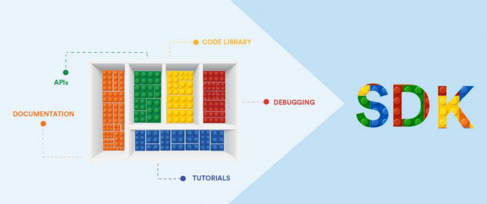
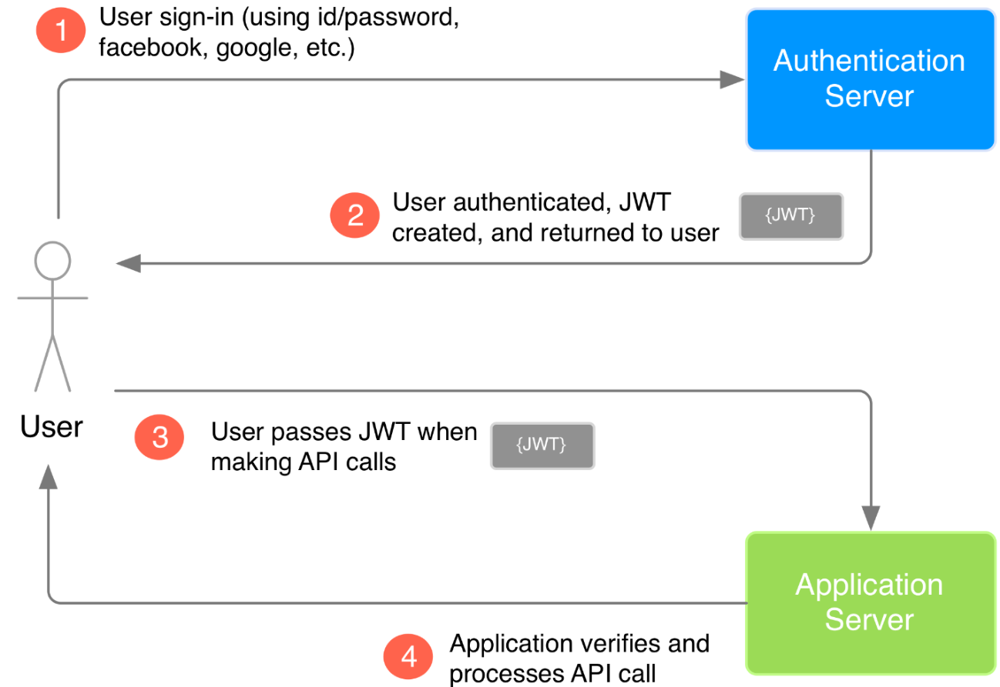
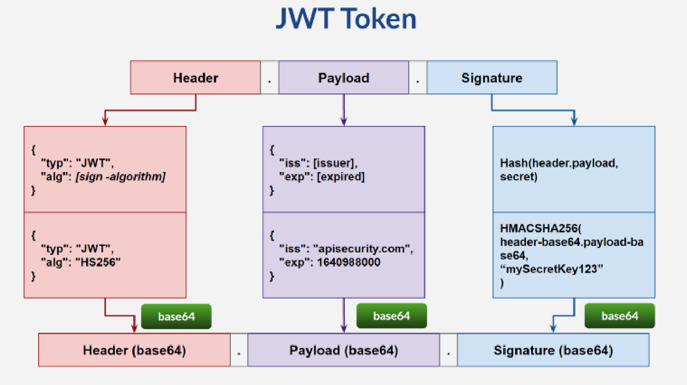

# **Дигитализация в банкирането - “дистанционни” канали за банкиране Un** iCredit **Un** locked 

София, Март 2023 

Empowering Communities to Progress. 

**----- Start of picture text -----** 
За какво ще си говорим днес **----- End of picture text -----** 

**2** 

**----- Start of picture text -----** 
За какво ще си говорим днес **----- End of picture text -----** 

Какви са новите реалности 

Как банкирането се адаптира към тях 

И каквото още решим 

**3** 

Slido.com #3829603 

**4** 

**----- Start of picture text -----** 
Новите клиенти **----- End of picture text -----** 

**5** 

**6** 

**7** 

**8** 

**9** 

**10** 

**11** 

**12** 

**13** 

200 000 Times 

**14** 

**----- Start of picture text -----** 
15 **----- End of picture text -----** 

**16** 

**----- Start of picture text -----** 
CHAT GPT **----- End of picture text -----** 

## What can **AI** do? 

**17** 

**18** 

**19** 

**20** 

**----- Start of picture text -----** 
История и еволюция в използването на банкови услуги **----- End of picture text -----** 

АТМ 

Phone Bank 

Online 

Mobile 

**21** 

**----- Start of picture text -----** 
Онлайн и Мобилно Банкиране Основни функции **----- End of picture text -----** 

## **Daily banking – информация и плащания** 

**22** 

**----- Start of picture text -----** 
Онлайн и Мобилно Банкиране Допълнителни Услуги **----- End of picture text -----** 

## Какво други услуги може да се използват през Мобилното или Онлайн банкиране? 

**23** 

**----- Start of picture text -----** 
Онлайн и Мобилно Банкиране Remote Identification and Onboarding **----- End of picture text -----** 

Възможността потребител да бъде идентифициран отдалечено, както и да получи достъп до определен продукт или дори да стане клиент. Как може да се случи това: 

- С приложение на доставчик на удостоверителни услуги: 

**24** 

**25** 

**26** 

**27** 

**28** 

**29** 

**30** 

**31** 

**32** 

**33** 

**34** 

**35** 

**36** 

**37** 

**----- Start of picture text -----** 
Wallets или какво е дигитален портфейл **----- End of picture text -----** 

**38** 

**----- Start of picture text -----** 
Онлайн и Мобилно Банкиране SDK **----- End of picture text -----** 

**40** 

**----- Start of picture text -----** 
Онлайн и Мобилно Банкиране SDK – Software Development Kit **----- End of picture text -----** 

**----- Start of picture text -----** 
По – бързи разработки **----- End of picture text -----** 

**----- Start of picture text -----** 
Спестява разходи **----- End of picture text -----** 

**----- Start of picture text -----** 
Клиентско преживяване **----- End of picture text -----** 

**42** 

**----- Start of picture text -----** 
Онлайн и Мобилно Банкиране Development and Support **----- End of picture text -----** 

Web apps are responsive versions of websites that can work on any mobile device or OS because they’re delivered using a mobile browser. 

Native apps are created for one specific platform or operating system. 

Hybrid apps are combinations of both native and web apps, but wrapped within a native app, giving it the ability to have its own icon or be downloaded from an app store. 

**45** 

**----- Start of picture text -----** 
Онлайн и Мобилно Банкиране Web Application **----- End of picture text -----** 

Заявка последвана от ръчен процес: 

- Потребителя попълва форма с основни данни 

   - Натиска бутон изпрати 

- 

- Системата записва събитието в “backend” част или генерира имейл с нотификация до специализирано звено, което следва да обработи заявката. 

- Служител на банката се свързва с клиента 

- - След което се пристъпва към подписване на договор – дистанционно или във филиал. 

**46** 

**----- Start of picture text -----** 
Онлайн и Мобилно Банкиране Development and Support **----- End of picture text -----** 

## **Advantages of native apps** 

## **Disadvantages of native apps** 

- ✓ Enhanced security 

- ✓ Improved performance 

- ✓ Push notifications 

- ✓ Tailored user experience 

ₓ High cost of development and support 

- ₓ Lack of flexibility 

ₓ Dependence on app stores 

- ₓ Code changes require updates 

**47** 

**----- Start of picture text -----** 
Онлайн и Мобилно Банкиране Hybrid **----- End of picture text -----** 

**----- Start of picture text -----** 
Native **----- End of picture text -----** 

**----- Start of picture text -----** 
Web **----- End of picture text -----** 

**48** 

**----- Start of picture text -----** 
Онлайн и Мобилно Банкиране Development and Support **----- End of picture text -----** 

## **Advantages of Hybrid apps** 

- ✓ Rapid Time to Market ✓ Easy Maintenance 

- ✓ Minimized Cost of Development ✓ Improved UI/UX 

## **Disadvantages of Hybrid apps** 

OS Inconsistencies 

**49** 

**----- Start of picture text -----** 
Онлайн и Мобилно Банкиране Development and Support **----- End of picture text -----** 

||**Native App**|**Hybrid App**|
|---|---|---|
|Languages|Objective C or Swift for IOS, Java or Kotlin for Android|General: HTML, CSS, Javascript, React|
|People|Need different team for each platform|Single team for core developments|
|Investment|High|Low|
|Development pace|Slow|Fast|
|Performance|Fast|Medium/Fast|

**50** 

**----- Start of picture text -----** 
Онлайн и Мобилно Банкиране Hybrid apps **----- End of picture text -----** 

**51** 

**----- Start of picture text -----** 
Онлайн и Мобилно Банкиране JWT **----- End of picture text -----** 

**52** 

**----- Start of picture text -----** 
Онлайн и Мобилно Банкиране JWT **----- End of picture text -----** 

**53** 

**----- Start of picture text -----** 
Онлайн и Мобилно Банкиране Основни принципи **----- End of picture text -----** 

## Сигурност 

**54** 

**----- Start of picture text -----** 
Онлайн и Мобилно Банкиране Основни принципи **----- End of picture text -----** 

## Наличност 

**56** 

**----- Start of picture text -----** 
Онлайн и Мобилно Банкиране Основни принципи **----- End of picture text -----** 

## Бързодействие 

**57** 

**----- Start of picture text -----** 
Recap **----- End of picture text -----** 

Digital Customers 

Quick and effective adaptation 

Invest in people and technologies 

**58** 

Slido.com #3829603 

**Ангел Якимов angel.yakimov@unicreditgroup.bg** 

Empowering Communities to Progress. 

