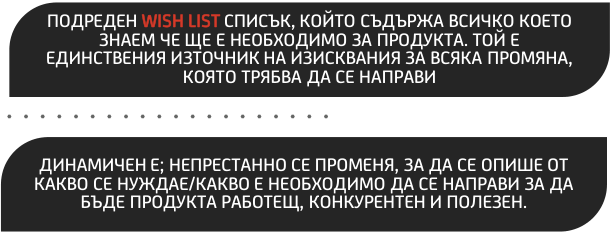
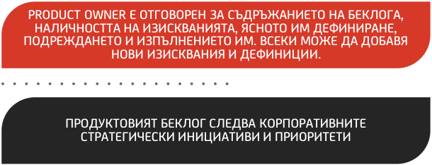
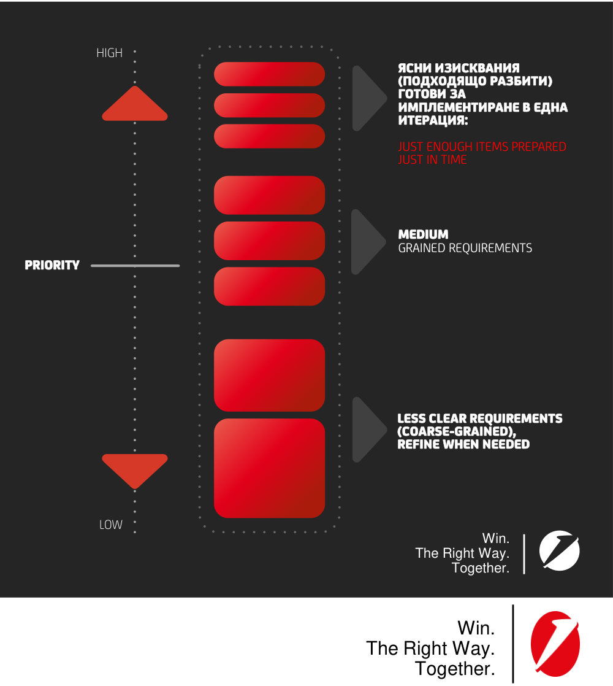
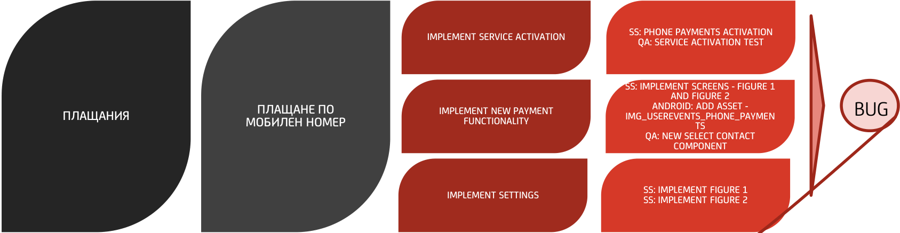
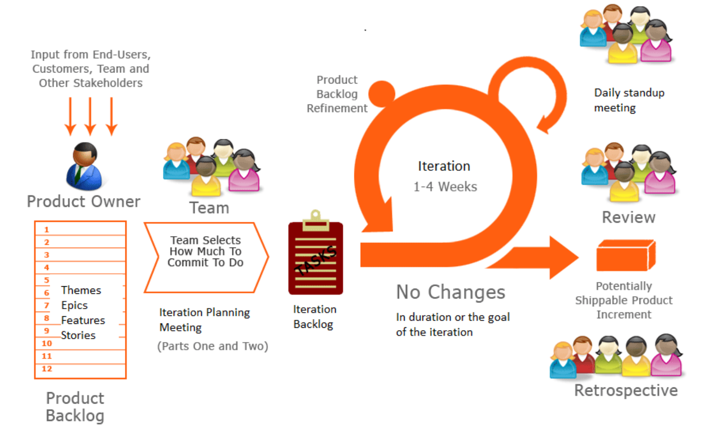
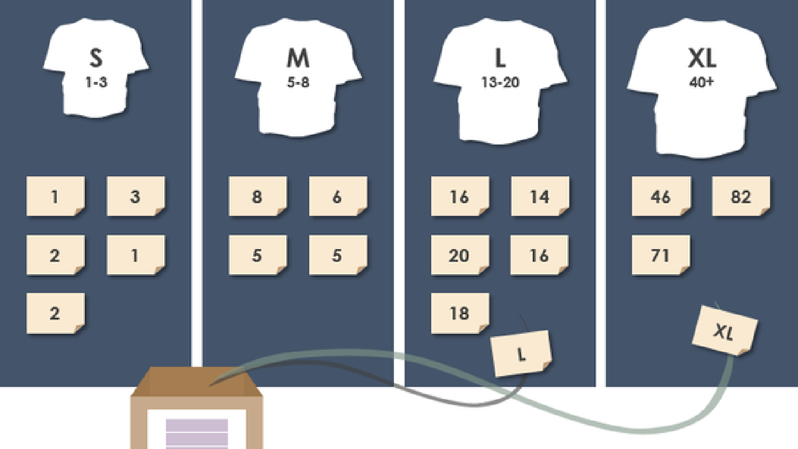
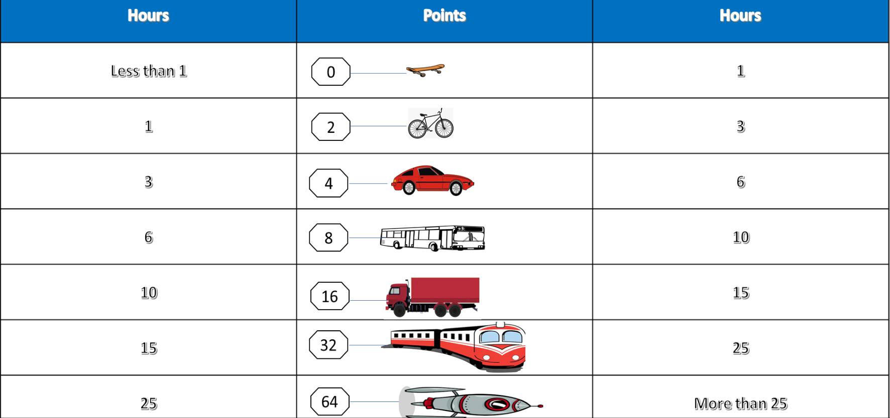
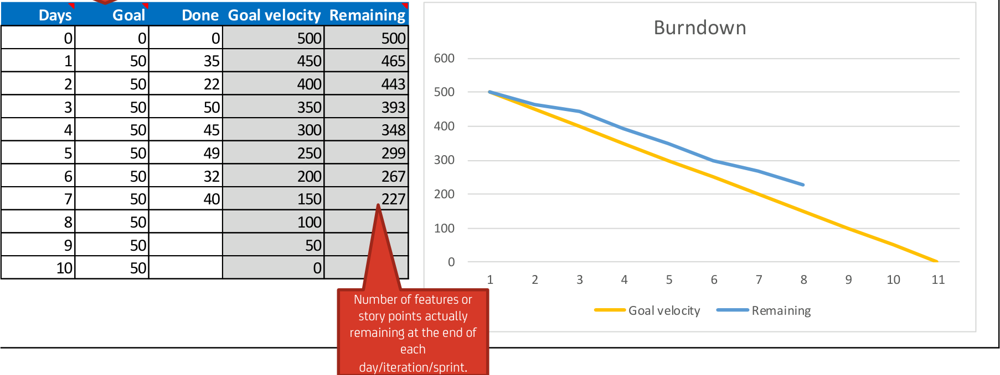
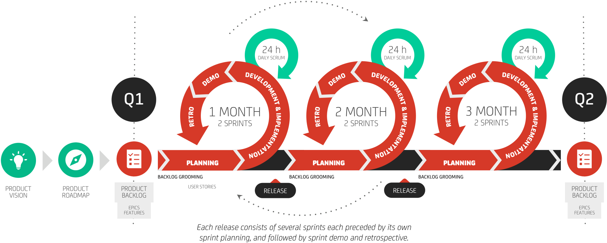
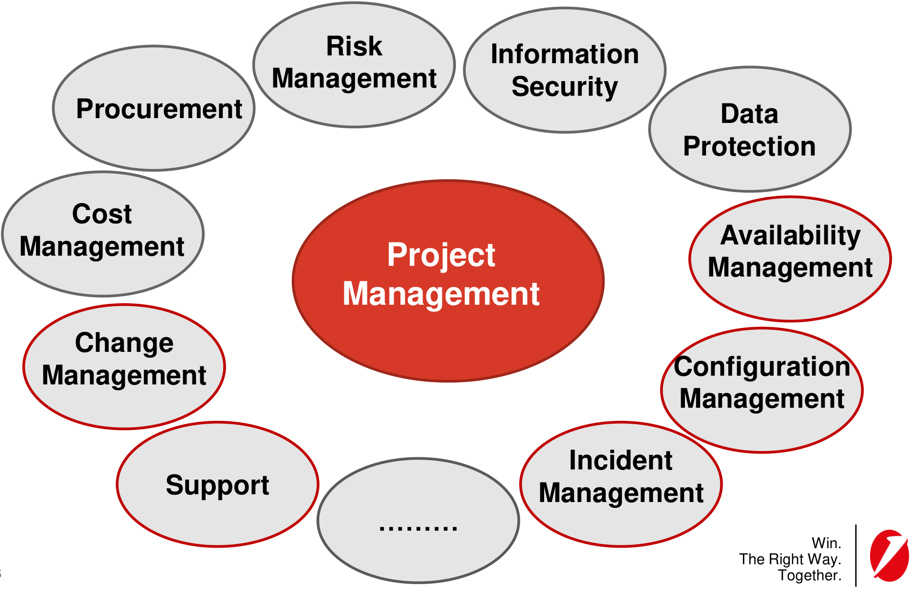

**Project Portfolio Management Project Management  Methodologies IT Service Management** 

Antoniya Toncheva, Senior Manger Digital Governance & Control Antoniya.Toncheva@UniCreditGroup.bg; 

Ralitsa Georgieva, Manager Digital Channels Ralitsa.I.Georgieva@UniCreditGroup.BG; Sofia, 12.03.2026 

Win. The Right Way. Together. 

UniCredit - Confidential 

## ~~**Agenda**~~ 

❑ Project, Program, Portfolio 

❑ Project Management Methodologies 

- ❑ Waterfall projects 

- ❑ Software Development LifeCycle 

- ❑ Agile projects 

- ❑ Communication and Team Engagement 

- ❑ Project Management and Other Processes 

- ❑ IT Service Management (ITSM) 

● UniCredit - Confidential 

## **What is a project?** 

A set of tasks that must be completed in order to arrive at a particular unique goal or outcome within a fixed period. 

Win. The Right Way. Together. 

**3** 

● UniCredit - Confidential 

**----- Start of picture text -----** 
Win. The Right Way. Together. **----- End of picture text -----** 

**4** 

● UniCredit - Confidential 

- ❑ Regulatory compliance 

- ❑ Security compliance 

- ❑ International/national standards compliance 

- ❑ Innovations 

- ❑ Automation and digitalization 

- ❑ New business products 

- ❑ Obsolescence (application upgrades or substitutions) 

**----- Start of picture text -----** 
Win. The Right Way. Together. **----- End of picture text -----** 

**5** 

● UniCredit - Confidential 

What is a **project** ? 

▪ **Limited resources (monetary, staffing)** 

▪ **Limited period (start, end)** 

## ▪ **Unique** 

## ▪ **Innovative** 

## ▪ **Clearly defined aims** 

▪ **Complex content** 

▪ **Cross-section organization** 

What is a ? **program** ▪ **Group of related projects** 

▪ **Common final objectives** 

▪ **Common start and end** 

What is a project **portfolio** ? ▪ **Strategic management of all projects and programs** ▪ **Global overview and prioritization** 

Win. The Right Way. Together. 

**6** 

● UniCredit - Confidential 

Every project is performed and delivered under 3 main constraints: 

- **Scope** – what must be done to produce the project's end result 

- **Time** – the amount of time available to complete a project 

- **Cost** - the budgeted amount available for the project 

These 3 parameters are interdependent - one side of the triangle cannot be changed without affecting the others: 

- ↑ **Scope** = ↑ **Time** & ↑ **Cost** 

- ↓ **Time** = ↑ **Cost** & ↓ **Scope** 

- ↓ **Budget** = ↑ **Time** & ↓ **Scope** 

Win. The Right Way. 

Together. 

**7** 

● UniCredit - Confidential 

**Clear project portfolio prioritization based on:** 

▪ Project typology 

- Strategic importance 

- Complexity and technical dependencies 

- Business KPIs 

▪ Deadline 

▪ Risk 

**Tasks backlog prioritization based on:** 

- Project priority 

- Resources availability 

- Complexity and time for completion 

- Technical dependencies 

- Risk 

Win. The Right Way. Together. 

**8** 

● UniCredit - Confidential 

**Waterfall** 

Planned with a clear goal, liner process, the result is visible at the end 

## **Agile** 

**9** 

Flexible model, delivered in short cycles (sprints), changes can be made, there is a visible result after every cycle and its being upgraded and enhanced 

Win. The Right Way. Together. 

● UniCredit - Confidential 

||**Waterfall**|**Agile**|
|---|---|---|
|**Approach**|Linear, sequential|Iterative, incremental|
|**Requirements**|Clear and complete from the very beginning|The framework and final goal are clear, but requirements change dynamically|
|**Timeline**|Fixed|Can be changed|
|**Flexibility**|Low|High|
|**Team**|Usually not fully dedicated|100% dedicated|
|**Feedback**|At the end of the phases|Throughout the entire project|
|**Suitable for**|Construction, Regulatory requirements|Software, design|

Win. 

The Right Way. Together. 

**10** 

● UniCredit - Confidential 

Win. The Right Way. Together. 

**11** 

● UniCredit - Confidential 

## **What is a Waterfall project?** 

- Waterfall project management maps out a project into distinct, sequential phases, with each new phase beginning only when the previous one has been completed. 

## **When to use Waterfall methodology?** 

- All the requirements are known, clear, and fixed 

- There are no ambiguous requirements 

- The project is short and simple 

- The development environment is stable 

- Resources are adequately trained and available 

- The necessary tools and techniques used are stable, and not dynamic 

**Phased Waterfall** model is applied when a project is divided into small phases and delivered at intervals 

Win. The Right Way. Together. 

**12** 

● UniCredit - Confidential 

The Waterfall Model, also known as the Linear-Sequential Life-cycle Model, is one of the first process models introduced for software development. The whole process is divided into sequential stages, and it is imperative to complete each phase successfully in order to move onto the next one. Waterfall Model consists of 6 phases: 

Win. The Right Way. Together. 

**13** 

● UniCredit - Confidential 

**1. Requirements Analysis** - all requirements of the project are analyzed and documented in a specification document and a feasibility analysis is done to check if these requirements are valid. It is essential to consider any limitations and constraints (e.g. time, budget constraints) which can affect the development process 

**2. System Design** - the system design is prepared which specifies hardware and system requirements, such as data layers, programming languages, network infrastructure, user interface etc. The overall system architecture is defined, which could cover high-level and low-level design. 

**3. Development** - the source code is written as per requirements. The physical design specifications are turned into a working code. The system is developed in small programs called units, after which these units are integrated. Sometimes, functionality of each unit is tested before integration, which is called Unit Testing. 

**4. Testing** - The code is handed over to the testing team. Testers check the program for all possible defects, by running test cases either manually or by automation. The client is involved in the testing phase as well, in order to ensure all requirements are met. All Flaws and bugs detected during this phase are fixed to ensure Quality Assurance. 

**5. Deployment** - the software is deployed into a live environment in order to test its performance. Once the software is deployed, it becomes available to end-users. Sometimes, this phase also includes training of real-time users to communicate benefits of the system. 

**6. Maintenance** - support and maintenance for the software, making sure it runs smoothly. If the client and users come across errors/defects/bugs during use, fixing them is the main purpose of this stage. 

Win. The Right Way. Together. 

**14** 

● UniCredit - Confidential 

## **Represents:** 

▪ Regular workflow 

▪ Possible scenarios 

- Actors 

(structures/competences involved) 

- Manual and automated decision points 

- Affected applications 

- Documents produced 

- Process start and end points 

Win. The Right Way. Together. 

**15** 

● UniCredit - Confidential 

- All parties influenced by the project: 

**StakeholdersStakeholders** 

      - Clients 

      - Business units 

      - Vendors 

- The overall decision-making body for a project. 

- **Steering Steering** • Takes certain decisions on move the final Go-live; change the scope and/or the budget of the project 

- **CommitteeCommittee** • Solving of project issues 

- • First filter to the Steering Committee 

- **Operative Operative** • Takes certain decisions on an operational level that does not move the final Go-live; does not change 

- **CommitteeCommittee** the scope and/or the budget of the project 

- • 

- **Project** Member of the Steering Committee 

- **Project Sponsor** • **Sponsor** Major owner/beneficiary of the project’s outcome • Person responsible for the overall success of the project 

- • Operational managing instance steering directions to all project activities 

- **Project** • 

- **Project Manager** Single escalation point for all issues arising that cannot be settled within the Project Team **Manager** • Aim to finalize the Project within objectives, resources, time, budget and quality and bears the overall responsibility for the project 

- ~~**Project**~~ • An expert within their field 

- **Project LeaderLeader** • keep their team engaged, motivated, and focused on the task at hand 

   - Responsible for carrying out the tasks allocated to them - timely, efficiently and in quality 

• Formed by the nomination of the most concerned line functions - each team member is single point of **Project Team Project Team** contact for the function he/she represents, inputting its know-how and competence • Line functions are to support their nominations, by dedicating allocation of their capacity to the project • Qualitative control **Quality Quality** • Monitor of the project progress Win. **Assurance Assurance** • The Right Way. Escalate project management issues to the Steering Committee **16** 

• Monitor of the project progress Win. • The Right Way. Escalate project management issues to the Steering Committee ~~Together.~~ 

● UniCredit - Confidential 

## **Waterfall** 

- When we have clear and complete business requirements and we can define the scope; 

- When the final product cannot be delivered in incremental (upgraded) versions; 

- When the project has a short delivery timeframe; 

- When the specialists who will work on the tasks cannot be allocated 100%; 

## **Agile** 

   - Self-organizing team; 

   - Delivery speed is important; 

   - When we have an idea of what the final product should be, but we understand that the market is dynamic and requirements change dynamically; 

   - Accelerated time to market, since excess work is minimized; 

   - Iterative and incremental; 

   - Changes in priorities; 

   - Improving the relationship between IT and the business; 

- **17** ▪ A 100% more effective way of hiring external resources. 

Win. 

The Right Way. Together. 

● UniCredit - Confidential 

## При инкременталния 

(добавящия) подход, продуктът се надгражда постепенно с нови функции и характеристики. 

При итеративното (повтарящо се/многократно) разработване се създават последователни версии на продукта. Всяка версия преминава през всички фази на процеса на разработка. 

Когато двата подхода се съчетаят, всяка следваща версия на продукта е по-пълна и по-добра от предишната. 

*Scrum.bg – Какво е Scrum – Къде се използва Scrum 

Win. The Right Way. Together. 

**18** 

● UniCredit - Confidential 

## Ако имаш **вътрешна** 

Непрестанно **учиш** 

Не осъждаш, **помагаш** 

в Вярваш **постоянното подобряване** и се стрешмиш към него Харесва ти да си част от 

**екип** 

си към Ориентиран **резултата** 

**мотивация Учиш се** от грешките 

Предпочиташ **директната комуникация** 

Оценяваш **усилията** 

Съзаваш условия за 

**Подкрепяш** , не командваш/не се налагаш **Клиентът** е в центъра 

Win. The Right Way. Together. 

**19** 

● UniCredit - Confidential 

**Хората и взаимоотношени ята** Повече от процесите и инструментите 

**Работещият софтуер** 

Повече от изчерпателната документация 

## **Сътрудничествот Реагирането на о с клиента промяната** 

Повече от формализиране на договора 

Повече от следването на плана 

* Манифест за **Team Charter** Agile | UniCredit Bulbank разработка на софтуер (agilemanifesto.org) 

Win. The Right Way. Together. 

**20** 

● UniCredit - Confidential 

**----- Start of picture text -----** 
01 **----- End of picture text -----** 

**----- Start of picture text -----** 
02 03 04 WELCOME FREQUENT COLLOCATED CHANGE DELIVERY TEAMS **----- End of picture text -----** 

## COLLOCATED TEAMS 

## SATISFY THE CUSTOMER 

Промяна в спецификациите е възможна, дори и в късните фази на проекта. Гъвкавите процеси използват промяната за конкурентно предимство. 

Често предоставяне на Тясно, ежедневно работещ софтуер (в периоди от сътрудничество между бизнес седмици, а не месеци) служители и разработчици 

Удовлетворение на клиентите чрез бърза доставка на полезен софтуер 

**----- Start of picture text -----** 
07 08 **----- End of picture text -----** 

**----- Start of picture text -----** 
09 **----- End of picture text -----** 

## 10 MAINTAIN SIMPLICITY 

## SUSTAINABLE PACE 

## WORKING SOFTWARE 

## CONTINUOUS ATTENTION 

Agile процесите насърчават устойчивото развитие. Спонсорите, разработчиците и потребителите трябва да могат 

Опростяването – изкуството да максимизираш стоността от несвършената работа – това е същността 

Работещия софтуер е основната мярка за напредък 

Непрекъснатия фокус към техническото съвършенство и добрия дизайн подобряват гъвкавостта. 

## 05 MOTIVATED INDIVIADUALS 

## FACE-TO-FACE CONTACT 

Изграждайте проекта с мотивирани хора. Дайте им среда и подрепяйте нуждите им, вярвайте, че ще свършат работата по ннай-добрия начин. 

Най-успешния и ефективен начин за разговори в екипа е лице в лице 

**----- Start of picture text -----** 
11 **----- End of picture text -----** 

**----- Start of picture text -----** 
12 **----- End of picture text -----** 

## SELF-ORGANIZING REFLECT AND TEAMS ADJUST 

Най-добрите архитектура, изисквания и дизайн идват от самоорганизиращи се екипи 

Регулярно екипът обсъжда как да стане по-ефективен, след което променя работата си по новия начин 

**да поддържат постоянно темпо** за неопределено време. 

Win. The Right Way. Together. 

**21** 

● UniCredit - Confidential 

**----- Start of picture text -----** 
1 2 3 4 5 6 7 8 9 **----- End of picture text -----** 

**----- Start of picture text -----** 
PC **----- End of picture text -----** 

Win. The Right Way. Together. 

**22** 

● UniCredit - Confidential 

**----- Start of picture text -----** 
AGILE TEAM DEVELOPMENT TEAM PRODUCT OWNER SCRUM MASTER DEVELOPERS DESIGNER IT ARCHITECT BUSINESS ANALYST SYTEM ANALYST QA **----- End of picture text -----** 

**----- Start of picture text -----** 
STAKEHOLDERS **----- End of picture text -----** 

Win. The Right Way. Together. 

**23** 

● UniCredit - Confidential 

Win. The Right Way. Together. 

**24** 

● UniCredit - Confidential 

- ❑ **Представлява** интересите на клиента 

- ❑ **Определя** кои фунционалности на продукта имат добавена стойнoст за клиента 

- ❑ **Притежава** продуктовия беклог и се грижи за актуализацията му 

- ❑ **Приоритезира** продуктовия беклог 

- ❑ **Определя** кога ще се качи на живо продукта и кои функционалности да се добавят 

- ❑ **Приема** или **отхвърля** свършената от екипа работа. 

- ❑ Може да **прекрати спринта** ако целта му вече не е актуална 

- ❑ Отговорен е за **максимизиране стойността** от продукта 

Win. The Right Way. Together. 

**25** 

● UniCredit - Confidential 

Win. The Right Way. Together. 

**26** 

● UniCredit - Confidential 

## **Roles** 

- Product Owner 

- • Development Team • Scrum Master 

## **Artifacts** 

- Product Backlog 

- • Sprint Backlog • Increment 

## **Events** 

- Sprint (2-4 weeks) 

- • Sprint Planning (2-8 hours) • Daily Scrum (15min) • Sprint Review (1-4 hours) • Sprint Retrospective (1-4 hours) 

Win. The Right Way. Together. 

**27** 

● UniCredit - Confidential 

**----- Start of picture text -----** 
PRODUC T SPRINT BACKLOG RETROSPECTIVE **----- End of picture text -----** 

**----- Start of picture text -----** 
ПОДРЕДЕН  WISH LIST  СПИСЪК, КОЙТО СЪДЪРЖА ВСИЧКО КОЕТО ЗНАЕМ ЧЕ ЩЕ Е НЕОБХОДИМО ЗА ПРОДУКТА. ТОЙ Е ЕДИНСТВЕНИЯ ИЗТОЧНИК НА ИЗИСКВАНИЯ ЗА ВСЯКА ПРОМЯНА, КОЯТО ТРЯБВА ДА СЕ НАПРАВИ ДИНАМИЧЕН Е; НЕПРЕСТАННО СЕ ПРОМЕНЯ, ЗА ДА СЕ ОПИШЕ ОТ КАКВО СЕ НУЖДАЕ/КАКВО Е НЕОБХОДИМО ДА СЕ НАПРАВИ ЗА ДА БЪДЕ ПРОДУКТА РАБОТЕЩ, КОНКУРЕНТЕН И ПОЛЕЗЕН. **----- End of picture text -----** 

**----- Start of picture text -----** 
ДЕФИНИРА СЕ, ПОДДЪРЖА СЕ И СЕ ПРИОРИТИЗИРА ОТ PRODUCT OWNER-А С ЕКСПЕРТНИЯ ПРИНОС НА ЦЕЛИЯ ЕКИП **----- End of picture text -----** 

**----- Start of picture text -----** 
PRODUCT OWNER Е ОТГОВОРЕН ЗА СЪДРЪЖАНИЕТО НА БЕКЛОГА, НАЛИЧНОСТТА НА ИЗИСКВАНИЯТА, ЯСНОТО ИМ ДЕФИНИРАНЕ, ПОДРЕЖДАНЕТО И ИЗПЪЛНЕНИЕТО ИМ. ВСЕКИ МОЖЕ ДА ДОБАВЯ НОВИ ИЗИСКВАНИЯ И ДЕФИНИЦИИ. ПРОДУКТОВИЯТ БЕКЛОГ СЛЕДВА КОРПОРАТИВНИТЕ СТРАТЕГИЧЕСКИ ИНИЦИАТИВИ И ПРИОРИТЕТИ **----- End of picture text -----** 

**----- Start of picture text -----** 
HIGH ЯСНИ ИЗИСКВАНИЯ (ПОДХОДЯЩО РАЗБИТИ) ГОТОВИ ЗА ИМПЛЕМЕНТИРАНЕ В ЕДНА ИТЕРАЦИЯ: JUST ENOUGH ITEMS PREPARED JUST IN TIME MEDIUM GRAINED REQUIREMENTS PRIORITY ` LESS CLEAR REQUIREMENTS (COARSE-GRAINED), REFINE WHEN NEEDED LOW Win. The Right Way. Together. Win. The Right Way. Together. **----- End of picture text -----** 

**28** 

● UniCredit - Confidential 

## **EPIC** 

**Съдържа основната функционалност на продукта, който трябва да се достави** 

## **FEATURE** 

**Голямо user story, за повече от 1 итерация** 

## **USER STORY** 

**Изискване. Ще бъде планирано за разработка през опредлен спринт** 

## **TASK** 

**User stories които са разбите на отделни задачи за изпълнение** 

**----- Start of picture text -----** 
SS: PHONE PAYMENTS ACTIVATION IMPLEMENT SERVICE ACTIVATION QA: SERVICE ACTIVATION TEST SS: IMPLEMENT SCREENS - FIGURE 1 AND FIGURE 2 ANDROID: ADD ASSET - ПЛАЩАНИЯ МОБИЛЕН НОМЕРПЛАЩАНЕ ПО  IMPLEMENT NEW PAYMENT FUNCTIONALITY IMG_USEREVENTS_PHONE_PAYMENTS BUG QA: NEW SELECT CONTACT COMPONENT SS: IMPLEMENT FIGURE 1 IMPLEMENT SETTINGS SS: IMPLEMENT FIGURE 2 **----- End of picture text -----** 

Win. The Right Way. Together. 

**29** 

● UniCredit - Confidential 

**----- Start of picture text -----** 
USER STORY SPRINT RETROSPECTIVE **----- End of picture text -----** 

## **USER STORY TYPES** 

## AS A (TYPE OF USER) I WANT (FUNCTIONALITY) SO THAT I CAN (REACH SOME GOAL, VALUE) + ACCEPTANCE CRITERIA 

(A SET OF STATEMENTS THAT MARKS A STORY AS COMPLETED AND WORKING AS EXPECTED; 

**A GOOD STORY ATTRIBUTES** I **Independent** N **Negotiable** V **Valuable** E **Estimable** 

CONDITION OF SATISFACTION THAT HELPS THE TEAM TO UNDERSTAND THE DESIRED OUTCOME AND SERVES AS A BASE FOR THE TEST SCENARIOS) 

* NOTE: THE ABOVE EXAMPLE IS RELEVANT TO STORIES FROM THE PERSPECTIVE OF USERS/PERSONAS. FOR TECHNICAL STORIES THE DESCRIPTION CAN BE DONE IN ANY FORM, HOWEVER ACCEPTANCE CRITERIA NEED TO BE DEFINED IN CASE. 

**----- Start of picture text -----** 
As a user of type customer, I want  to be able to see list of all transactions from my account, so that  I have control over my money. **----- End of picture text -----** 

S **Small** 

**----- Start of picture text -----** 
T **----- End of picture text -----** 

**Testable** 

Win. The Right Way. Together. 

Win. The Right Way. Together. 

**30** 

● UniCredit - Confidential 

## **USER STORY TYPES** 

**----- Start of picture text -----** 
USER STORY **----- End of picture text -----** 

concise statement that describes something a user needs 

**----- Start of picture text -----** 
TECHNICAL **----- End of picture text -----** 

user perspective is not needed and format can be populated in a form suitable for the Team - e.g. “Build Dev environment” or “Implement a webservice method that returns the user session id” 

**----- Start of picture text -----** 
REFACTORING **----- End of picture text -----** 

controlled technique for improving the design of an existing code base. The goal of refactoring is to pay off technical debt - e.g. Refactor the code (as-is), so that the Payment forms to be loaded fast on the screen 

**----- Start of picture text -----** 
SPIKES **----- End of picture text -----** 

used to drive out risk and uncertainty in a user story – knowledge research, additional analyze, exploration, design – e.g. “Research push and pull support for sending notifications to the BBM users in case of card authorizations 

## **ACCEPTANCE CRITERIA** 

(A SET OF STATEMENTS THAT MARKS A STORY AS COMPLETED AND WORKING AS EXPECTED; 

CONDITION OF SATISFACTION THAT HELPS THE TEAM TO UNDERSTAND THE DESIRED OUTCOME AND SERVES AS A BASE FOR THE TEST SCENARIOS) 

**----- Start of picture text -----** 
A GOOD STORY ATTRIBUTES I Independent N Negotiable V Valuable E Estimable S Small T Testable Win. The Right Way. Together. **----- End of picture text -----** 

Win. The Right Way. Together. 

**31** 

● UniCredit - Confidential 

DEFINITION OF READY 

**List with criteria, based on which to check whether everything is defined in order the one** 

DEFINITION OF DONE 

**List with exit criteria to determine a User Story is done:** 

**----- Start of picture text -----** 
DEFINITION OF DONE **----- End of picture text -----** 

**List with exit criteria to determine a Feature is done:** 

**… … …** 

Win. The Right Way. Together. 

**32** 

● UniCredit - Confidential 

**Just as the PO owns the backlog, the development team determines the definition of done. Each team must have in place Definition of Done (DoD)** 

**----- Start of picture text -----** 
The Definition of Done is the exit criteria to determine whether a product backlog item is complete **----- End of picture text -----** 

**----- Start of picture text -----** 
1 2 3 4 5 6 7 8 **----- End of picture text -----** 

**Usually the team puts together a checklist, that describes when done means finished. Example for what it may includes:** 

- Meets acceptance criteria 

- All tasks completed 

- Conventions are kept 

- No Functional or Critical Bugs 

**9** 

   - Artifacts from analysis and design 

- The  development team needs to know what the result will be and when they call something done-done. 

- The Product Owner owns value and the development team owns quality (they produce it, test it and present it for acceptance), so they shall agree together on the DoD. 

- Code implements requirements correctly and check is performed on defined environment 

- Unit test coverage level, Testing and automation 

- User documentation, technical documentation is prepared 

- Learning and knowledge transfer 

Win. The Right Way. Together. 

Win. The Right Way. Together. 

**33** 

● UniCredit - Confidential 

## Дайте пример 

Win. The Right Way. Together. 

**34** 

● UniCredit - Confidential 

# Сега е мой ред Let’s play a game (; 

Win. The Right Way. Together. 

**35** 

● UniCredit - Confidential 

Аз като **клиент** 

Бих искала **да получа оцветени великденски яйца,** 

Така че **да мога да направя декорация в залата.** 

**Acceptance criteria** : 

- да са оцветени в поне 2 цвята; 

- да е оцветено поне 90% от яйцето; 

- бялото и черното не ги броим за цвят; 

Win. The Right Way. Together. 

**36** 

● UniCredit - Confidential 

## **Roles** 

- Product Owner 

- • Development Team • Scrum Master 

## **Artifacts** 

- Product Backlog 

- • Sprint Backlog • Increment 

## **Events** 

- Sprint (2-4 weeks) 

- • Sprint Planning (2-8 hours) • Daily Scrum (15min) • Sprint Review (1-4 hours) • Sprint Retrospective (1-4 hours) 

Win. The Right Way. Together. 

**37** 

● UniCredit - Confidential 

**----- Start of picture text -----** 
ESTIMATION SPRINT RETROSPECTIVE **----- End of picture text -----** 

**----- Start of picture text -----** 
MEASURE OF RELATIVE SIZE AND COMPLEXITY **----- End of picture text -----** 

**----- Start of picture text -----** 
UNIT LESS, COMPARE AGAINST EACH OTHER WITHIN THE SAME TEAM **----- End of picture text -----** 

**----- Start of picture text -----** 
GENERATE THE TEAMS VELOCITY WHICH CAN BE USED TO PREDICT FUTURE WORK CAPACITY **----- End of picture text -----** 

## **WHY WE ESTIMATE?** 

- Arrive at a shared understanding - to give story points to an item, you need to learn about it 

- Organize product backlog based on value and effort – we consider not only the priority, but also the effort that takes to accomplish the work 

- Plan the upcoming work – we are leveraging on empiricism (we learn and then we apply the knowledge) 

- Estimates provide us with a way to measure a team’s velocity and have data to support our forecasting (by knowing the team’s past capacity we can forecast when a new feature will be done or how much we can deliver by a given date) 

- Provide visibility over what can be delivered during the sprint 

- Slice User stories and work smaller 

**----- Start of picture text -----** 
Most important is the team to be focused on delivering value instead of focusing on estimations and delivering story points **----- End of picture text -----** 

**Keep calm, and make sure your work has an impact** 

**----- Start of picture text -----** 
ESTIMATE ` **----- End of picture text -----** 

Win. The Right Way. Together. 

**38** 

● UniCredit - Confidential 

**1 2 3 4** 

**5 6 7 8 9** 

## **Man hours estimation vs Story points estimations** Estimating in Estimations with **MAN HOURS STORY POINTS** 

when estimating in man hours the teams takes into consideration only the time needed the work to be finished (usually in days) and tries to fit into the time-boxed sprint with taking certain number of User Stories. 

Story points are abstract, relative, and about effort. Story points are complexity-based effort estimates. Estimation with story points is based on analogy and we always compare to something known and already used. 

- Difficult to estimate precisely 

- People generally underestimate obstacles they might face and consider only the best-case scenario 

- When estimating in hours usually there is a risk of having a lot of discussions based on the seniority of the developers doing the job: for you, it’s 3 days but for me, it’ll be at least 5 

- We estimate the effort 

- We do not simplify the effort to just hours 

- We estimate as we also include the complexity of the work, dependencies, risks, uncertainty, testing 

- No correlation with skills and experience of the estimator 

- Velocity is Tracked 

## **If estimating with Story points:** 

Are we going to use the Fibonacci sequence? If yes, then to choose a “from – to” sequence, e.g. – 1, 2, 3, 5, 8, 13 

To choose **Reference stories** - some sample stories that could represent a few of the first Fibonacci numbers and to keep 

a list of those reference stories for future reference. 

When to estimate – on Backlog refinement or on Planning session? 

Are we going to use a tool? Task writing – online or offline? 

Win. 

The Right Way. Together. 

**39** 

● UniCredit - Confidential 

Win. The Right Way. Together. 

**40** 

● UniCredit - Confidential 

Win. The Right Way. Together. 

**41** 

● UniCredit - Confidential 

Win. The Right Way. Together. 

**42** 

● UniCredit - Confidential 

Win. The Right Way. Together. 

**43** 

● UniCredit - Confidential 

## Number of features 

## BURNDOWN CHART 

||Number of features|Number of features|Number of features|Number of features|||
|---|---|---|---|---|---|---|
||of story points you plan to complete.|||||B|
|**Days** 0||**Goal** 0||**Done ** 0|**Goal velocity ** 500|**Remaining** 500|
|1||50||35|450|465|
|2||50||22|400|443|
|3||50||50|350|393|
|4||50||45|300|348|
|5||50||49|250|299|
|6||50||32|200|267|
|7||50||40|150|227|
|8||50|||100||
|9||50|||50||
|10||50|||0||
||||||||

**----- Start of picture text -----** 
Days Goal Done Goal velocity Remaining Burndown 0 0 0 500 500 1 50 35 450 465 600 2 50 22 400 443 500 3 50 50 350 393 4 50 45 300 348 400 5 50 49 250 299 300 6 50 32 200 267 7 50 40 150 227 200 8 50 100 100 9 50 50 0 10 50 0 1 2 3 4 5 6 7 8 9 10 11 Number of features or Goal velocity Remaining story points actually remaining at the end of each day/iteration/sprint. **----- End of picture text -----** 

Win. The Right Way. Together. 

**44** 

● UniCredit - Confidential 

_Daily stand-ups happen on every day during the sprint_ 

**----- Start of picture text -----** 
24 h 24 h 24 h DAILY SCRUM DAILY SCRUM DAILY SCRUM Q1 Q2 1 MONTH 2 MONTH 3 MONTH 2 SPRINTS 2 SPRINTS 2 SPRINTS PLANNING PLANNING PLANNING BACKLOG GROOMING BACKLOG GROOMING BACKLOG GROOMING PRODUCT  PRODUCT PRODUCT USER STORIES RELEASE RELEASE PRODUCT VISION ROADMAP BACKLOG BACKLOG EPICS EPICS FEATURES FEATURES Each release consists of several sprints each preceded by its own sprint planning, and followed by sprint demo and retrospective. **----- End of picture text -----** 

Win. The Right Way. Together. 

**45** 

● UniCredit - Confidential 

## **Roles** 

- Product Owner 

- • Development Team • Scrum Master 

## **Artifacts** 

- Product Backlog 

- • Sprint Backlog • Increment 

## **Events** 

- Sprint (2-4 weeks) 

- • Sprint Planning (2-8 hours) • Daily Scrum (15min) • Sprint Review (1-4 hours) • Sprint Retrospective (1-4 hours) 

Win. The Right Way. Together. 

**46** 

● UniCredit - Confidential 

**----- Start of picture text -----** 
SPRINT SPRINT PL ANNING RETROSPECTIVE **----- End of picture text -----** 

THE SPRINT PLANNING PROCESS DETERMINES: 

- THE USER STORIES SPLIT INTO TASKS 

- THE CAPACITY AND COMMITMENT OF THE TEAM TO THESE TASKS 

**----- Start of picture text -----** 
WHEN? WHO? **----- End of picture text -----** 

**DURING THE 1ST PRODUCT OWNER WEEK OF THE SCRUM MASTER SPRINT, IT GIVES THE THE TEAM START OF THE SPRINT** 

## **PREPARATION** 

- Clear goal & requirements for the sprint (list of prioritized and analyzed stories, those tagged with “Ready for planning”) 

- Invitation to the participants sent in advance, session organized (room booked, in case of on-site meeting) 

- Alignment with important stakeholders from the bank outside of the team (if needed) 

- Dependencies on platform, framework, or other developments affecting the goals of the sprint 

- Planned absences (holidays, trainings, trips etc.) 

**----- Start of picture text -----** 
HOW LONG? **----- End of picture text -----** 

**----- Start of picture text -----** 
PURPOSE? **----- End of picture text -----** 

**PLAN IN DETAIL AND APPROXIMATELY 2- COMMIT WHAT WILL 2.5 HOURS BE DELIVERED DURING THE SPRINT** 

## **DURING THE SPRINT PLANNING** 

- Set the purpose for the meeting (SM) 

- Remind everyone to speak up, zoom in screen for better visibility 

- Set Sprint goal, take into consideration risks, dependencies, assumptions 

- Check up on team capacity (determine capacity for each team member & the team as a whole) 

- The Product Owner defines the USs with the biggest priority 

- The team commits what can realistically be accomplished for the sprint 

- Stories known as unachievable for the sprint are not selected 

- Based on the User stories’ estimation and User story priority shall be decided which of them to be included in the forthcoming Sprint 

- Product Owner may need to adjust priorities based on team capacity & availability (re-prioritization & re-assignments in case team capacity does not meet tasks estimations) 

- It is recommended some of the Stories (which are not included in the next Sprint), but are with high priority to be Tagged as a Backup 

- Tasks shall be assigned to team members 

- All Work items that are included in the Sprint shall be assigned to the new Sprint Iteration 

- If needed in the Sprint can be also included bugs for fixing 

- Sprint dates shall be set 

- The Scrum Master summarizes the outcome of the Planning 

- Product Owner updates customer & key stakeholders on the committed sprint plan 

Win. The Right Way. Together. 

**47** 

● UniCredit - Confidential 

## **DAILY STAND-UP** 

## **GOLDEN RULES** 

**----- Start of picture text -----** 
DAILY STAND - SPRINT UP RETROSPECTIVE **----- End of picture text -----** 

**----- Start of picture text -----** 
WHEN? WHO? PURPOSE? HOW LONG? DAILY, IN THE  DEV TEAM AND  SYNC BETWEEN  APPROXIMATELY MORNING PRODUCT OWNER IS SCRUM MASTER,  TEAM MEMBERS, SIGNAL FOR  15 MIN OPTIONAL AS PER  IMPEDIMENTS, TEAM DECISION FOSTER FAST TEAM DECISION MAKING **----- End of picture text -----** 

- Same time, same place 

- Stand-up lasts up to 15 mins 

- Be on time (if not bring chocolate) 

- Team members facilitate on rotation 

## **PREPARATION** 

- Room & presenter 

- Presented Visual board 

- Connectivity setup for remote participants 

## **DURING THE DAILY STAND-UP** 

- Everyone presents what was done yesterday, are there any impediments, what is the plan for today 

- Off-topic discussions can be discussed after the daily statuses have been given 

- One person speaks at a time and he is passing the ball to the next one ` 

- (up to his choice) 

- No electronic devices (phones, laptops, etc.) 

- Stand up if in the room 

SHARING INFORMATION BETWEEN TEAM MEMBERS IN A SHORT 10-15 MINUTES SLOT: 

- WHAT WERE YOU DOING YESTERDAY? 

   - Turn your camera on if remotely 

   - ● Update the team, not your boss 

   - Appropriate level of details – raise an issue but don`t try to solve it 

- WHAT WILL YOU DO TODAY 

- WHAT ABOUT THE SHOW STOPPERS AND DELAYS 

Win. The Right Way. Together. 

Win. The Right Way. Together. 

**48** 

● UniCredit - Confidential 

**----- Start of picture text -----** 
GROOMING SPRINT RETROSPECTIVE **----- End of picture text -----** 

BACKLOG REFINEMENT IS THE ACT OF ADDING DETAIL, ESTIMATES AND ORDER TO ITEMS TO THE PRODUCT BACKLOG ITEMS. THIS IS AN ONGOING PROCESS IN WHICH THE PRODUCT OWNER AND THE TEAM COLLABORATE ON THE DETAILS OF PRODUCT BACKLOG ITEMS. THE PO AND THE TEAM ARE GOING THROUGH THE USS, TAGGED WITH “READY FOR GROOMING” IN ORDER TO CLARIFY ALL THE DETAILS NEEDED FOR THE START OF THE DEVELOPMENT. THE TEAM ASKS THE PO QUESTIONS, WHICH HELP THE REQUIREMENTS TO BE CLEAR AND UNDERSTANDABLE FOR EACH TEAM MEMBER. THE USS SHALL REACH THE FINEGRAINED STAGE. 

**----- Start of picture text -----** 
WHEN? WHO? PURPOSE? HOW LONG? DURING THE 2ND NORMALLY HELD  PRODUCT OWNER SCRUM MASTER BACKLOG ITEMS, SO PREPARING THE  APPROXIMATELY 2-2.5 HOURS WEEK OF THE SPRINT THE TEAM THEY TO BE READY TO before forthcoming  BE POOLED INTO THE Planning NEXT SPRINT **----- End of picture text -----** 

## **PREPARATION** 

## **DURING THE GROOMING** 

- Requirements gathered and agreed from all ● The PO or any Stakeholder explains the relevant sources, clear priorities, analysis business context for feature/stories in scope complete. 

- Define the feasibility – here can be derived 

- ● User stories are prepared based on the Spikes (the research USs) in order to gather requirements and are tagged with “Ready more information and insights for grooming”. 

   - Slicing the Uss – the smaller the Uss, the easiest it’s to be understood what it’s needed to be delivered. Also the Uss shall fit into one Sprint 

   - Add acceptance criteria (if missing) 

   - Definition of ready – serves the team as a final check to see whether everything that needed to be defined is defined and the US is ready to be selected in the next Sprint. **The ready User stories have to be clear, concise and actionable.** The **refined and ready** User stories are tagged with “Ready for planning” 

   - Estimations – starts when everything from the previous points is done 

Win. The Right Way. Together. 

Win. The Right Way. Together. 

**49** 

● UniCredit - Confidential 

**----- Start of picture text -----** 
SPRINT SPRINT REVIEW | DEM O RETROSPECTIVE **----- End of picture text -----** 

A MEETING IN WHICH A DETAILED REVIEW OF THE PAST SPRINT IS MADE, A DEMO OF THE DEVELOPMENTS IS PRESENTED 

**----- Start of picture text -----** 
HOW LONG? **----- End of picture text -----** 

**----- Start of picture text -----** 
WHEN? **----- End of picture text -----** 

**----- Start of picture text -----** 
WHO? **----- End of picture text -----** 

**----- Start of picture text -----** 
PURPOSE? **----- End of picture text -----** 

**----- Start of picture text -----** 
UP TO 1 HOUR **----- End of picture text -----** 

**ONCE, AT THE VERY END OF THE SPRINT** 

**PRODUCT OWNER, THE TEAM PRESENTS DEVELOPMENT THE STORIES THAT TEAM, SCRUM HAVE BEEN FINISHED MASTER, DURING THE SPRINT STAKEHOLDERS** 

## **PREPARATION** 

## **DURING THE DEMO** 

   - Live demonstration of the finished work – 100% completed stories are demonstrated 

- Room and remote connection 

- Needed environments for demonstration are up and running 

   - Team decides who demonstrates 

- Participants are informed on what will be presented 

   - PO reflects on what was the Sprint Goal and which were the work items in focus (features, stories, etc.) 

- Invitations are sent 

- Direct feedback is given by the PO/Stakeholders 

- Sprint Overview – planned items, (un)finished items, changed priorities, how to continue with incomplete work – the status of the work items that are finished is changed to closed, the status of  the unfinished work items remains active and based on priorities the PO decides whether they to be transferred to the next Sprint or moved to the Backlog 

- Sprint Statistics 

**----- Start of picture text -----** 
INCREMENT INCREMENT INCREMENT **----- End of picture text -----** 

**----- Start of picture text -----** 
”DONE”  UPDATED PRODUCT  NEXT SPRINT FUNCTIONALITIES BACKLOG PLANNING DATE **----- End of picture text -----** 

Win. The Right Way. Together. 

**50** 

● UniCredit - Confidential 

**----- Start of picture text -----** 
SPRINT RE TROSPEC TIV SPRINT RETROSPECTIVE E **----- End of picture text -----** 

TEAM MEETING WHERE INFORMATION AND FEEDBACK IS SHARED ABOUT THE POSITIVE THINGS THAT HELP THE TEAM, THE NEGATIVE THINGS THAT HINDER THE ACTIVITY AND WHAT AND HOW  CAN BE IMPROVED 

**----- Start of picture text -----** 
WHEN? **----- End of picture text -----** 

**----- Start of picture text -----** 
WHO? **----- End of picture text -----** 

**----- Start of picture text -----** 
HOW LONG? **----- End of picture text -----** 

PURPOSE? **ONCE, AT THE END** usually after Demo **OF EACH SPRINT PRODUCT OWNER  IS SCRUM MASTERTEAM TEAM & PROCESS IMPROVEMENT UP TO 1 HOUR** and Review rituals **OPTIONAL** 

## **PREPARATION** 

## **DURING THE RETRO** 

- As preparation team members can send in advance to the Scrum master topics for discussion/ improvement 

   - Present preliminary sent topics to the team (if any) & retrospective board from last meeting 

   - Discuss topics in the form of Keep, Stop, Start doing (or other) 

- Scrum Master sends in advance to the squad the sprint performance metrics report 

   - Review and discuss team performance metrics 

- Scrum master groups related topics and sends them to the squad 

- Analyze current process and eliminate waste 

**----- Start of picture text -----** 
MORE LESS **----- End of picture text -----** 

**----- Start of picture text -----** 
KEEP START **----- End of picture text -----** 

**----- Start of picture text -----** 
STOP **----- End of picture text -----** 

Win. The Right Way. Together. 

Win. The Right Way. Together. 

**51** 

● UniCredit - Confidential 

**----- Start of picture text -----** 
understand say mean hear **----- End of picture text -----** 

**message sender** 

**recipient** 

Win. The Right Way. Together. 

**52** 

● UniCredit - Confidential 

Описание от клиента 

Изпълнение 

Истинската нужда на клиента 

Дизайн 

Win. The Right Way. Together. 

**53** Често се случва клиентът да изисква повече от колкото реално има нужда. 

● UniCredit - Confidential 

Win. The Right Way. Together. 

**54** 

● UniCredit - Confidential 

**----- Start of picture text -----** 
Risk Information Management Security Procurement Data Protection Cost Availability Management Project Management Management Change Configuration Management Management Incident Support Management ……… Win. The Right Way. Together. **----- End of picture text -----** 

**55** 

● UniCredit - Confidential 

**IT Service Management** is the approach to deliver the right business value through IT solutions by implementing the right mix of **People, Process and Technology** . ITSM helps in making the connection between IT and the business strategy and helps an organization to understand the impact of IT on different business processes. 

Win. The Right Way. Together. 

**56** 

● UniCredit - Confidential 

**People** - the end users (customers and employees), management and external service providers who use the IT services provided by the organization directly or indirectly. 

**Technology** - providing the right IT services to the ‘People’. Enables process automation and an easy to use interface for both the service providers and the end users 

**Processes** , especially those that are more workflow-driven, can benefit significantly from being supported with specialized software tools. 

Win. The Right Way. Together. 

**57** 

● UniCredit - Confidential 

**Change Management** - review and approval of all changes (on test and production environments), to minimize the impact of change-related incidents and ensure internal alignment 

**Incident Management** - Restore normal service operation as quickly as possible and minimize the adverse impact on business operations 

**Problem Management** - Diagnoses the root cause of incidents and determines their resolution 

**Availability Management** - ensures IT service availability to match or exceed the current and future agreed needs of the business. All IT infrastructure, processes, tools, roles etc. are appropriate for the agreed SLA 

**Capacity management** is managing the available capacity to ensure that resources are used optimally. 

**Configuration Management** - provides accurate, complete and relevant information of the IT infrastructure 

**Service Desk** provides a Single Point of Contact ("SPOC") to meet the communication needs of both users and IT staff 

Win. The Right Way. Together. 

**58** 

● UniCredit - Confidential 

Win. The Right Way. Together. 

**59** 

